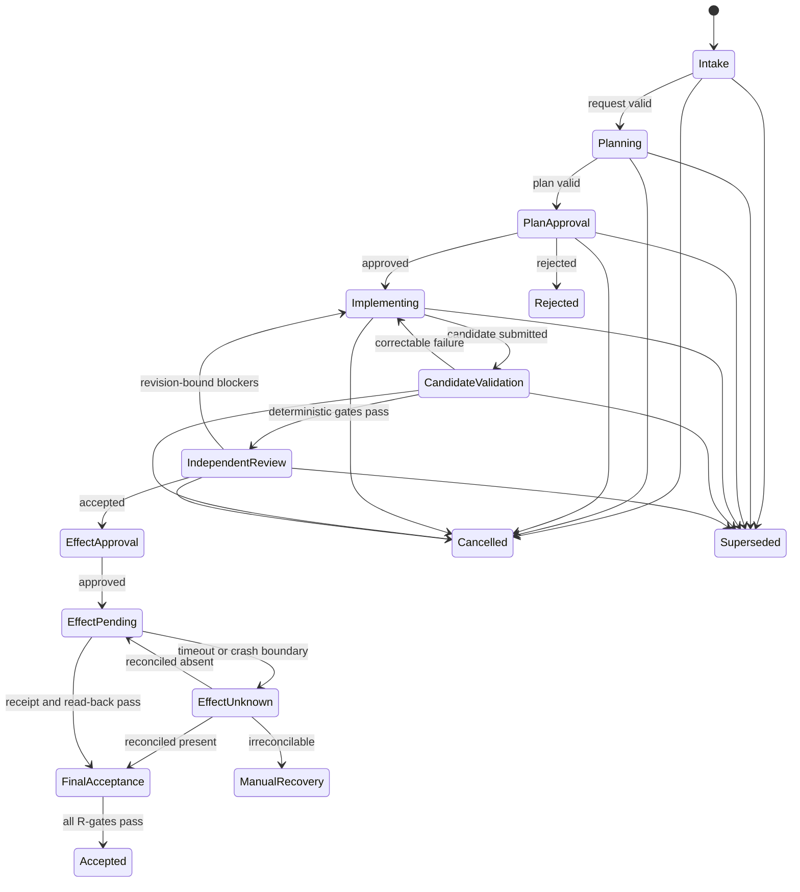

# Run record

- Case: `AR-E4`
- Condition: `baseline`
- Prompt: Design a resumable coding-agent workflow with durable state, typed handoffs, approval gates, retries by failure class, independent verification, and recovery after uncertain external effects. I am not asking whether a particular repository is ready for it yet.
- Expected routing: `agent-workflow-design`
- Loaded skills observed in Codex events: `agent-workflow-design`
- Final response:

## Workflow status: Conditional

The workflow is implementable as a generic coding-agent control plane. It remains conditional until the organization defines approval owners, protected paths, credential scopes, verification commands, deployment environments, and external systems’ idempotency/read-back capabilities.

## 1. Outcome contract

The workflow converts a versioned coding request into an independently verified change, optionally integrated or deployed, while remaining safe to pause, resume, cancel, supersede, or recover.

Requirements:

- **R1** — Bind every run to an immutable request version and base repository revision.
- **R2** — Persist authoritative state outside model conversations.
- **R3** — Use typed, versioned handoffs; treat model outputs as claims.
- **R4** — Enforce repository, credential, network, and external-effect boundaries outside prompts.
- **R5** — Require human approval for designated consequential transitions.
- **R6** — Independently verify implementation against the exact candidate revision.
- **R7** — Retry according to failure class with bounded budgets and no-progress detection.
- **R8** — Reconcile uncertain external effects before retrying them.
- **R9** — Preserve evidence sufficient to reconstruct every transition.
- **R10** — Accept the workflow only when all requirement gates pass against one exact revision.

Trigger: submission of an accepted `CodingRequest`.

Terminal states:

- `ACCEPTED`
- `REJECTED`
- `CANCELLED`
- `SUPERSEDED`
- `FAILED_PERMANENT`
- `MANUAL_RECOVERY_REQUIRED`

Invariants:

- Only the coordinator changes workflow state.
- State transitions use optimistic concurrency or transactional compare-and-set.
- Models cannot grant approvals, alter authoritative state, or decide final acceptance.
- The implementation worker cannot modify the control plane or verification policy.
- Evidence is revision-bound and becomes stale when its inputs change.
- An external effect is never blindly repeated after an ambiguous outcome.
- Cancellation prevents new effects but does not erase completed effects or receipts.

Non-goals:

- Deciding whether a specific repository is suitable.
- Eliminating accountable human decisions.
- Letting agents self-certify correctness.
- Automatically rolling back every possible external effect.

## 2. Evidence ledger

- **E1** — The requested design explicitly requires resumability, durable state, typed handoffs, gates, classified retries, independent verification, and uncertain-effect recovery.
- **I1** — A deterministic coordinator should own transitions because these requirements demand inspectable behavior. Falsified if orchestration is intentionally delegated to an untrusted conversational process.
- **A1** — Git-like immutable revision identifiers are available. Revalidate when adapting to another version-control system.
- **A2** — Workers can operate in isolated workspaces or branches. If false, serialize all writers.
- **A3** — External systems expose at least one of idempotency keys, conditional writes, durable receipts, or authoritative read-back. Otherwise consequential external writes are blocked.
- **Q1** — Which paths constitute the protected control plane?
- **Q2** — Which operations require product, security, compliance, or deployment approval?
- **Q3** — What test and acceptance commands are authoritative?
- **Q4** — What retry, time, token, and cost budgets apply?
- **Q5** — Which external effects support automated compensation?

## 3. State machine



Every transition is fail-closed. A phase completing does not imply that its result is valid, and a valid result does not imply workflow acceptance.

## 4. Phase map

| Phase | Kind / owner | Purpose and output |
|---|---|---|
| Intake | Deterministic / coordinator | Validate request schema, identity, policy, base revision, and deduplication key. |
| Clarification | Human or model-assisted / requester | Resolve material ambiguity; models may propose questions but cannot invent requirements. |
| Planning | Model / planner | Semantically analyze the task and propose a bounded implementation and verification plan. |
| Plan validation | Deterministic / coordinator | Validate schema, scope, revision binding, protected paths, and required gates. |
| Plan approval | Human / accountable owner | Approve scope, architecture, risk, and any consequential effects. |
| Workspace allocation | Deterministic / coordinator | Create isolated workspace and record baseline tree, dirty state, and lease. |
| Implementation | Model / worker | Modify only the authorized workspace and return a candidate manifest. Model judgment is needed for code synthesis and diagnosis. |
| Candidate validation | Deterministic / gate runner | Compute actual diff, detect forbidden mutations, build, lint, test, scan, and preserve evidence. |
| Independent review | Fresh model or human / reviewer | Evaluate semantic correctness and requirement coverage without producer context anchoring. |
| Effect approval | Human / effect owner | Authorize merge, publication, deployment, migration, or another designated effect. |
| Effect execution | Deterministic / effect executor | Execute one effect using a stable idempotency identity and record request/receipt. |
| Reconciliation | Deterministic, then human if needed | Resolve `outcome_unknown` by querying authoritative external state. |
| Final acceptance | Deterministic / coordinator | Recheck all gates and approvals against the exact resulting revision and external state. |

The planner, implementer, and semantic reviewer are the only default model phases. Routing, polling, testing, commits, transitions, and retries belong in deterministic code.

## 5. Durable state and authority

Use a transactional database as the source of truth, plus immutable artifact storage for logs, diffs, reports, and receipts.

Core records:

```text
Run
  run_id, request_id, request_version
  base_revision, candidate_revision, integrated_revision
  state, state_version
  active_phase_id
  cancellation_state, superseded_by
  created_at, updated_at

PhaseAttempt
  phase_id, phase_kind, owner
  input_digest, attempt_number
  execution_status, result_validity
  started_at, lease_expires_at, ended_at
  output_artifact_refs[]

Approval
  approval_id, gate_type, decision
  subject_digest, revision
  approver_identity, authority_role
  conditions, expires_at, decided_at

GateReceipt
  gate_id, gate_version
  subject_revision, input_digest
  checks[], verdict, artifact_refs[]
  executed_by, executed_at

Effect
  effect_id, operation, target
  idempotency_key, expected_version
  state: prepared|sent|confirmed|absent|outcome_unknown|failed
  request_digest, provider_receipt
  reconciliation_evidence[]
```

All transitions require `(run_id, expected_state, expected_state_version)`. Workers receive leases but never direct state-transition authority. Late results are stored for audit and rejected if the lease, request version, or revision binding no longer matches.

On resume, the coordinator must:

1. Acquire the run lease.
2. Read authoritative request, repository, approval, and external state.
3. Compare them with the checkpoint identities.
4. Invalidate stale gates and expired approvals.
5. Reconcile any `sent` or `outcome_unknown` effect.
6. Resume from the earliest state whose prerequisites remain valid.

## 6. Typed handoffs

Use distinct versioned contracts rather than one generic agent envelope.

```json
{
  "schema": "implementation-candidate/v1",
  "run_id": "run_...",
  "phase_id": "phase_...",
  "request_version": 4,
  "base_revision": "abc123",
  "candidate_revision": "def456",
  "status": "candidate_ready",
  "claimed_changed_paths": ["src/x.ts", "test/x.test.ts"],
  "requirement_claims": [
    {"requirement_id": "R-feature-1", "evidence_refs": ["artifact://note/17"]}
  ],
  "known_limitations": [],
  "artifact_refs": ["artifact://diff/22"]
}
```

```json
{
  "schema": "review-result/v1",
  "run_id": "run_...",
  "reviewed_revision": "def456",
  "review_policy_version": "review-7",
  "status": "accepted_with_no_blockers",
  "findings": [],
  "requirement_assessments": [
    {"requirement_id": "R-feature-1", "verdict": "satisfied", "evidence_refs": ["artifact://review/8"]}
  ]
}
```

Permitted statuses must have exact meanings; for example, `candidate_ready` means only that the worker is submitting a candidate. It does not mean tests passed or the task is accepted.

Semantic validation includes:

- IDs and revisions exist and match the active run.
- Candidate descends from the pinned base unless explicitly replanned.
- Claimed files agree with the computed change set.
- Evidence references exist and are immutable.
- The reviewer’s revision exactly equals the candidate being considered.
- Models cannot populate approval or final-acceptance fields.

## 7. Gates and final acceptance

| Claim | Independent gate |
|---|---|
| Requested scope was understood | Approved plan maps each request requirement to implementation and verification evidence. |
| Only allowed files changed | Compare baseline and candidate trees, including deletions, reversions, modes, submodules, and generated files. |
| Control plane is intact | Verify protected paths and policy digests against trusted versions. |
| Build/tests pass | Coordinator runs pinned commands in a clean environment and stores complete receipts. |
| Change meets intent | Fresh reviewer evaluates the exact candidate revision and requirement set. |
| Approval exists | Validate signer authority, subject digest, revision, conditions, and expiry. |
| Merge/deploy succeeded | Verify provider receipt and authoritative read-back. |
| Workflow succeeded | Re-evaluate every `R#` gate against one exact final state. |

Final acceptance is:

```text
all_required_gates_pass
AND no_unresolved_blockers
AND approvals_valid_for(final_revision, effect_digest)
AND external_effects_confirmed_or_not_required
AND request_version_is_current
AND run_not_cancelled_or_superseded
```

## 8. Capability and mutation boundaries

- Give each worker a dedicated workspace, branch, and short-lived credential.
- Enforce allowed paths through sandboxing where possible; always perform post-state comparison.
- Deny worker writes to workflow definitions, gate configuration, evidence stores, approval records, CI policy, protected hooks, and evaluator configuration.
- Restrict network destinations and API operations independently of tool descriptions.
- Give effect executors narrowly scoped credentials unavailable to planning and implementation workers.
- Require approval for merge, deployment, migration, secret rotation, production writes, destructive actions, and scope expansion.
- Never allow parallel writers in the same mutable workspace. Parallel analysis is safe; parallel implementation requires isolated branches and a separate integration phase.
- Preserve pre-existing user changes and treat modifying or reverting them as mutations.

## 9. Retry and recovery model

| Failure class | Response |
|---|---|
| Malformed model output | Retry the same phase with schema errors; maximum 2 repair attempts. |
| Deterministic transient | Retry only enumerated safe/idempotent errors with exponential backoff and jitter. |
| Failed candidate gate | Return concrete violations to the implementer; maximum 3 candidate revisions. |
| Failed implementation hypothesis | Require a new diagnosis and changed strategy; stop on equivalent repeated attempts. |
| Semantic review blocker | Return revision-bound findings to implementation; use a fresh reviewer on the next candidate. |
| Stale request, base, approval, or gate | Do not retry; invalidate downstream evidence and replan or reapprove. |
| Policy denial or missing authority | Block pending an accountable decision. |
| Worker crash before effect | Resume or retry from the last valid checkpoint. |
| Crash after effect may have been sent | Enter `EFFECT_OUTCOME_UNKNOWN`; reconcile before any replay. |
| Irreconcilable external effect | Enter `MANUAL_RECOVERY_REQUIRED`. |

No-progress signals include the same failure fingerprint across attempts, unchanged candidate revision, repeated equivalent patches, oscillating revisions, exhausted budget, or results arriving for superseded state.

### Uncertain external effects

Use this protocol:

1. Persist `Effect(prepared)` with stable `effect_id`, idempotency key, target, request digest, and expected external version.
2. Commit the record before sending.
3. Send using the same idempotency key or conditional version.
4. Persist the provider receipt and mark `confirmed`.
5. If the process dies or times out after sending, mark or infer `outcome_unknown`.
6. Query the external system by idempotency key, object identity, request digest, or expected state.
7. If present and matching, record reconciliation evidence and continue.
8. If absent, retry the same effect identity within budget.
9. If conflicting or unobservable, stop for manual recovery—never manufacture success or blindly replay.

## 10. Observability and verification

Emit an append-only event stream keyed by `run_id`, `phase_id`, `attempt`, revision, and effect ID. Record:

- State transition requests and accepted/rejected transitions.
- Model, prompt bundle, schema, policy, and harness versions.
- Input digests and artifact references.
- Tool requests, exit status, and relevant sanitized output.
- Actual change sets and protected-path checks.
- Gate definitions, observations, and receipts.
- Approval identities, subjects, conditions, and expiry.
- Retry classifications, budgets, and no-progress fingerprints.
- Effect preparation, sending, receipts, read-back, and reconciliation.
- Cancellation, supersession, stale results, and terminal reason.

Required trajectory tests include:

- Invalid or concurrent transition rejection.
- Malformed and semantically false handoffs.
- Unauthorized mutation, including deletion and reversion.
- Attempted modification of gate policy or evidence.
- Stale and late worker results.
- Reviewer result bound to the wrong revision.
- Approval rejection, expiry, amendment, and supersession.
- Crash before send, during send, and after effect completion.
- Duplicate delivery and idempotent recovery.
- Irreconcilable external state.
- Retry exhaustion and repeated-no-progress detection.
- Cancellation at every phase.
- Every phase “successful” while a final requirement gate still fails.

## 11. Human decisions still required

Before activation, accountable owners must define:

- Approval classes and authorized approvers.
- Repository write scope and protected control-plane paths.
- Required build, test, security, and semantic acceptance gates.
- Production credential and network boundaries.
- Retry, cost, latency, and concurrency budgets.
- Approval expiration and supersession policy.
- External effect reconciliation and compensation procedures.
- Audit retention, privacy, and redaction rules.

If any consequential external operation lacks enforceable authority plus idempotency or authoritative read-back, that transition must remain disabled.

Outcome checks remain `not_verifiable` until reviewed against the suite rubric.
