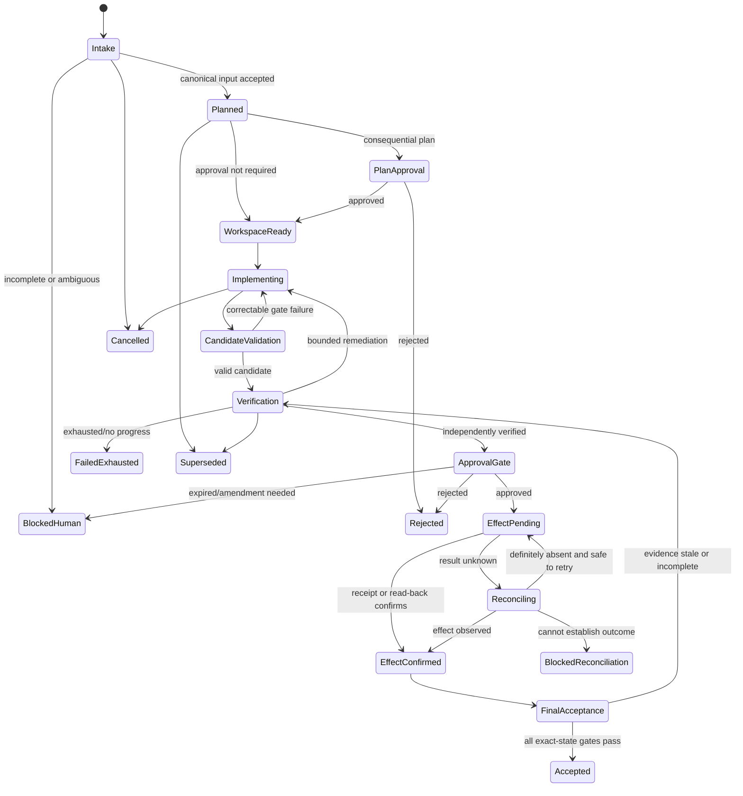

# Run record

- Case: `AR-E4`
- Condition: `candidate`
- Prompt: Design a resumable coding-agent workflow with durable state, typed handoffs, approval gates, retries by failure class, independent verification, and recovery after uncertain external effects. I am not asking whether a particular repository is ready for it yet.
- Expected routing: `agent-workflow-design`
- Loaded skills observed in Codex events: `agent-workflow-design`
- Final response:

## Workflow status: Conditional

The workflow is implementable as a resumable state machine. It remains conditional on organization-specific decisions about approval ownership, protected paths, deployment authority, retry budgets, and which external systems support idempotency or authoritative read-back.

The central rule is: deterministic orchestration owns state, policy, sequencing, effects, retries, and acceptance. Models produce bounded, typed claims; they never decide that their own work has passed.

## 1. Outcome contract

The workflow’s outcome is an accepted, traceable code change bound to an exact ticket version, base revision, resulting revision, approval chain, and verification record.

Requirements:

- `R1` — Every run has immutable `run_id`, `task_id`, ticket version, base revision, and policy version.
- `R2` — Work can resume after coordinator, worker, or verifier interruption without relying on conversation memory.
- `R3` — Every model handoff is schema-validated and bound to the state it inspected.
- `R4` — Workers cannot authorize their own work or modify the control plane that evaluates it.
- `R5` — Mutation is confined to an isolated workspace and enforced write/resource scope.
- `R6` — Required tests and policy checks are executed independently of worker self-report.
- `R7` — Semantic review is performed in a fresh context against the exact candidate revision.
- `R8` — Consequential effects require valid approval receipts.
- `R9` — Retries are bounded and vary by failure class.
- `R10` — Unknown external-effect outcomes enter reconciliation, never blind replay.
- `R11` — Final acceptance requires all gates to apply to the same, current revision and inputs.
- `R12` — Cancellation, supersession, expiry, stale results, and late workers cannot advance state.

Trigger: submission of a canonical work item plus authoritative repository and policy references.

Terminal states:

- `ACCEPTED`
- `REJECTED`
- `CANCELLED`
- `SUPERSEDED`
- `FAILED_EXHAUSTED`
- `BLOCKED_HUMAN`
- `BLOCKED_RECONCILIATION`

Non-goals include choosing product direction, silently expanding scope, approving security exceptions, resolving ambiguous requirements without an accountable owner, or deploying without explicit authority.

Core invariants:

- State advances only through coordinator-validated transitions.
- A receipt is immutable; corrections create new receipts.
- Every approval and verification is revision-bound and expires when relevant state changes.
- No worker writes to workflow schemas, policies, gates, evidence records, or verifier configuration.
- Successful phase execution is distinct from valid output and overall acceptance.

## 2. Evidence ledger

- `A1` — Git-like immutable revision identities are available. Revalidate when a workspace is created and before every gate.
- `A2` — Workers can be isolated by branch, worktree, container, or equivalent. If not, mutation phases must remain blocked.
- `A3` — Tests and static checks have deterministic commands or service interfaces.
- `A4` — External systems provide at least one of idempotency keys, conditional writes, durable receipts, or authoritative read-back.
- `I1` — Semantic correctness cannot be established entirely through executable checks, so independent model or human review is required. This is falsified for fully mechanical changes with complete executable specifications.
- `Q1` — Which paths, systems, credentials, and environments are protected?
- `Q2` — Who owns product, architecture, security, and deployment approvals?
- `Q3` — Which changes require one or multiple approvals?
- `Q4` — What time, cost, token, and retry budgets apply?
- `Q5` — Which external operations lack safe reconciliation?

## 3. State machine



Every nonterminal state also supports `PAUSED`. Resume first enters `RECONCILING_STATE`, which compares durable state with authoritative repository, ticket, approval, and external state before returning to the earliest safe phase.

## 4. Phase map

| Phase | Kind | Owner | Purpose and output |
|---|---|---|---|
| Canonicalize intake | Deterministic | Coordinator | Resolve identities, versions, required fields, policy, and duplicate runs |
| Clarify requirements | Human | Product/technical owner | Resolve ambiguity with a durable decision receipt |
| Investigate and plan | Model | Planner | Semantic investigation and bounded implementation proposal |
| Validate plan | Deterministic | Coordinator | Schema, scope, dependency, policy, and freshness checks |
| Approve plan | Human | Accountable approver | Authorize scope or consequential strategy |
| Provision workspace | Deterministic | Harness | Create isolated workspace and capture baseline manifest |
| Implement | Model | Implementer | Modify only the authorized workspace and return a change manifest |
| Validate candidate | Deterministic | Harness | Compare actual changes, run prescribed checks, detect protected mutations |
| Diagnose failure | Model | Implementer or diagnostician | Interpret concrete failures and propose a materially different correction |
| Independent review | Model/human | Fresh verifier | Assess semantic correctness against requirements and exact revision |
| Approve effect | Human | Release/security owner | Authorize merge, deployment, migration, or other consequential effect |
| Execute effect | Deterministic | Effect executor | Perform one authorized, idempotent or conditional operation |
| Reconcile effect | Deterministic first; human if needed | Reconciler | Determine whether an uncertain external operation occurred |
| Final acceptance | Deterministic | Coordinator | Confirm all requirements, gates, approvals, and receipts align |

Model use is limited to investigation, synthesis, implementation, failure diagnosis, and semantic review—tasks requiring interpretation. Commands, transitions, hashing, persistence, policy checks, Git operations, and external writes remain deterministic.

## 5. Durable state and authority

Use a transactional database as the authoritative control store and an immutable artifact store for logs, diffs, test output, review material, and effect receipts.

Minimum durable records:

```text
Run {
  run_id, task_id, state, state_version,
  ticket_ref, ticket_version, policy_version,
  base_revision, candidate_revision,
  workspace_id, owner_lease,
  attempt_budgets, created_at, updated_at,
  cancellation_epoch, superseded_by
}

PhaseAttempt {
  phase_id, attempt_no, input_state_version,
  owner, status, started_at, ended_at,
  handoff_ref, evidence_refs[], failure_class
}

ApprovalReceipt {
  approval_id, type, decision, approver,
  scope_hash, revision, policy_version,
  issued_at, expires_at, conditions[]
}

EffectIntent {
  effect_id, operation, target, payload_hash,
  expected_version, idempotency_key,
  approval_id, status, request_ref, receipt_ref
}
```

Transitions use compare-and-swap on `state_version`. Workers receive leases, but a lease grants permission to submit a result—not permission to advance workflow state. Late results whose input version, revision, cancellation epoch, or lease no longer matches are recorded and rejected.

On resume, the coordinator re-reads:

- Current ticket and requirements version
- Repository base and candidate revisions
- Workspace change manifest
- Policies and protected-path rules
- Approval validity
- External effect status
- Remaining budgets and leases

Changed inputs invalidate only dependent evidence. For example, a documentation-only candidate change might preserve compile evidence if policy explicitly allows it; otherwise default to invalidating all revision-bound gates.

## 6. Typed handoffs

Use distinct schemas instead of one generic agent envelope.

A planning result:

```json
{
  "schema": "plan.v1",
  "run_id": "r-123",
  "ticket_version": "t-7",
  "base_revision": "abc123",
  "status": "proposed",
  "requirements": ["R1", "R2"],
  "proposed_write_set": ["src/x.ts", "tests/x.test.ts"],
  "steps": [],
  "risks": [],
  "open_questions": [],
  "evidence_refs": []
}
```

An implementation result:

```json
{
  "schema": "implementation.v1",
  "run_id": "r-123",
  "attempt": 2,
  "base_revision": "abc123",
  "candidate_revision": "def456",
  "status": "candidate_ready",
  "claimed_changed_paths": [],
  "requirement_claims": [
    {"requirement_id": "R1", "evidence_refs": []}
  ],
  "checks_requested": [],
  "unresolved": []
}
```

An independent review result:

```json
{
  "schema": "review.v1",
  "run_id": "r-123",
  "candidate_revision": "def456",
  "review_context_hash": "sha256:...",
  "verdict": "pass_with_no_blockers",
  "findings": [
    {
      "finding_id": "F1",
      "severity": "blocker",
      "requirement_id": "R2",
      "location": "src/x.ts:42",
      "evidence_ref": "artifact://..."
    }
  ],
  "coverage": ["R1", "R2"],
  "uncertainties": []
}
```

These are claims, not proof. The coordinator independently resolves revisions, computes actual changed paths, runs checks, verifies artifact integrity, and confirms review coverage.

Fields such as final acceptance, approval validity, permission compliance, and successful external effect are coordinator-owned and must not be accepted from model output.

## 7. Gates and acceptance

| Claim | Independent gate |
|---|---|
| Requirements are current | Fetch authoritative ticket and compare version/hash |
| Only allowed files changed | Compare complete baseline/candidate trees, including deletions and reversions |
| Control plane unchanged | Hash protected files/configuration outside worker authority |
| Candidate is buildable | Run pinned build command in a clean verifier environment |
| Tests pass | Execute configured tests and retain command, environment, exit code, and output |
| Change meets requirements | Independent review against exact candidate revision |
| Review remains applicable | Compare review revision and context hash before acceptance |
| Approval is valid | Validate approver authority, scope hash, revision, policy, conditions, and expiry |
| External effect succeeded | Verify signed receipt or read authoritative state |
| Workflow is complete | Evaluate all `R#` predicates against one coherent state snapshot |

A reviewer pass cannot override failed deterministic checks. Likewise, green tests do not override unresolved semantic blockers.

## 8. Capability and mutation boundaries

- Implementers receive write access only to an isolated candidate workspace.
- Control-plane state, policies, gate definitions, approval records, verifier configuration, and evidence storage are inaccessible to implementers.
- Credentials are phase-specific, short-lived, and scoped to one operation and target.
- General shell access is treated as broad capability; sandboxing and post-run state comparison enforce actual authority.
- Network access is deny-by-default and destination-scoped.
- Merge, deployment, migrations, ticket mutation, and external messaging require separate effect intents and approvals.
- Parallel implementers use separate workspaces and branches. A deterministic integration phase or dedicated integration owner combines results.
- The system never “cleans up” unauthorized mutations by discarding unknown pre-existing changes; it quarantines the workspace and escalates.

## 9. Retry and recovery model

| Failure class | Response |
|---|---|
| Malformed model output | Retry schema repair in the same context, maximum 2 attempts |
| Semantic handoff violation | Return precise violations; one bounded correction |
| Transient deterministic error | Code-level exponential backoff with jitter, only for classified idempotent errors |
| Test or policy failure | Return concrete evidence to implementer if within approved scope |
| Failed implementation hypothesis | Require a new diagnosis and changed strategy; stop on equivalent repetition |
| Independent review blocker | Remediate, then use a fresh review bound to the new revision |
| Stale ticket, revision, policy, or approval | No retry; invalidate dependent evidence and replan or reapprove |
| Permission or scope violation | No automatic retry; quarantine and escalate |
| Budget exhaustion/no progress | Enter `FAILED_EXHAUSTED` or `BLOCKED_HUMAN` |
| Unknown external effect | Enter reconciliation; never blindly resend |

No-progress detection should include:

- Same failure fingerprint on consecutive attempts
- Semantically equivalent patches or proposed actions
- Oscillation between candidate states
- Repeated unchanged review blockers
- Duplicate workers for an already-leased phase
- Results arriving for superseded revisions

Suggested default budgets are three implementation attempts, two structured-output repairs per model phase, and three transient retries per safe deterministic operation. These are policy defaults, not universal values.

### Uncertain external effects

Before an effect:

1. Persist an immutable `EffectIntent`.
2. Bind it to an approval, exact payload hash, target, and expected external version.
3. Generate a stable idempotency key.
4. Commit state as `EFFECT_PENDING`.
5. Send the request.

If execution stops before success is recorded:

1. Read the external system using the idempotency key, operation ID, expected version, or target-state query.
2. If the desired effect is confirmed, persist its receipt and continue.
3. If definitely absent, retry the same intent only when the operation is safely idempotent.
4. If conflicting or unknowable, enter `BLOCKED_RECONCILIATION`; require an accountable human decision.

## 10. Observability and trajectory verification

Append immutable events for state transitions, leases, phase attempts, model/harness versions, context manifests, schema failures, gate observations, retry decisions, approvals, effect requests, receipts, reconciliation, cancellation, and terminal decisions.

Each event carries `run_id`, `phase_id`, `state_version`, actor, timestamp, input identities, and artifact references. Store redacted context manifests and hashes rather than secrets or unnecessary raw prompts.

Required workflow tests include:

- Invalid transition and forged-state-version rejection
- Malformed and semantically invalid handoffs
- Protected-path and out-of-scope mutation detection
- Worker attempts to modify policy or verification machinery
- Stale, duplicate, late, cancelled, and superseded results
- Approval rejection, amendment, expiry, and revision mismatch
- Coordinator crash before and after checkpoint writes
- Crash before an external request, after sending it, and after external success but before receipt persistence
- Retry exhaustion, repeated-failure detection, and oscillation
- Reviewer pass against the wrong revision
- All phases executing successfully while final acceptance still fails
- Parallel workspace isolation and deterministic integration conflicts

## 11. Human decisions required before activation

The workflow must not invent:

- Protected repository and infrastructure boundaries
- Approval matrix and accountable named roles
- Which effect classes are reversible or consequential
- Acceptance commands and semantic review standards
- Credential, network, and data-retention policies
- Retry/time/cost budgets
- Rules for invalidating evidence after different classes of change
- External-system reconciliation procedures
- Emergency cancellation and rollback authority

Until these are configured, implementation and verification may run in an isolated workspace, but merge, deployment, migration, and other consequential effects must remain blocked.

Outcome checks remain `not_verifiable` until reviewed against the suite rubric.
