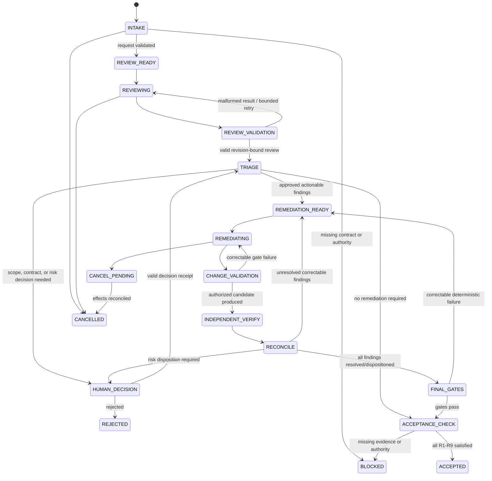

# Run record

- Case: `AWD-E1`
- Condition: `candidate`
- Prompt: Design a durable review-and-remediation agent workflow. I need the state machine, authority boundaries, typed handoffs, retry semantics, resumability, independent verification, and failure recovery. Do not choose or implement an orchestration runtime yet.
- Expected routing: `agent-workflow-design`
- Loaded skills observed in Codex events: `agent-workflow-design`
- Final response:

## Workflow status: Conditional

The workflow is design-ready and runtime-neutral. It remains conditional on four policy choices: what revisions may be reviewed, who may approve scope changes and risk acceptance, which verification commands are authoritative, and whether the workflow may create commits or only prepare a working-tree change.

## 1. Outcome contract

Goal: produce a remediated software revision whose identified material defects are resolved or explicitly dispositioned, and whose acceptance is supported by independent, revision-bound evidence.

Requirements:

- `R1` Review an immutable source snapshot against an immutable review contract.
- `R2` Record findings as falsifiable, evidence-backed claims.
- `R3` Permit remediation only within an approved write scope.
- `R4` Independently verify the remediated revision; never accept the remediator’s self-report.
- `R5` Reconcile every original finding as `fixed`, `not_reproduced`, `accepted_risk`, `superseded`, or `open`.
- `R6` Run authoritative deterministic project gates on the exact candidate revision.
- `R7` Preserve durable state sufficient to resume after any interruption.
- `R8` Fail closed on stale evidence, unauthorized mutation, missing authority, or outcome-unknown effects.
- `R9` Require accountable human decisions for contract changes, scope expansion, material risk acceptance, and consequential publication or deployment.

Trigger:

```text
ReviewRequest {
  subject_ref,
  base_revision,
  candidate_revision,
  review_contract_ref,
  requested_by,
  policy_version
}
```

Successful terminal condition:

```text
ACCEPTED only if:
- all mandatory review dimensions were completed;
- no unresolved blocking finding remains;
- every accepted risk has a valid human decision receipt;
- deterministic gates passed on final_revision;
- independent verification inspected final_revision;
- the actual change set remained within authorized scope;
- all evidence and approvals are current and revision-bound.
```

Other terminal states:

- `REJECTED`: authoritative human or policy rejection.
- `FAILED`: bounded recovery exhausted or unrecoverable invariant violation.
- `CANCELLED`: cancellation acknowledged before further effects.
- `SUPERSEDED`: source, contract, or requested outcome was replaced.
- `PARTIAL`: useful evidence exists, but acceptance was not established.

Non-goals:

- Selecting an orchestration framework.
- Merging, deploying, or publishing without a separately authorized effect stage.
- Allowing agents to redefine the review contract or accept risk.
- Treating “review completed,” valid JSON, or green local tests as workflow success.

Core invariants:

- All findings, reviews, tests, and approvals name the exact revision they cover.
- Reviewers cannot mutate the reviewed subject.
- Remediators cannot modify workflow policy, gates, approvals, or evidence records.
- A producer cannot be the sole verifier of its own output.
- The coordinator alone advances authoritative workflow state.
- Stale or unverified evidence never advances acceptance.

## 2. Evidence ledger

Observed:

- `E1`: Repository guidance requires revision-sensitive artifacts and exact revision binding.
- `E2`: Repository guidance distinguishes evidence, technical severity, policy disposition, and human verdict.
- `E3`: `.agent-artifacts/<branch>/<workflow>/<revision>/` is the preferred artifact location, but only when safely ignored and untracked.
- `E4`: The repository already conceptualizes review as read-only and remediation as a separately bounded implementation responsibility.

Inferred:

- `I1`: The requested workflow primarily targets source-code review and remediation. This is falsified if the review subject is instead infrastructure, policy, documents, or external records.
- `I2`: Multiple remediation iterations may be necessary, but concurrent writers are not necessary for the baseline design.

Assumed:

- `A1`: Git revisions or an equivalent immutable snapshot identity are available. Revalidate during intake.
- `A2`: The project can declare deterministic verification commands. Revalidate before remediation begins.
- `A3`: Reviewer and remediator can operate with separately enforced permissions. Revalidate during runtime selection.
- `A4`: Durable workflow storage will support conditional writes or equivalent concurrency control.

Open:

- `Q1`: Who owns material-risk acceptance?
- `Q2`: May remediation produce commits, or only a proposed working-tree patch?
- `Q3`: Which paths, generated files, migrations, and dependency changes require extra approval?
- `Q4`: Which test, build, security, and policy gates are authoritative?
- `Q5`: What severity threshold makes a finding blocking?
- `Q6`: What retention and redaction policy applies to prompts, patches, logs, and evidence?

## 3. State machine



Any active state may transition to:

- `STALE` when its source revision, contract, policy, or approval changes.
- `SUPERSEDED` when a newer request explicitly replaces it.
- `FAILED` when a non-recoverable invariant is violated.
- `PARTIAL` when budgets expire but useful evidence can be retained.

Only deterministic orchestration may execute transitions.

## 4. Phase map

| Phase | Kind | Owner | Purpose and output |
|---|---|---|---|
| Intake | Deterministic | Coordinator | Resolve immutable source identity, contract, policy, authority, budgets, and artifact storage |
| Review | Model | Independent reviewer | Semantic investigation and falsifiable findings; no writes to subject |
| Review validation | Deterministic | Gate service | Validate schema, provenance, revision binding, evidence references, and review coverage |
| Triage | Deterministic + human | Coordinator / accountable owner | Apply severity policy and identify decisions automation cannot make |
| Remediation | Model | Remediator | Produce bounded code changes and an implementation claim manifest |
| Change validation | Deterministic | Gate service | Compare actual mutations with authorized paths and protected state |
| Independent verification | Model | Fresh verifier | Reassess findings and look for regressions without producer context or authority |
| Finding reconciliation | Deterministic | Coordinator | Join original findings, implementation claims, and verification results by stable IDs |
| Final gates | Deterministic | Gate service | Run authoritative commands against the exact final candidate |
| Acceptance | Deterministic + human receipts | Coordinator | Evaluate `R1–R9`; no model decides acceptance |
| Publication/deployment | Out of scope | Separate authority | Requires its own approval and effect-reconciliation contract |

Models are used only where semantic code understanding, hypothesis formation, or adversarial evaluation is required.

## 5. Typed handoffs

Use versioned, phase-specific contracts rather than a generic message envelope.

```ts
type RevisionIdentity = {
  repositoryId: string;
  baseRevision: string;
  subjectRevision: string;
  workingTreeDigest?: string;
};

type EvidenceRef = {
  artifactId: string;
  digest: string;
  mediaType: string;
  producerPhaseId: string;
};

type Finding = {
  findingId: string;
  revision: RevisionIdentity;
  contractRequirementIds: string[];
  category: string;
  severity: "info" | "low" | "medium" | "high" | "critical";
  blockingRecommendation: boolean; // claim, not policy decision
  locationRefs: string[];
  observedEvidence: EvidenceRef[];
  expectedBehavior: string;
  observedBehavior: string;
  falsificationProcedure: string;
  remediationConstraintIds: string[];
  confidence: "low" | "medium" | "high";
};

type ReviewResult = {
  schemaVersion: "review-result/v1";
  runId: string;
  phaseId: string;
  attempt: number;
  revision: RevisionIdentity;
  reviewerIdentity: string;
  reviewerContextDigest: string;
  dimensionsCompleted: string[];
  findings: Finding[];
  limitations: string[];
  evidenceRefs: EvidenceRef[];
};
```

```ts
type RemediationResult = {
  schemaVersion: "remediation-result/v1";
  runId: string;
  phaseId: string;
  attempt: number;
  inputRevision: RevisionIdentity;
  outputRevision: RevisionIdentity;
  addressedFindingIds: string[];
  claimedChangedPaths: string[];
  verificationClaims: Array<{
    commandId: string;
    outcome: "pass" | "fail" | "not_run";
    receiptRef?: EvidenceRef;
  }>;
  unresolved: Array<{
    findingId: string;
    reason: string;
    requestedDecision?: string;
  }>;
};
```

```ts
type VerificationResult = {
  schemaVersion: "verification-result/v1";
  reviewedRevision: RevisionIdentity;
  verifierIdentity: string;
  independentFromProducer: boolean;
  findingResults: Array<{
    findingId: string;
    status: "fixed" | "still_present" | "not_reproduced" | "invalidated";
    evidenceRefs: EvidenceRef[];
  }>;
  regressionFindings: Finding[];
  limitations: string[];
};

type HumanDecisionReceipt = {
  decisionId: string;
  decisionType: "scope_change" | "contract_change" | "risk_acceptance" | "reject";
  accountableActor: string;
  revision: RevisionIdentity;
  findingIds: string[];
  decision: string;
  rationale: string;
  issuedAt: string;
  expiresAt?: string;
  policyVersion: string;
};
```

Fields such as final acceptance, authority, approval validity, and policy compliance are coordinator-owned and must never be accepted from model output.

## 6. Independent gates and final acceptance

| Claim | Independent gate |
|---|---|
| Review covered the contract | Compare completed dimension IDs with the versioned review contract |
| Finding concerns current code | Verify all locations and evidence against the named source revision |
| Remediator changed only allowed files | Compute actual before/after change set, including deletions and reversions |
| Finding was fixed | Fresh verifier reproduces or falsifies it on the exact output revision |
| Tests passed | Coordinator runs the registered command and records exit status, environment, logs, and revision |
| No regression was introduced | Required regression suite plus independent semantic review |
| Risk was accepted | Validate a current human receipt covering the exact finding and revision |
| Artifact exists | Read it back, validate digest, type, non-emptiness, and provenance |
| External effect occurred | Read authoritative state or reconcile an idempotency/effect receipt |

Final acceptance is a fresh computation over authoritative state. It is not a stored model verdict.

## 7. Authority boundaries

Coordinator:

- Owns state transitions, leases, budgets, policy evaluation, evidence registration, and final acceptance.
- May invoke effects only through explicitly authorized adapters.
- Cannot manufacture human decisions.

Reviewer:

- Read-only access to subject revision and declared evidence.
- Cannot mutate code, review contract, policies, approvals, or findings after registration.
- Does not receive remediator rationale during independent verification.

Remediator:

- Writes only to an isolated workspace and approved path set.
- Cannot access approval credentials or mutate coordinator state.
- Cannot modify workflow definitions, gate configuration, evidence store, test commands, reviewer configuration, or protected branch state.
- Dependency, migration, generated-code, or security-sensitive changes can require separate approval.

Verifier:

- Read-only access to the exact candidate revision.
- Fresh context and no shared writable state with the remediator.
- Cannot disposition risk or approve the workflow.

Human owner:

- Owns changes to intended behavior, scope, architecture, policy exceptions, and material-risk acceptance.
- Decisions must be explicit, attributable, revision-bound, and optionally expiring.

A shell or general filesystem capability is not itself a boundary. The eventual runtime must enforce isolation; otherwise the coordinator must compare complete before/after state and fail closed.

## 8. Retry semantics

| Failure class | Recovery |
|---|---|
| Malformed model result | Retry the same phase with exact schema errors; maximum 2 repair attempts |
| Semantically invalid handoff | Retry only if the source remains current and violations are correctable |
| Correctable remediation gate failure | Return concrete violations to the same remediator; maximum 3 remediation attempts |
| Independent finding remains | Start a new remediation attempt with verifier evidence, not an automatic prompt replay |
| New regression finding | Add a stable finding ID, re-triage severity and scope |
| Transient deterministic failure | Retry only named idempotent error classes with bounded exponential backoff |
| Flaky verification | Apply declared flake policy; never repeatedly rerun until green |
| Stale revision or contract | No retry; invalidate affected evidence and rebase/restart from the earliest safe state |
| Unauthorized mutation | Quarantine workspace, preserve evidence, and fail or require human recovery |
| Missing approval or policy denial | Block; do not ask a model to work around it |
| Repeated equivalent failure | Stop after two materially unchanged failure signatures |
| Budget exhaustion | End `PARTIAL` or `FAILED`, preserving unresolved findings and evidence |

Budgets should cover attempts, wall time, tokens/cost, total changed lines/files, and deterministic command duration. Budget extensions are human policy decisions.

## 9. Resumability and recovery

Persist a checkpoint after every accepted transition and before/after every consequential effect:

```ts
type WorkflowCheckpoint = {
  schemaVersion: "review-remediation-checkpoint/v1";
  runId: string;
  state: string;
  stateVersion: number;
  sourceIdentity: RevisionIdentity;
  reviewContractDigest: string;
  policyVersion: string;
  activePhase?: {
    phaseId: string;
    attempt: number;
    leaseOwner: string;
    leaseExpiresAt: string;
  };
  acceptedTransitionIds: string[];
  evidenceReceiptIds: string[];
  decisionReceiptIds: string[];
  retryBudgets: Record<string, number>;
  pendingEffects: string[];
  cancellationRequested: boolean;
  supersededByRunId?: string;
};
```

On resume:

1. Acquire a compare-and-set lease.
2. Re-read repository revision, working-tree digest, contract, policy, approvals, and external effects.
3. Compare them with the checkpoint.
4. Invalidate evidence whose revision, policy, environment, or approval is stale.
5. Reconcile any `pendingEffect` through idempotency key or authoritative read-back.
6. Resume from the earliest state whose prerequisites remain valid.

Late worker results are accepted only when their `runId`, `phaseId`, attempt, lease generation, input revision, and state version still match. Otherwise they are recorded as late evidence and ignored.

Cancellation becomes `CANCEL_PENDING` while an effect may be in flight. The workflow reaches `CANCELLED` only after that effect is confirmed absent, completed, or explicitly marked outcome-unknown and escalated.

## 10. Observability and trajectory verification

Record an append-only event stream containing:

- Run, phase, attempt, transition, and lease identities.
- Source, candidate, contract, policy, tool, model, and instruction versions.
- Input/output schema digests.
- Actual mutation sets and protected-path checks.
- Gate invocation, exact command/environment, result, and evidence receipt.
- Human decisions and approval expiry.
- Retry classification, budget consumption, and no-progress signatures.
- Cancellation, staleness, supersession, reconciliation, and terminal reason.
- Artifact digests and access-controlled provenance.

Required workflow tests:

- Invalid transitions and forged acceptance are rejected.
- Malformed and semantically invalid handoffs cannot advance state.
- A reviewer or verifier cannot mutate the subject.
- A remediator cannot change policy, gates, approvals, or evidence.
- Unclaimed deletions, reversions, and out-of-scope writes are detected.
- Review results for revision A cannot approve revision B.
- Late, duplicated, or superseded worker results are ignored.
- Restart before and after each checkpoint resumes at the correct state.
- Crash after an effect request but before its receipt reconciles safely.
- Expired or amended approval invalidates acceptance.
- Repeated identical failures stop rather than loop.
- Cancellation during remediation and effect execution is recoverable.
- All phases can “execute successfully” while final acceptance still correctly fails.

No orchestration runtime is selected by this design. Runtime evaluation should later be based on whether candidates can enforce these contracts—especially durable conditional state updates, isolated write scopes, revision-bound evidence, leases, idempotent effects, and independent verifier contexts.

Outcome checks remain `not_verifiable` until reviewed against the suite rubric.
