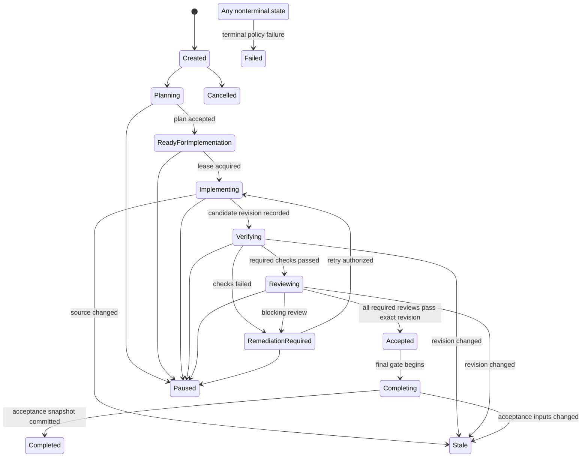

# Run record

- Case: `AWD-E2`
- Condition: `candidate`
- Prompt: We have a supervisor agent that keeps the whole coding workflow in its chat history: it delegates implementation, remembers which reviewer passed, retries failures itself, and decides when the run is complete. Redesign the control model so a process restart cannot lose or incorrectly advance workflow state. I only want the architecture and contracts, not implementation code.
- Expected routing: `agent-workflow-design`
- Loaded skills observed in Codex events: `agent-workflow-design`
- Final response:

## Workflow status: Conditional

The redesign is restart-safe if the workflow engine and durable store become authoritative, while agents are reduced to bounded workers that submit claims. Remaining assumptions concern repository isolation, approval policy, and external effect semantics; none should be inferred by an agent.

The central rule is:

> Conversation history may help a worker reason, but it never establishes workflow state, authorization, acceptance, retries, or completion.

The textual transition contracts below are authoritative; the diagram is only a summary.

## 1. Outcome contract

### Requirements

- `R1` A process restart must not lose any accepted transition, attempt count, approval, review verdict, or effect receipt.
- `R2` Restart must never advance a run merely because an agent previously claimed success.
- `R3` Every implementation, test, and review result must bind to an exact immutable source revision and workflow input version.
- `R4` Completion requires deterministic evaluation of all configured acceptance gates against one acceptance snapshot.
- `R5` Duplicate, delayed, or retried worker results must be harmless.
- `R6` A worker must not control its own retry authorization, acceptance, reviewer selection, or terminal state.
- `R7` The system must distinguish execution success, valid output, review verdict, and overall acceptance.
- `R8` Cancellation, supersession, stale evidence, retry exhaustion, and uncertain external effects must have explicit states.
- `R9` Operators must be able to reconstruct why every transition occurred from durable evidence.
- `R10` Workers cannot modify the control plane, policies, evidence records, or acceptance configuration used to judge them.

### Trigger

A versioned workflow request is accepted with:

- stable `run_id`;
- immutable request/specification reference and digest;
- pinned base repository revision;
- workflow-definition and policy versions;
- required gates and accountable approval owners.

### Terminal states

- `Completed`: all acceptance gates passed for the same acceptance snapshot.
- `Failed`: a non-retryable failure or retry budget exhaustion was durably recorded.
- `Cancelled`: authorized cancellation was recorded and outstanding leases invalidated.
- `Superseded`: a newer request explicitly replaced the run.

`Paused` and `Stale` are nonterminal blocked states. They cannot silently become `Completed`.

### Non-goals

- Preserving an agent’s entire conversation as authoritative state.
- Allowing a supervisor model to invent transitions or retry policy.
- Treating “worker finished,” valid JSON, tests executed, or reviewer responded as completion.
- Automatically carrying review approval across a changed revision.

## 2. Evidence ledger

- `E1` The current supervisor holds delegation, reviewer, retry, and completion state in chat history.
- `E2` A process restart can therefore remove or distort state needed for correct control decisions.
- `I1` The supervisor currently combines probabilistic reasoning with authoritative orchestration. This is falsified if an existing durable coordinator already independently enforces every transition.
- `A1` Repository revisions can be given immutable identities. If not, acceptance cannot safely bind evidence to code.
- `A2` Workers can operate in isolated workspaces or branches. Without isolation, concurrent writers must be disabled.
- `A3` Gate commands and required reviewer classes can be configured deterministically.
- `Q1` Which changes require human product, architecture, security, or deployment approval?
- `Q2` Are there external side effects such as PR creation, merging, deployment, or ticket updates?
- `Q3` What retention, privacy, and audit requirements apply to evidence?

## 3. Control-plane architecture

Use five separable components.

1. **Durable workflow store**

   The sole authority for run state, transition history, leases, attempts, evidence references, approvals, and effect receipts. Writes use transactions and optimistic concurrency.

2. **Deterministic coordinator**

   Reads durable state, evaluates transition guards, issues work, validates result envelopes, applies retry policy, and computes final acceptance. It does not depend on a model session.

3. **Task queue and lease manager**

   Delivers work at least once. Each assignment has a durable identity, attempt number, lease token, deadline, and input-state version. Duplicate delivery is expected.

4. **Bounded model workers**

   Planning, implementation, diagnosis, and semantic review workers receive reconstructed task-specific context. They return typed claims and artifact references. They cannot mutate workflow state directly.

5. **Independent gate/effect services**

   Deterministic tests, policy checks, repository inspection, artifact verification, external writes, and read-back reconciliation run outside model authority.

A chat transcript may be stored as a diagnostic artifact, but rebuilding or advancing the run from transcript interpretation is forbidden.

## 4. State and transition contract

Every state-changing command carries:

- `command_id`: globally unique idempotency key;
- `run_id`;
- expected `run_version`;
- expected current state;
- actor identity and authority class;
- referenced assignment or approval identity;
- evidence references;
- timestamp supplied by the control plane;
- transition reason code.

A transition commits atomically:

1. validate expected version and transition guard;
2. append an immutable event;
3. update the current-state projection;
4. create any resulting assignments or outbox effects;
5. increment `run_version`.

Conflicting or repeated commands never get reinterpreted by a model:

- Same `command_id`, same payload: return the original receipt.
- Same `command_id`, different payload: reject as an integrity violation.
- Wrong `run_version`: reject as stale.
- Invalid source state: reject.
- Late result from an expired lease: retain for audit but do not advance state.
- Result for a superseded revision: mark stale and do not advance state.

The event log is the durable raw record. Current-state tables and dashboards are rebuildable projections, not competing authorities.

## 5. Phase map

| Phase | Kind | Owner | Durable output | Advancement condition |
|---|---|---|---|---|
| Intake and pinning | Deterministic | Coordinator | Request digest, base revision, policy version | Inputs resolvable and policy valid |
| Planning | Model, if needed | Planner | Structured plan and scope claims | Schema/policy checks and required approval |
| Work assignment | Deterministic | Coordinator | Assignment plus lease | Dependencies satisfied |
| Implementation | Model | Isolated implementer | Candidate revision and change manifest | Revision exists; scope and provenance verified |
| Mechanical verification | Deterministic | Gate service | Test and policy receipts | All required mechanical gates pass |
| Failure diagnosis | Model, if needed | Diagnostician | Failure classification and remediation proposal | Classification accepted; retry policy permits |
| Semantic review | Model or human | Independent reviewer | Revision-bound verdict | Valid verdict from required reviewer class |
| Retry decision | Deterministic/human | Coordinator or approval owner | Retry authorization or terminal reason | Budget, policy, and progress guards satisfied |
| Final acceptance | Deterministic | Coordinator | Acceptance snapshot | Every required gate passes the identical snapshot |
| External completion effect | Deterministic | Effect service | Idempotent effect/read-back receipt | Effect reconciled with authoritative external state |

Models are justified only for semantic planning, code production, diagnosis, or review. Routing, counting, parsing, test execution, state changes, and completion are deterministic.

## 6. Handoff contracts

### Work assignment

Must include:

- `assignment_id`, `run_id`, `phase_id`, `attempt`;
- lease token and expiry;
- workflow-definition and policy versions;
- pinned base revision and expected input revision;
- bounded objective and acceptance criteria;
- permitted write set and protected paths;
- available evidence references;
- required result schema version.

### Implementation result

Must include:

- assignment and attempt identities;
- observed base revision;
- produced candidate revision;
- claimed changed paths;
- requirement-to-change mapping;
- tests the worker claims it ran;
- artifact references;
- status: `candidate_produced`, `blocked`, or `failed`;
- blocker or failure classification.

It may not declare tests authoritative, reviews passed, retry allowed, or workflow complete.

### Verification receipt

Must include:

- gate identity and configuration version;
- exact candidate revision;
- invocation identity;
- exit/result classification;
- checked scope and captured artifacts;
- start/end timestamps;
- status: `passed`, `failed`, `inconclusive`, or `infrastructure_error`.

A successfully executed failing test is `failed`, not `passed`.

### Review verdict

Must include:

- reviewer identity and independence class;
- exact candidate revision and relevant input digests;
- review rubric version;
- findings with severity and evidence locations;
- verdict: `pass`, `block`, or `inconclusive`;
- conflicts or limitations.

A pass applies only to the exact revision reviewed. Any subsequent code change invalidates it.

### Acceptance snapshot

Must contain:

- run and workflow versions;
- specification digest;
- base and candidate revisions;
- complete required-gate set;
- accepted receipt identities;
- approval identities and expiry state;
- policy version;
- external-state versions, if relevant.

`Completed` is permitted only when one deterministic evaluation finds the snapshot complete and internally consistent.

## 7. Reviewer and acceptance rules

Reviewer memory is replaced by durable, revision-bound verdict records.

For each required review slot, configure:

- reviewer class, such as correctness, security, or human owner;
- independence requirement;
- applicable scope;
- rubric version;
- blocking severity threshold;
- expiry or invalidation rule.

The coordinator fills review slots from accepted verdicts. A reviewer response does not itself fill a slot until its schema, provenance, revision, authority, and independence constraints pass.

Final acceptance requires:

- candidate revision still exists and is current;
- no unauthorized mutations;
- all deterministic gates passed that revision;
- all required review slots passed that revision;
- required approvals remain valid;
- no unresolved blocking findings;
- no active cancellation, supersession, or stale marker;
- all consequential effects are either not started or reconciled as required.

## 8. Capability and authority boundaries

- Workers receive no credentials that can write workflow state or evidence records.
- Implementers write only to isolated repository workspaces.
- Reviewers are read-only with respect to the candidate and cannot amend their reviewed revision.
- Workflow definitions, gate configuration, reviewer policy, protected branches, and evidence stores are outside worker write scope.
- The coordinator is the only transition authority, but even it is constrained by deterministic guards.
- Human approvals are signed or authenticated records identifying scope, revision, decision, and expiry.
- External mutations go through an effect service using narrow credentials, idempotency keys, expected-version checks, and read-back.
- Parallel implementation is allowed only with isolated mutable state and an explicit integration phase.

A general shell in a worker environment must not have ambient access capable of bypassing these boundaries.

## 9. Retry and recovery model

Retry state is durable and policy-owned:

- malformed result: bounded resubmission for the same assignment;
- transient deterministic infrastructure failure: coordinator retry with backoff, only for classified idempotent operations;
- failed code/test/review gate: new implementation attempt derived from recorded violations;
- stale revision or changed specification: invalidate affected evidence and return to the earliest safe phase;
- policy denial, missing approval, unsafe scope expansion: pause, do not retry;
- retry budget exhaustion or repeated no-progress signature: fail or require human intervention.

No-progress detection should compare failure fingerprints, candidate revisions, changed paths, and remediation claims. Repeating equivalent attempts does not reset budgets.

### Restart procedure

On startup, the coordinator:

1. loads durable nonterminal runs;
2. rebuilds projections from the event log if necessary;
3. expires or reconciles abandoned leases;
4. re-reads repository and external authoritative state;
5. marks mismatched evidence stale;
6. checks outbox entries and uncertain effects;
7. requeues only assignments whose guards still hold;
8. resumes from the earliest safe state.

It never asks a supervisor model, “What were we doing?”

### Uncertain external effects

Use a transactional outbox plus stable effect idempotency key. If the process dies after sending an effect but before recording success, the effect service first queries authoritative external state:

- observed applied: record reconciled receipt;
- observed not applied: safely retry if policy permits;
- outcome unknowable: enter `EffectUnknown`/paused state for operator resolution.

Blind replay is prohibited.

## 10. Observability and trajectory verification

Persist events for:

- commands accepted and rejected;
- transitions and guard evaluations;
- assignments, leases, expiries, and duplicates;
- worker result validation;
- source and candidate revision observations;
- every gate’s checked scope and receipt;
- reviewer verdicts and invalidations;
- retry decisions and budget consumption;
- approvals, cancellations, and supersession;
- external effect requests and reconciliation;
- final acceptance evaluation and terminal reason.

Required workflow tests include:

- restart before and after every transition commit;
- crash after assignment creation but before delivery;
- duplicate delivery and duplicate result submission;
- late result after lease expiry;
- review pass followed by revision change;
- all phases “executed” while a required gate failed;
- retry exhaustion and equivalent no-progress attempts;
- cancellation racing with worker completion;
- specification or base-revision supersession;
- crash before and after an external effect;
- worker attempts to alter control-plane or gate files;
- corrupted projection rebuilt from the event log;
- expired approval during final acceptance.

## Human decisions and open contracts

Before declaring the design fully `Ready`, accountable owners must define:

- which semantic decisions require humans rather than model reviewers;
- reviewer independence rules;
- retry/time/cost budgets;
- protected repository and control-plane paths;
- approval expiration and amendment semantics;
- external effects and their reconciliation APIs;
- retention and privacy policy for prompts, artifacts, and evidence;
- whether completion means “accepted candidate,” “merged,” or “deployed.”

Until those are set, the engine must fail closed at the affected transition. The key architectural shift remains fixed: durable deterministic orchestration owns truth; agents produce bounded, revision-linked claims that only independently validated evidence can advance.

Outcome checks remain `not_verifiable` until reviewed against the suite rubric.
