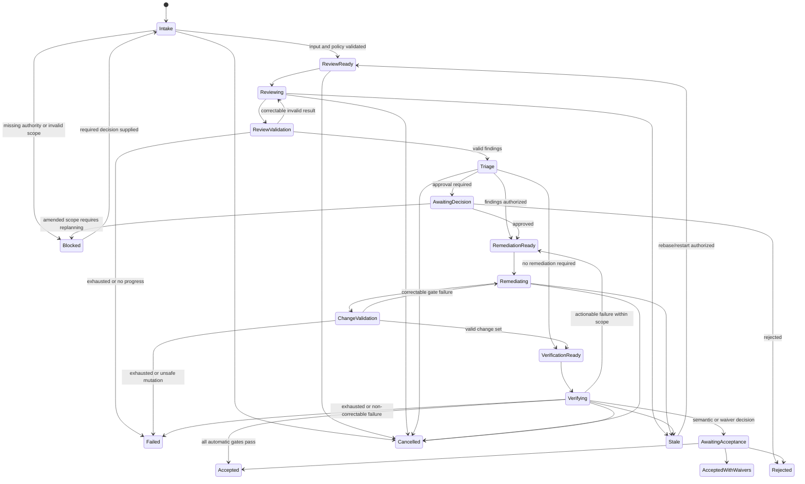

# Run record

- Case: `DW-E3`
- Condition: `baseline`
- Prompt: Design a durable agent workflow for a review-and-remediation process. I need the state machine, authority boundaries, retry semantics, resumability, and verification model, but do not choose or implement a runtime yet.
- Expected routing: `agent-workflow-design`
- Loaded skills observed in Codex events: `agent-workflow-design`
- Final response:

## Workflow status: Conditional

The design is durable and runtime-neutral, but activation depends on four policy decisions: what may be remediated automatically, who accepts residual risk, which checks are mandatory, and which systems permit reversible/idempotent writes. Until configured, consequential effects remain blocked.

## 1. Outcome contract

The workflow reviews a versioned target, identifies substantiated findings, performs only authorized remediations, and independently verifies the exact resulting state.

Requirements:

- `R1` — Every review is bound to an immutable target identity: repository revision, document version, configuration digest, or equivalent.
- `R2` — Findings contain evidence, severity, affected scope, and a falsifiable acceptance condition.
- `R3` — Only approved findings enter remediation.
- `R4` — Remediation occurs in isolated mutable state and cannot alter workflow controls or evidence.
- `R5` — Mechanical and semantic checks independently verify the resulting exact revision.
- `R6` — Final acceptance requires all mandatory findings resolved, explicitly waived, or rejected with an accountable decision.
- `R7` — Every transition, decision, effect, and verification result is durably reconstructible.
- `R8` — Interruption, duplication, stale results, cancellation, and outcome-unknown effects cannot silently advance the workflow.

Trigger: a request containing the target identity, review policy version, requested scope, and initiator.

Terminal states:

- `Accepted` — all outcome gates pass.
- `AcceptedWithWaivers` — gates pass and every residual finding has an authorized waiver.
- `Rejected` — an accountable owner declines remediation or acceptance.
- `Cancelled` — cancellation is recorded; no further effects permitted.
- `Failed` — retry/recovery budget exhausted.
- `Superseded` — a newer run or target version replaces this run.

Invariants:

- State is advanced only by the coordinator, never by a model.
- Evidence and approvals are append-only or versioned.
- Review, remediation, and verification remain bound to exact state identities.
- A producer cannot approve or independently verify its own work.
- Workers cannot modify policies, gates, approvals, workflow state, or evidence receipts.
- Successful phase execution is not equivalent to valid output or workflow acceptance.
- Late results from expired leases or obsolete revisions are recorded but cannot advance state.

Non-goals:

- Choosing an orchestration framework, queue, database, model, or deployment platform.
- Automatically making product, security, compliance, or risk-acceptance decisions.
- Deploying verified changes unless deployment is later added as a separate workflow.

## 2. Evidence ledger

- `E1` — The requested process requires review, remediation, verification, retries, and resumability.
- `E2` — No runtime or enforcement environment has been selected.
- `I1` — Reviews may contain semantic findings that deterministic rules alone cannot discover. Falsified if the review policy consists entirely of executable checks.
- `A1` — The target can be assigned an immutable identity or digest. Without this, verification cannot be safely bound to reviewed state.
- `A2` — Remediation can occur in an isolated workspace or equivalent versioned transaction.
- `A3` — Consequential external writes provide idempotency, expected-version checks, or authoritative read-back.
- `Q1` — Which finding classes permit automatic remediation?
- `Q2` — Which severities require human approval or prohibit waivers?
- `Q3` — What are the retry, time, cost, and concurrency budgets?
- `Q4` — Which checks constitute mandatory final acceptance?

## 3. State machine



`Paused` is an execution condition, not evidence of business progress. A paused run retains its current state, releases or expires leases, and must reconcile on resume.

## 4. Phase map

| Phase | Kind | Owner | Result |
|---|---|---|---|
| Intake and normalization | Deterministic | Coordinator | Validated run snapshot and immutable target identity |
| Policy/scope approval | Human or deterministic | Accountable owner/policy engine | Signed decision receipt |
| Mechanical review | Deterministic | Check runners | Reproducible check receipts |
| Semantic review | Model | Reviewer | Structured candidate findings |
| Finding validation | Deterministic, optionally independent model/human | Coordinator/evaluator | Accepted, rejected, or disputed findings |
| Triage | Deterministic plus human for policy exceptions | Coordinator/owner | Authorized remediation set |
| Remediation planning | Model when synthesis is needed | Remediator | Proposed actions mapped to findings |
| Remediation execution | Deterministic tools or bounded model worker | Isolated worker | Change set and effect receipts |
| Change-scope validation | Deterministic | Coordinator | Authorized diff and protected-state checks |
| Mechanical verification | Deterministic | Independent check runner | Exact-revision results |
| Semantic verification | Fresh model or human | Independent verifier | Finding-by-finding verdicts |
| Final acceptance | Deterministic gate plus human where required | Coordinator/accountable owner | Terminal decision receipt |

Models are used only for semantic interpretation, investigation, synthesis, or evaluation. Parsing, routing, transitions, hashing, policy enforcement, diffing, test execution, budgets, and persistence remain deterministic.

## 5. State and authority model

The authoritative store contains:

- `run_id`, `workflow_schema_version`, and current state;
- immutable target identity and current candidate identity;
- policy and instruction versions;
- finding, action, attempt, approval, artifact, and receipt identifiers;
- leases with owner, epoch, and expiry;
- retry and resource budgets;
- cancellation, supersession, and terminal reasons;
- an append-only transition/event history.

Transitions use compare-and-set semantics against the expected state and state version. A transition must include its prerequisite evidence references. Duplicate commands return the recorded result; conflicting commands fail closed.

Freshness rules:

- Review evidence is invalid if the target identity changes.
- Remediation authorization is invalid if findings, scope, or policy changes materially.
- Verification is valid only for the exact candidate identity inspected.
- Approval validity includes subject identity, scope, policy version, issuer, timestamp, and optional expiry.
- A newer target does not silently replace the current target; it makes the run `Stale` or `Superseded`.

Pause stops scheduling new work. Cancellation also revokes leases and prohibits new effects, while allowing reconciliation of already-requested effects.

## 6. Handoff contracts

Each handoff includes:

```text
schema_version
run_id
phase_id
attempt_id
lease_epoch
input_state_identity
policy_version
status
claims[]
artifact_refs[]
effect_receipt_refs[]
producer_identity
created_at
```

Core result types:

- `ReviewResult`: candidate findings with `finding_id`, category, severity, affected locations, evidence references, rationale, confidence, and acceptance criteria.
- `TriageDecision`: disposition per finding—`remediate`, `waive`, `reject`, `defer`, or `needs_clarification`—plus authority receipt.
- `RemediationResult`: addressed finding IDs, proposed/actual changes, candidate state identity, changed resources, and unresolved conditions.
- `VerificationResult`: exact candidate identity, checks performed, evidence receipts, and per-finding status—`verified_resolved`, `still_present`, `regressed`, or `not_verifiable`.
- `AcceptanceDecision`: terminal disposition, satisfied requirements, waiver receipts, and residual risks.

Model-generated fields are claims. Models may recommend severity, remediation, or disposition, but cannot authoritatively grant permission, mark a gate passed, issue a waiver, or declare final acceptance.

## 7. Gate and acceptance model

| Claim | Independent gate |
|---|---|
| Target reviewed | Review input digest equals authoritative target digest |
| Finding is supported | Evidence exists, location resolves, schema and policy rules pass |
| Remediation was authorized | Approval/policy receipt matches finding set and scope |
| Only allowed resources changed | Before/after comparison includes edits, deletions, reversions, and external effects |
| Control plane remained intact | Protected-resource digest and permissions remain unchanged |
| Tests/checks pass | Coordinator executes configured commands and records complete results |
| Finding is resolved | Verifier evaluates the acceptance criterion against the exact candidate identity |
| No regression occurred | Mandatory regression suite and policy checks pass |
| External effect succeeded | Idempotency receipt or authoritative read-back confirms expected state |
| Workflow is complete | Every `R#` maps to current, non-stale evidence |

Final acceptance requires all mandatory gates to pass, no unauthorized mutations, no unresolved blocking findings, valid approvals/waivers, and verification bound to the exact candidate state.

## 8. Authority boundaries

Coordinator:

- Owns sequencing, state, leases, policy evaluation, budgets, and acceptance.
- May schedule effects but does not invent approvals.

Reviewer:

- Read-only access to the target and relevant evidence.
- May propose findings; cannot mutate the target or approve remediation.

Remediator:

- Writes only to an isolated candidate workspace or explicitly scoped external resources.
- Cannot write workflow definitions, policy, gate configuration, approvals, evidence stores, verifier configuration, or source-of-truth target state.
- Receives narrowly scoped credentials and network access.

Verifier:

- Read-only access to the candidate and evidence.
- Uses a fresh context independent of the remediator.
- Cannot modify the candidate or waive findings.

Human owner:

- Owns scope changes, risk acceptance, waivers, policy exceptions, and consequential approvals.

If the eventual runtime cannot enforce boundaries before execution, the workflow must capture complete before/after state and reject unauthorized changes. That is weaker than preventive isolation and should exclude high-impact automatic remediation.

Parallel remediation is allowed only for disjoint, isolated state. A deterministic integration owner merges changes and reruns all applicable verification.

## 9. Retry semantics

| Failure class | Response |
|---|---|
| Malformed model output | Retry the same phase with validation errors; no effects |
| Unsupported or contradictory finding | One evidence-correction attempt, then reject/dispute or escalate |
| Transient deterministic error | Bounded idempotent retry with backoff and jitter |
| Failed remediation gate | Return concrete violations to the same worker if scope is unchanged |
| Failed implementation hypothesis | Require a changed diagnosis/action plan; count equivalent attempts as no progress |
| Independent verification failure | Return to remediation only when authorized and actionable |
| Stale input or revision | Do not retry; invalidate dependent evidence and re-enter at the earliest safe state |
| Missing authority or policy denial | Block; never retry automatically |
| Unauthorized mutation | Stop effects, preserve evidence, quarantine candidate, escalate |
| Outcome-unknown external effect | Reconcile by idempotency key/read-back before any replay |
| Expired lease or late result | Record result but reject transition |
| Budget exhaustion or oscillation | Fail or request accountable intervention |

Budgets should exist per phase and run: attempts, elapsed time, model/tool cost, effect count, and optionally changed-resource size.

No progress includes identical failure signatures, materially equivalent patches, repeated unchanged findings, state oscillation, or declining evidence quality. Crossing the threshold stops automated retries.

## 10. Resumability and recovery

Checkpoint after every accepted transition and before/after every consequential effect. A checkpoint records the state version, exact target/candidate identities, completed evidence, approvals, outstanding effect intents, lease state, and remaining budgets.

On resume:

1. Acquire a new lease epoch.
2. Read authoritative workflow state.
3. Re-read target, candidate, policy, approvals, and external effect state.
4. Compare them with checkpoint identities.
5. Mark stale evidence and invalidate downstream transitions.
6. Reconcile any effect that was requested but lacks a final receipt.
7. Resume from the earliest state whose prerequisites still hold.

Never resume from conversational history alone. Completed work may be reused only when its evidence remains current.

For an interruption:

- Before an effect request: safely repeat the phase.
- After intent persistence but before dispatch: dispatch once using the recorded idempotency key.
- After dispatch but before receipt: query authoritative state; do not blindly replay.
- After local mutation but before change recording: reconstruct the complete diff from the isolated workspace.
- During verification: discard partial verdicts unless individual checks have durable, exact-state receipts.

## 11. Observability and trajectory verification

Record structured events for phase starts/ends, transition attempts, leases, model/instruction versions, context manifests, validation errors, tool/effect requests, receipts, findings, approvals, changes, checks, retries, stale results, cancellations, reconciliation, and terminal decisions.

Sensitive prompts, credentials, or raw data need not be retained. Preserve a reconstructible context manifest containing source identities, selection rules, versions, hashes, and redaction policy.

The workflow itself should be tested against:

- invalid or out-of-order transitions;
- malformed and semantically invalid model results;
- stale, duplicate, and late results;
- unauthorized and protected-path mutations;
- verifier/remediator identity collisions;
- revision changes during every phase;
- approval expiry, amendment, rejection, and supersession;
- crashes immediately before and after effects;
- outcome-unknown external writes;
- retry exhaustion, oscillation, and duplicate scheduling;
- pause, cancel, resume, and partial completion;
- all phases “succeeding” while final acceptance gates fail;
- verification evidence referring to a different revision;
- parallel changes colliding during integration.

## Human decisions required before activation

- Define automatic-remediation categories and maximum blast radius.
- Define blocking severity and waiver authority.
- Select mandatory mechanical and semantic acceptance checks.
- Establish isolation and protected-control-plane enforcement requirements.
- Set retry, cost, latency, and concurrency budgets.
- Define retention, privacy, and audit requirements.
- Decide whether `AcceptedWithWaivers` is a permitted terminal outcome.
- Require idempotency or read-back guarantees for every external mutation.

This design intentionally leaves storage, queues, workflow engines, model providers, sandboxes, and execution runtimes unspecified.

Outcome checks remain `not_verifiable` until reviewed against the suite rubric.
