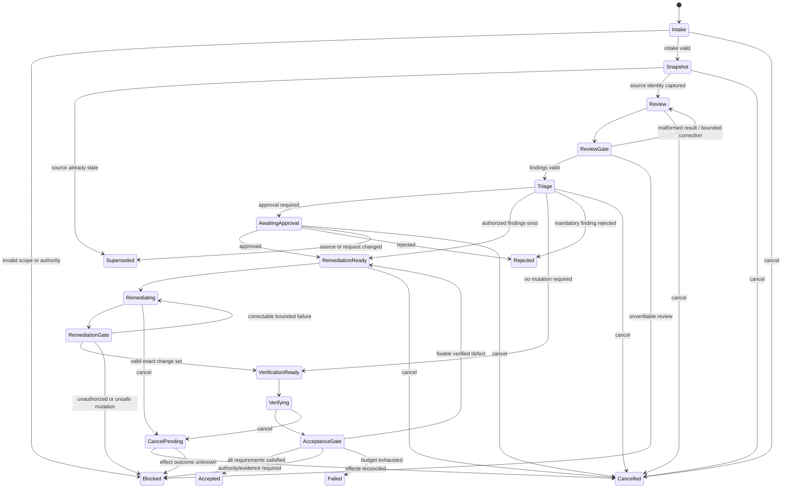

# Run record

- Case: `DW-E3`
- Condition: `candidate`
- Prompt: Design a durable agent workflow for a review-and-remediation process. I need the state machine, authority boundaries, retry semantics, resumability, and verification model, but do not choose or implement a runtime yet.
- Expected routing: `agent-workflow-design`
- Loaded skills observed in Codex events: `agent-workflow-design`
- Final response:

## Workflow status: Conditional

The workflow is runtime-neutral and implementable once the accountable owners, remediation target, risk tiers, and approval policy are defined. It must remain blocked from consequential mutations until those decisions are configured.

## 1. Outcome contract

The workflow reviews a versioned target, identifies substantiated findings, applies only authorized remediations, and independently verifies the exact resulting state.

Requirements:

- `R1` Every run is bound to an immutable review scope and source revision.
- `R2` Findings contain evidence, severity, affected scope, and a falsifiable acceptance condition.
- `R3` Deterministic policy decides whether each finding is dismissed, auto-remediable, approval-required, or prohibited.
- `R4` Mutations occur only in isolated, explicitly authorized scope.
- `R5` The remediation producer cannot approve or verify its own work.
- `R6` Verification is bound to the exact resulting revision.
- `R7` A run remains resumable across process and model-context loss.
- `R8` Retries are bounded and classified by failure semantics.
- `R9` Every transition, decision, mutation, and gate has durable evidence.
- `R10` Cancellation, supersession, drift, partial completion, and uncertain effects fail safely.

Trigger: a request containing the target identity, source revision, review policy version, scope, and requester authority.

Terminal states:

- `ACCEPTED`: all required findings are resolved or explicitly waived, and all acceptance gates pass.
- `REJECTED`: an accountable authority rejects the run or a mandatory finding.
- `BLOCKED`: authority, evidence, safety, or policy prevents progress.
- `CANCELLED`: cancellation was acknowledged and no unaccounted effect remains.
- `SUPERSEDED`: a newer request or source revision replaces the run.
- `FAILED`: retry/recovery budgets are exhausted without a safe result.

Invariants:

- No result from a stale revision advances the workflow.
- Models propose claims and actions; they do not authorize transitions.
- The durable coordinator is the sole state-transition authority.
- Protected workflow policy, evidence, approvals, and verification configuration are never writable by remediation workers.
- Acceptance requires current evidence, not merely successful phase execution.

Non-goals: choosing a runtime, implementing workers, deploying changes, or defining domain-specific review criteria.

## 2. Evidence ledger

- `E1` The requested process includes review and remediation.
- `E2` The design must cover state, authority, retries, resumability, and verification without selecting a runtime.
- `A1` The review target has a stable revision or version identifier. Revalidate at intake.
- `A2` Remediation can occur in isolated mutable state. Revalidate before remediation authorization.
- `A3` Independent verification can inspect the produced state. Revalidate before execution.
- `Q1` What is being reviewed: code, infrastructure, documents, records, or another system?
- `Q2` Which risk classes permit automatic remediation?
- `Q3` Who owns waivers, approvals, and final acceptance?
- `Q4` Which external effects lack idempotency or authoritative read-back?

## 3. State machine



`PAUSED` may overlay any nonterminal state. Resume restores the underlying state only after reconciliation.

## 4. Phase map

| Phase | Kind | Owner | Result |
|---|---|---|---|
| Intake | Deterministic | Coordinator | Validated run contract and identities |
| Snapshot | Deterministic | Snapshot service | Immutable source manifest and hash |
| Review | Model where semantic judgment is needed; otherwise deterministic | Reviewer | Finding manifest |
| Review gate | Deterministic plus independent semantic checks where necessary | Gate service | Validated findings |
| Triage | Deterministic policy, with human decisions for consequential cases | Policy engine / accountable owner | Disposition per finding |
| Remediation planning | Model | Planner | Proposed bounded changes and verification mapping |
| Remediation | Model or deterministic executor | Isolated worker | Change manifest and candidate revision |
| Remediation gate | Deterministic | Gate service | Actual-versus-authorized change assessment |
| Verification | Deterministic tests plus independent semantic reviewer | Verifier | Evidence bundle bound to candidate revision |
| Acceptance | Deterministic aggregation, with required human sign-off | Coordinator / accountable owner | Terminal verdict |

Models are justified only for semantic review, diagnosis, synthesis, and remediation choices that cannot be expressed reliably as rules.

## 5. State, identity, and authority

The authoritative store contains:

- `run_id`, `request_id`, and `workflow_schema_version`
- target, immutable `source_revision`, and policy version
- current state and monotonic transition sequence
- phase attempts, leases, deadlines, and budgets
- findings and dispositions
- approval and waiver receipts
- candidate revision and actual change set
- verification evidence
- effect requests, idempotency keys, and receipts
- terminal reason

Every transition uses compare-and-set against the expected state and sequence number. Duplicate transition requests are idempotent; late results are recorded but cannot advance state.

Authority boundaries:

- Coordinator: may validate and transition state; cannot invent findings, approvals, or evidence.
- Reviewer: read-only; may report findings but cannot authorize remediation.
- Policy engine: classifies according to versioned rules; cannot waive policy.
- Human approver: may approve, reject, or waive only within explicitly delegated scope.
- Remediator: may mutate only isolated candidate state and permitted resources.
- Verifier: read-only against the exact candidate revision; independent of the remediator.
- Acceptance gate: evaluates receipts; it cannot modify the candidate to make it pass.

Human approval is required for scope expansion, policy exceptions, high-risk changes, sensitive-data access, protected targets, production effects, and waivers of mandatory findings.

## 6. Handoff contracts

A finding should minimally contain:

```text
finding_id
review_run_id
source_revision
rule_or_criterion_id
severity
affected_locations[]
claim
evidence_refs[]
acceptance_condition
confidence
status = proposed
```

A remediation result should contain:

```text
finding_ids[]
source_revision
candidate_revision
authorized_scope_id
claimed_changes[]
actual_change_artifact_ref
verification_requirements[]
unresolved_risks[]
status = completed | partial | blocked
```

A verification result should contain:

```text
candidate_revision
policy_version
checks[{check_id, invocation_ref, result, evidence_ref}]
finding_results[{finding_id, verdict, evidence_refs[]}]
unexpected_change_result
verifier_identity
status = pass | fail | inconclusive
```

Fields such as approval, waiver validity, authorization, and final acceptance are coordinator-owned and cannot be supplied by a model.

## 7. Verification and acceptance

Material claims require independent gates:

- Source identity: recompute or read the authoritative revision.
- Finding validity: confirm evidence exists, locations belong to the reviewed revision, and acceptance conditions are testable.
- Authorized scope: compare the actual before/after change set with permitted paths and resources, including deletions and reversions.
- Tests pass: run the canonical commands independently and retain invocation, environment, exit status, and output references.
- Finding resolved: evaluate each acceptance condition against the candidate revision.
- No regression: run required baseline, security, policy, and domain-specific checks.
- External effect completed: use expected-version writes plus read-back or durable receipts.
- Independent review: use a fresh verifier context bound to the candidate revision.

Final acceptance requires all of the following:

```text
source and candidate identities are current
all mandatory findings are resolved or validly waived
all required approvals remain valid
no unauthorized mutations exist
all mandatory checks pass
no required evidence is missing or inconclusive
no effect is outcome-unknown
the run has not been cancelled or superseded
```

## 8. Retry semantics

| Failure | Response |
|---|---|
| Malformed model output | Retry the same phase with validation errors; maximum two corrections |
| Unsupported or false claim | Return gate violations to the responsible phase if source remains current |
| Transient deterministic failure | Idempotent retry with bounded exponential backoff and jitter |
| Failed remediation hypothesis | Permit a new strategy, not repetition of the equivalent change |
| Verification failure | Re-enter remediation only for authorized, diagnosable failures |
| Stale source or candidate | Invalidate dependent evidence and return to `Snapshot` or `Review` |
| Missing approval or policy denial | Do not retry; wait, reject, or block |
| Unauthorized mutation | Stop worker, quarantine candidate, record violation, require human disposition |
| Unknown external-effect outcome | Reconcile by idempotency key/read-back; never blindly replay |
| Evaluator disagreement | Escalate under configured adjudication policy; do not average verdicts |

Budgets should exist per phase and per run: attempts, elapsed time, model/token cost, deterministic execution time, and mutation count.

No-progress detection triggers when the same failure signature recurs, changes oscillate, candidate revisions repeat equivalent behavior, or attempts consume budget without retiring a finding. The result is strategy escalation or `FAILED`, not unlimited retries.

## 9. Resumability and recovery

Write a checkpoint:

- after every accepted transition;
- before and after every consequential effect;
- whenever ownership, approval, revision, or policy changes;
- on pause, cancellation, or lease expiry.

On resume:

1. Acquire a time-bounded lease using compare-and-set.
2. Load the durable checkpoint; never reconstruct authority from conversation history.
3. Re-read authoritative source, candidate, approvals, policies, and external effects.
4. Compare their versions with the checkpoint.
5. Invalidate downstream evidence affected by drift.
6. Reconcile in-flight effects.
7. Resume from the earliest state whose prerequisites remain valid.

Examples:

- Changed source revision invalidates review, triage, remediation, and verification.
- Changed candidate revision invalidates all candidate-bound verification.
- Expired approval returns the run to `AwaitingApproval`.
- Changed verification policy invalidates only checks governed by that policy unless broader invalidation is declared.
- Lost worker lease permits reassignment; late output from the old lease is rejected.
- Cancellation during mutation enters `CancelPending` until state and effects are reconciled.

## 10. Observability and trajectory verification

Maintain an append-only event stream plus queryable current state. Record transition requests and outcomes, identities, leases, structured handoffs, validation failures, tool/effect receipts, approvals, revision hashes, retry classifications, budgets, cancellation, drift, and terminal rationale.

The workflow itself needs tests for:

- invalid and duplicate transitions;
- malformed and semantically invalid findings;
- stale, late, and superseded worker results;
- unauthorized edits, including control-plane changes;
- approval expiry and revocation;
- retry exhaustion and no-progress detection;
- crashes immediately before and after an effect;
- checkpoint corruption and authoritative-state disagreement;
- cancellation during each effectful phase;
- verifier results against the wrong revision;
- all phases reporting success while final acceptance still fails;
- deterministic replay from the event record to the same current state.

## Human decisions still required

Before this can be marked `Ready`, define:

- the review target and its authoritative version mechanism;
- risk/severity taxonomy and auto-remediation threshold;
- approvers and their delegated authority;
- protected paths, resources, credentials, and environments;
- mandatory verification suites and waiver policy;
- run-level attempt, time, cost, and effect budgets;
- retention, privacy, and audit requirements;
- reconciliation mechanisms for every consequential external effect.

This design deliberately leaves runtime, queue, database, model provider, sandbox technology, and deployment architecture undecided.

Outcome checks remain `not_verifiable` until reviewed against the suite rubric.
