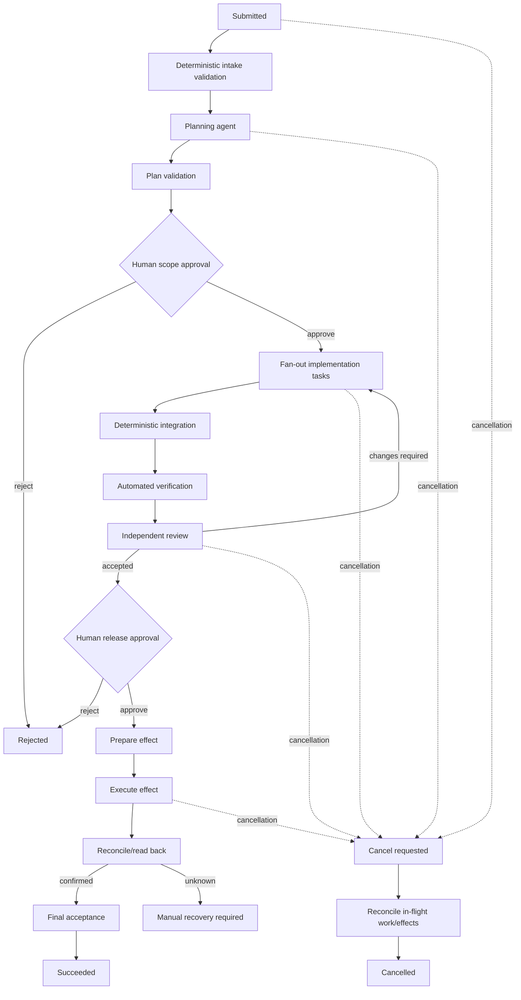

# Run record

- Case: `PTC-E5`
- Condition: `baseline`
- Prompt: Design a resumable multi-agent delivery workflow with typed handoffs, human approval gates, independent review, durable state, retries by failure class, cancellation, and recovery after uncertain external effects. I haven't chosen a runtime.
- Expected routing: `agent-workflow-design`
- Loaded skills observed in Codex events: `agent-workflow-design`
- Final response:

## Workflow status: Conditional

The design is runtime-neutral and implementable, but promotion to production should remain blocked until the following are selected:

- A durable transactional state store.
- A queue or scheduler with leases and redelivery.
- An artifact/evidence store.
- An isolation mechanism for concurrent workers.
- External systems’ idempotency, version-check, and read-back capabilities.
- Named human owners for scope, risk, and release approvals.

The central rule is: deterministic orchestration owns state, sequencing, authority, retries, effects, and acceptance. Agents produce bounded, typed claims; they never advance workflow state directly.

## 1. Outcome contract

The workflow delivers an approved change from a versioned request through planning, implementation, independent review, and release.

Requirements:

- `R1` Every decision and artifact is bound to a stable `run_id`, source version, and revision.
- `R2` Agent-to-agent handoffs are schema-validated, provenance-bearing claims.
- `R3` Scope and release require accountable human approval.
- `R4` Producers cannot approve or independently review their own work.
- `R5` State survives coordinator, worker, and runtime restarts.
- `R6` Retries depend on failure class and have bounded budgets.
- `R7` Cancellation prevents new effects and safely resolves in-flight effects.
- `R8` Uncertain external effects are reconciled before replay.
- `R9` Final acceptance requires evidence against the exact released revision.
- `R10` Operators can reconstruct decisions, attempts, approvals, and effects.

Trigger: submission of a versioned delivery request.

Terminal states:

- `SUCCEEDED`
- `REJECTED`
- `CANCELLED`
- `FAILED`
- `SUPERSEDED`
- `MANUAL_RECOVERY_REQUIRED`

Invariants:

- Only the coordinator changes authoritative workflow state.
- State transitions use compare-and-set against the expected state version.
- Workers cannot modify workflow policy, approval records, or gate configuration.
- Approval applies only to its recorded scope, revision, and expiry.
- A stale, cancelled, or superseded attempt cannot publish a result.
- “Phase ran,” “result is valid,” and “workflow accepted” remain separate facts.
- No external write may be retried while its outcome is unknown.

Non-goals: choosing a specific runtime, eliminating human accountability, allowing unconstrained autonomous deployment, or treating model confidence as verification.

## 2. Evidence ledger

- `E1` The requested workflow must be resumable, multi-agent, typed, reviewed, approval-gated, cancellable, and recoverable.
- `E2` No runtime has been selected.
- `I1` Delivery may include consequential external effects such as repository writes, tickets, deployments, or notifications. If delivery is artifact-only, the effect subsystem can be reduced.
- `A1` Workers can be given isolated workspaces or equivalent enforced mutation boundaries. Without this, parallel mutation must be disabled.
- `A2` External targets offer at least one of idempotency keys, conditional writes, operation lookup, or authoritative read-back.
- `Q1` Which effects require approval: merge, production deployment, data migration, notifications?
- `Q2` What retry, cost, latency, and retention limits apply?
- `Q3` Which human roles own scope, security, and release decisions?
- `Q4` Are regulated data, secrets, or residency constraints involved?

`A1` and `A2` must be revalidated during runtime and integration selection.

## 3. State machine



Any nonterminal state may also become `PAUSED`, `STALE`, `SUPERSEDED`, or `FAILED`.

## 4. Phase map

| Phase | Kind | Owner and purpose | Output/effect |
|---|---|---|---|
| Intake | Deterministic | Coordinator validates request, policy, identity, and source version | Normalized request |
| Plan | Model | Planner decomposes ambiguous work and identifies risks/dependencies | `PlanProposal` |
| Plan gate | Deterministic | Validate schema, coverage, scope, budgets, and dependencies | Gate receipt |
| Scope approval | Human | Product/technical owner accepts intended work and risks | Signed approval receipt |
| Execute tasks | Model workers | Each worker performs one bounded semantic implementation task | `WorkResult` plus artifacts |
| Integrate | Deterministic or designated integrator | Combine isolated changes and detect conflicts | Candidate revision |
| Verify | Deterministic | Run configured checks against candidate revision | `VerificationReceipt` |
| Review | Fresh model or human | Independently inspect exact candidate revision | `ReviewDecision` |
| Release approval | Human | Accountable owner accepts exact revision and evidence | Release approval receipt |
| Apply effect | Deterministic effect executor | Merge, deploy, publish, or update external system | Effect attempt/receipt |
| Reconcile | Deterministic | Confirm authoritative external state | Reconciliation receipt |
| Accept | Deterministic | Evaluate all `R#` gates against exact final state | Terminal decision |

Models are justified only for decomposition, implementation, and semantic review. Routing, validation, test invocation, state changes, retry timing, integration policy, and external writes should be deterministic.

## 5. Durable state and authority

Use one authoritative transactional store with append-only events and materialized state.

Core records:

```text
Run {
  run_id, workflow_version, state, state_version,
  request_ref, source_revision, target_environment,
  cancellation_epoch, superseded_by,
  created_at, updated_at
}

PhaseAttempt {
  phase_id, attempt_id, input_revision,
  lease_owner, lease_expiry, status,
  handoff_ref, failure_class, started_at, ended_at
}

Approval {
  approval_id, gate, decision, approver_identity,
  scope_hash, revision, evidence_hash,
  expires_at, decided_at
}

Effect {
  effect_id, idempotency_key, target,
  expected_target_version, intent_hash,
  status, provider_receipt, reconciliation_ref
}
```

Every artifact is immutable and content-addressed. Every transition records its expected prior `state_version`, actor, reason, and evidence references.

On resume:

1. Acquire or renew a lease.
2. Reload the run from the authoritative store.
3. Re-read repository and external target identities.
4. Expire invalid approvals and leases.
5. Discard or quarantine late results tied to old attempts or revisions.
6. Reconcile all `SENT` or `OUTCOME_UNKNOWN` effects.
7. Resume from the earliest phase whose evidence remains valid.

Conversation history is never checkpoint state.

## 6. Typed handoffs

Use distinct, versioned schemas rather than a universal free-form envelope. A common header may contain:

```json
{
  "schema": "WorkResult",
  "schema_version": 1,
  "run_id": "run-...",
  "phase_id": "implement-...",
  "attempt_id": "attempt-...",
  "source_revision": "sha256-or-vcs-id",
  "workflow_version": "v1",
  "producer": {
    "worker_id": "worker-...",
    "model": "model-version",
    "instruction_hash": "sha256..."
  }
}
```

Key result types:

- `PlanProposal`: requirements covered, task DAG, risks, proposed write sets, required approvals, verification plan.
- `WorkAssignment`: exact input revision, permitted paths/resources, acceptance checks, attempt budget.
- `WorkResult`: `completed | blocked | failed`, produced revision, changed paths, artifact references, claimed checks, unresolved risks.
- `VerificationReceipt`: command/config identity, revision, exit status, structured results, logs and artifact hashes.
- `ReviewDecision`: `accept | changes_required | escalate`, reviewed revision, findings with severity and evidence.
- `ApprovalDecision`: `approve | reject | amend`, exact scope/revision, expiry, approver identity.
- `EffectIntent`: target, operation, payload hash, expected version, idempotency key, approval reference.
- `EffectReceipt`: `confirmed | not_applied | outcome_unknown | conflict`, provider receipt and read-back evidence.

Models may propose completion, risk, or review findings. They may not determine approval validity, state transitions, retry eligibility, or final acceptance.

## 7. Gates and acceptance

| Claim | Independent gate |
|---|---|
| Plan covers the request | Requirement-to-task coverage check plus human scope approval |
| Worker changed only permitted state | Actual before/after diff, including deletions and reversions |
| Tests pass | Coordinator runs pinned commands against the exact candidate revision |
| Review is independent | Reviewer has no producer context beyond required artifacts and cannot share producer identity/credentials |
| Review applies | Reviewed revision equals current candidate revision |
| Release is approved | Approval signature, scope hash, revision, role, and expiry validate |
| Effect succeeded | Provider receipt plus authoritative read-back |
| Workflow succeeded | All `R#` requirements and gates evaluate true for the final revision and external state |

A new commit, amended scope, changed target, expired approval, or external drift invalidates dependent evidence.

## 8. Capability and mutation boundaries

- Planner: read-only access to approved inputs.
- Implementation worker: isolated workspace; scoped repository paths; no production credentials.
- Reviewer: read-only candidate access; no write or deployment capability.
- Effect executor: narrowly scoped service credential; accepts only coordinator-signed `EffectIntent`.
- Coordinator: owns transitions but should not hold broad production credentials directly.
- Humans: approve through authenticated, auditable identities.

Protect the control plane: workflow definitions, policy, schemas, gates, approval records, evidence storage, and evaluator configuration are outside worker write scope.

Parallel workers require separate worktrees, sandboxes, branches, or snapshots. A deterministic integration phase owns merging. If isolation cannot be enforced, execute mutating workers serially.

## 9. Retry, cancellation, and recovery

| Failure class | Response |
|---|---|
| Malformed model output | Retry same phase with validation errors; small fixed limit |
| Gate violation within worker scope | Return exact violation to that worker; create a new attempt |
| Provider throttling/network timeout before effect submission | Bounded exponential backoff with jitter |
| Failed implementation hypothesis | Require a changed diagnosis/strategy; stop on repeated equivalent attempts |
| Test or review rejection | Re-enter implementation with findings; invalidate downstream evidence |
| Stale revision or approval | No retry; recompute or reapprove |
| Policy denial or missing authority | Block for human action |
| Unauthorized mutation | Quarantine workspace, revoke lease, escalate |
| Outcome-unknown external effect | Never replay; reconcile first |
| Repeated no-progress | Pause and escalate after configured threshold |

Budgets should exist per phase and run: attempts, elapsed time, model tokens, monetary cost, and external operations.

Cancellation uses a durable `cancel_requested` flag plus monotonically increasing `cancellation_epoch`:

- Stop issuing new leases and effects.
- Ask cooperative workers to stop.
- Reject late results from earlier epochs.
- Allow already-started safety checks and reconciliation to finish.
- Do not assume an external request was cancelled merely because the local worker stopped.
- Terminalize as `CANCELLED` only after in-flight effects are confirmed, reversed by an approved compensation, or explicitly transferred to manual recovery.

For uncertain effects, use this protocol:

1. Persist `EffectIntent` and idempotency key.
2. Commit state as `PREPARED`.
3. Submit the effect.
4. Record `SENT` and any provider receipt.
5. Read back authoritative state.
6. Mark `CONFIRMED`, `NOT_APPLIED`, `CONFLICT`, or `OUTCOME_UNKNOWN`.
7. Replay only when non-application is proven or the provider guarantees idempotency.
8. Otherwise enter `MANUAL_RECOVERY_REQUIRED`.

Compensating actions are new approved effects, never silent rollback assumptions.

## 10. Observability and verification

Record append-only events for:

- State transitions and rejected transitions.
- Leases, heartbeats, expiry, and worker identity.
- Context, workflow, model, prompt, schema, and policy versions.
- Handoffs and schema/semantic validation.
- Actual mutation sets.
- Gate inputs, checks, outcomes, and artifact hashes.
- Approval issuance, amendment, rejection, expiry, and revocation.
- Effect preparation, submission, receipts, and reconciliation.
- Retry classification, backoff, budget consumption, and no-progress detection.
- Pause, cancellation, supersession, and recovery decisions.

Minimum trajectory tests:

- Invalid and stale transitions are rejected.
- Duplicate or late workers cannot publish.
- Malformed and semantically false handoffs fail.
- Protected paths and out-of-scope resources cannot be changed.
- Review does not transfer to a new revision.
- Expired or amended approvals cannot authorize effects.
- Restart works before submission, after submission, and before receipt persistence.
- Redelivered effect tasks do not duplicate effects.
- Cancellation works before and during consequential effects.
- Successful phases cannot produce overall success when an outcome gate fails.
- Shared mutable-state parallelism is refused.
- Retry exhaustion and repeated no-progress escalate correctly.

## 11. Decisions needed before implementation

Select:

1. State-store consistency and availability requirements.
2. Queue lease and redelivery semantics.
3. Workspace isolation for parallel mutation.
4. Artifact retention and sensitive-data policy.
5. Human approval roles, expiry, delegation, and emergency override policy.
6. Consequential effects and their idempotency/read-back contracts.
7. Retry, cost, and time budgets.
8. Whether semantic review is model-only, human-only, or risk-tiered.
9. Recovery ownership and the operational runbook for `MANUAL_RECOVERY_REQUIRED`.

Runtime selection should follow these contracts. A runtime is suitable only if it can enforce or reliably implement durable compare-and-set transitions, leases, immutable evidence, isolated workers, authenticated approvals, and effect reconciliation.

Outcome checks remain `not_verifiable` until reviewed against the suite rubric.
