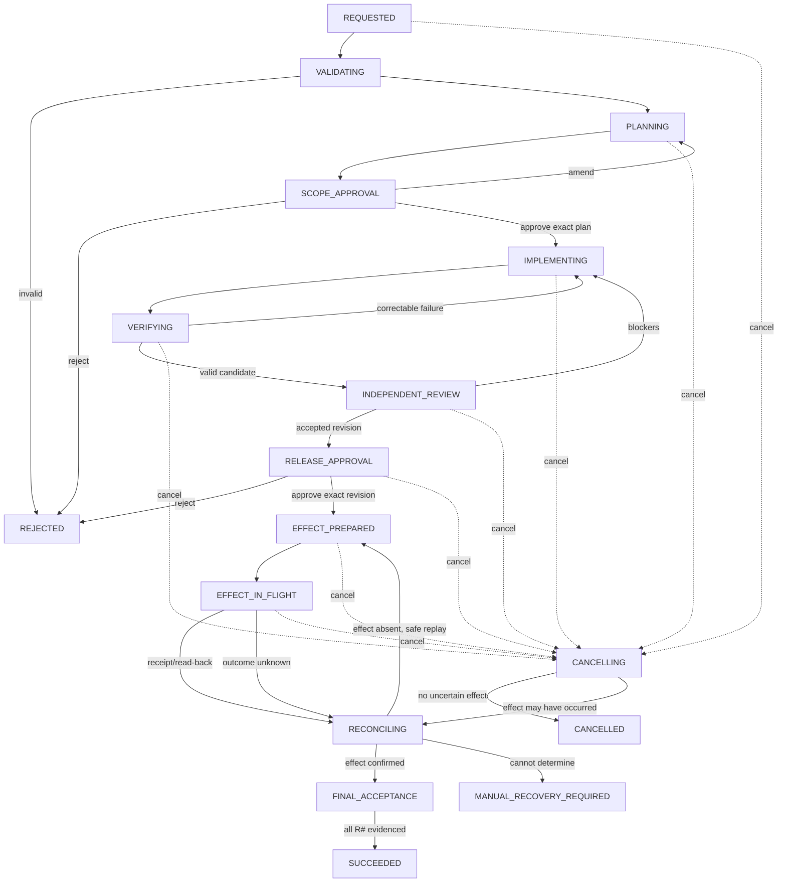

# Run record

- Case: `PTC-E5`
- Condition: `candidate`
- Prompt: Design a resumable multi-agent delivery workflow with typed handoffs, human approval gates, independent review, durable state, retries by failure class, cancellation, and recovery after uncertain external effects. I haven't chosen a runtime.
- Expected routing: `agent-workflow-design`
- Loaded skills observed in Codex events: `agent-workflow-design`
- Final response:

## Workflow status: Conditional

The workflow is runtime-neutral and implementable, but deployment remains conditional on three choices:

- durable orchestration/store technology;
- enforceable worker isolation;
- reconciliation support for each external system that may be mutated.

No consequential external effect may be enabled until its idempotency or read-back recovery strategy is defined.

## 1. Outcome contract

Goal: deliver a requested change through planning, implementation, independent review, approval, and release with reconstructible evidence and safe resumption.

Requirements:

- `R1` Every transition is owned by deterministic orchestration.
- `R2` All model-to-workflow handoffs are typed, versioned claims.
- `R3` Human approval is required for scope and consequential effects.
- `R4` Review is independent and bound to the exact candidate revision.
- `R5` Durable state supports restart without relying on conversation history.
- `R6` Retries are bounded and depend on failure class.
- `R7` Cancellation prevents new effects and handles in-flight effects explicitly.
- `R8` Outcome-unknown external writes are reconciled before replay.
- `R9` Final acceptance requires evidence for the exact delivered revision.
- `R10` Workers cannot modify orchestration, policy, approval, or evidence records.

Trigger: an authorized delivery request containing scope, source revision, acceptance criteria, risk classification, and accountable owner.

Terminal states:

- `SUCCEEDED`
- `REJECTED`
- `CANCELLED`
- `FAILED`
- `SUPERSEDED`
- `MANUAL_RECOVERY_REQUIRED`

Invariants:

- One immutable `run_id`; every attempt has its own `attempt_id`.
- Artifacts and approvals are bound to content hashes or exact revisions.
- A stale result can be recorded but cannot advance state.
- Phase completion is distinct from output validity and workflow acceptance.
- Cancellation is monotonic; a cancelled run cannot resume.
- External effects are never blindly replayed after uncertain completion.

Non-goals: autonomous product prioritization, security-risk acceptance, compliance waivers, or bypassing repository/release controls.

## 2. Evidence ledger

- `E1` The desired workflow must be resumable, reviewed independently, and gated by humans.
- `E2` No runtime has been selected.
- `A1` Source control provides immutable revision identifiers.
- `A2` Workers can run in isolated workspaces or their mutations can be detected afterward.
- `A3` External systems expose at least one of idempotency keys, operation lookup, expected-version writes, or authoritative read-back.
- `I1` Delivery includes a consequential publication or deployment step; falsified if output is artifact-only.
- `Q1` Which changes require architecture, security, compliance, or deployment approval?
- `Q2` Which external systems can be mutated, and what reconciliation mechanisms do they expose?
- `Q3` What retry, cost, latency, and retention limits apply?
- `Q4` Is parallel implementation needed? If so, what isolation and integration mechanism exists?

## 3. State machine



Pause is an orthogonal run flag allowed only at safe boundaries. Supersession terminates the old run and creates a new run; it does not mutate the old run’s source identity.

## 4. Phase map

| Phase | Kind | Owner | Output/effect |
|---|---|---|---|
| Intake validation | deterministic | Coordinator | Validated request snapshot |
| Planning | model | Planner | Proposed approach, risks, verification plan; semantic synthesis requires a model |
| Scope approval | human | Product/technical owner | Signed decision bound to plan hash |
| Implementation | model | Worker | Candidate revision and claims; code investigation and synthesis require a model |
| Mechanical verification | deterministic | Verification service | Test, lint, policy, diff, and artifact receipts |
| Independent review | model/human | Fresh reviewer | Findings bound to candidate revision; semantic correctness requires judgment |
| Release approval | human | Release/risk owner | Approval bound to revision and evidence bundle |
| External effect | deterministic adapter | Effect service | Durable operation identity and provider receipt |
| Reconciliation | deterministic, human fallback | Effect service/operator | Confirmed, absent, conflicted, or unknown outcome |
| Final acceptance | deterministic | Coordinator | Requirement-to-evidence evaluation |

The reviewer receives the approved requirements, candidate diff, and verification evidence, but not the implementer’s persuasive narrative unless explicitly needed.

## 5. Durable state and authority

Use an append-only event log plus a transactional current-state projection.

Core records:

```text
Run {
  run_id, workflow_version, status,
  request_snapshot_hash, source_revision,
  current_candidate_revision?,
  cancellation_requested_at?,
  lease_owner?, lease_expires_at?,
  created_at, updated_at
}

PhaseAttempt {
  run_id, phase_id, attempt_id, status,
  input_manifest_hash, output_manifest_ref?,
  worker_identity, model_and_harness_version?,
  started_at, finished_at?,
  failure_class?
}

Approval {
  approval_id, run_id, gate,
  subject_type, subject_hash,
  decision, approver_identity,
  policy_version, expires_at?, decided_at
}

EvidenceReceipt {
  receipt_id, run_id, phase_id,
  evidence_type, subject_hash,
  artifact_ref, producer, verifier,
  observed_at, expires_at?
}

EffectOperation {
  effect_id, run_id, adapter, target,
  intent_hash, idempotency_key,
  expected_version?, status,
  provider_operation_id?, receipt_ref?,
  reconciliation_attempts
}
```

Rules:

- Transitions use compare-and-swap on state version.
- A phase lease prevents duplicate ownership but does not establish correctness.
- Late results are accepted into history and rejected for advancement if their input hash or lease generation is stale.
- Resume reloads current authoritative source, approvals, effects, and leases.
- Changed source, policy, requirements, or external state invalidates dependent evidence.
- Approval amendment creates a new decision; it never edits the old receipt.

## 6. Typed handoffs

Use distinct schemas rather than a universal free-form message.

Common header:

```json
{
  "schema": "implementation-result/v1",
  "run_id": "run_…",
  "phase_id": "implementation",
  "attempt_id": "attempt_…",
  "input_manifest_hash": "sha256:…",
  "subject_revision": "git:…",
  "status": "candidate_produced",
  "artifact_refs": [],
  "claims": [],
  "provenance": {
    "worker_id": "…",
    "harness_version": "…",
    "instruction_bundle_hash": "sha256:…"
  }
}
```

Important result types:

- `PlanResult`: scope, assumptions, affected areas, risks, proposed checks, approval questions.
- `ImplementationResult`: candidate revision, claimed changed paths, requirement mapping, unresolved issues.
- `VerificationResult`: commands/checks actually run, exit status, environment identity, logs and artifact hashes.
- `ReviewResult`: exact reviewed revision, findings with severity and evidence locations, disposition.
- `ApprovalDecision`: approve/reject/amend, exact subject hash, approver and policy basis.
- `EffectIntent`: target, desired state, idempotency key, expected version, reconciliation method.
- `ReconciliationResult`: `confirmed | absent | conflicted | unknown`, observations, provider references.
- `AcceptanceResult`: each `R#`, required evidence receipts, verdict.

Models may propose claims and dispositions. They may not set approvals, mark gates passed, assign effect completion, or declare the workflow successful.

## 7. Gates and acceptance

| Claim | Independent gate |
|---|---|
| Scope is approved | Valid approval signature bound to current plan hash |
| Only permitted files changed | Actual before/after diff against enforced write policy |
| Tests pass | Coordinator-run commands with environment and revision receipts |
| Artifact exists | Read-back, format validation, and content hash |
| Review passed | Independent reviewer disposition for exact candidate revision |
| Release is authorized | Unexpired approval bound to revision and evidence bundle |
| External write succeeded | Provider receipt plus authoritative read-back when available |
| Delivery succeeded | Deterministic evaluation of all `R#` against current evidence |

Any candidate change after review invalidates review and downstream approvals.

## 8. Capability and mutation boundaries

- Planner: read-only access to request, source, and relevant evidence.
- Implementer: isolated branch/worktree; scoped repository credentials; no production credentials.
- Reviewer: read-only candidate access; no shared model session or writable workspace.
- Verification service: known commands only; cannot modify approval or workflow policy.
- Effect service: narrowly scoped credentials for one target and operation family.
- Coordinator: sole writer of workflow transitions; it does not perform arbitrary model-generated shell commands.
- Control-plane code, policy, schemas, event log, approval records, and evaluator configuration are protected from workers.

Parallel implementers require separate mutable workspaces. A deterministic integrator or separately authorized integration owner creates the combined candidate; worker branches never merge themselves into the delivery target.

## 9. Retry and recovery

| Failure class | Response |
|---|---|
| Malformed model output | Same attempt context; schema feedback; maximum 2 repairs |
| Semantic handoff violation | Reject result; retry phase once with concrete violations |
| Correctable verification failure | Return evidence to implementer; bounded implementation cycle |
| Failed implementation hypothesis | Require a revised diagnosis; stop on repeated equivalent strategy |
| Transient deterministic error | Code-level exponential backoff with jitter, only for classified idempotent errors |
| Rate limit | Respect provider retry time within run deadline |
| Stale input or late result | No retry in place; rebuild input snapshot and start a new attempt |
| Policy denial or missing approval | Block; human decision required |
| Reviewer blocker | New implementation attempt, then fresh review of new revision |
| Unauthorized mutation | Quarantine workspace and fail; never auto-clean user-owned state |
| Outcome-unknown external effect | Enter reconciliation; do not replay |
| Retry exhaustion/no progress | `FAILED` or human escalation |

Suggested initial budgets: two output repairs, three implementation cycles, three transient-effect attempts, and a wall-clock deadline per phase. Make these policy-controlled.

No-progress detection should catch unchanged failure signatures, identical candidate hashes, oscillating patches, repeated tool calls, and duplicate active work.

## 10. Cancellation and uncertain effects

Cancellation behavior:

1. Persist `cancellation_requested`.
2. Stop scheduling new phases and revoke outstanding worker leases.
3. Ask interruptible workers to stop; ignore any late results for advancement.
4. If no consequential effect started, finalize `CANCELLED`.
5. If an effect is in flight, transition through reconciliation before finalizing.
6. Do not automatically roll back. Compensation is a separate approved effect with its own receipt and reconciliation.

External-effect protocol:

1. Persist `EffectIntent` before transmission.
2. Derive a stable idempotency key from run, target, and intent hash.
3. Mark `EFFECT_IN_FLIGHT` transactionally before sending.
4. Send using expected-version conditions where available.
5. Persist provider operation ID and receipt.
6. Read back authoritative state.
7. After a crash, query by provider operation ID or idempotency key.
8. Replay only when authoritative evidence proves the original effect is absent and replay is safe.
9. If neither success nor absence can be established, require manual recovery.

## 11. Observability and verification

Record correlated events for every transition, attempt, approval, context manifest, artifact, tool/effect request, receipt, gate observation, retry, cancellation, and reconciliation decision. Logs should contain references and hashes, with secrets and sensitive prompt content redacted.

Required trajectory tests include:

- invalid transition and forged approval rejection;
- malformed and semantically false model claims;
- stale, duplicate, and late results;
- reviewer approval for the wrong revision;
- candidate mutation after approval;
- cancellation before, during, and after an effect;
- crash before send, after send, and before receipt persistence;
- safe idempotent replay and unrecoverable unknown outcome;
- expired or amended approvals;
- unauthorized control-plane mutation;
- retry exhaustion and no-progress detection;
- all phases “completed” while final requirement evidence remains incomplete.

## Human decisions still required

Before enabling delivery effects, accountable owners must decide:

- approval matrix by risk and environment;
- permitted repositories, paths, credentials, and external targets;
- which acceptance properties require human judgment;
- effect-specific reconciliation and compensation policies;
- retry, time, cost, and concurrency budgets;
- evidence retention and sensitive-data policy;
- whether parallel writing is permitted and how integration is controlled.

This design can be mapped cleanly onto a durable workflow engine, a queue plus transactional database, or an event-sourced custom coordinator. The contracts and state semantics should remain the same whichever runtime is selected.

Outcome checks remain `not_verifiable` until reviewed against the suite rubric.
