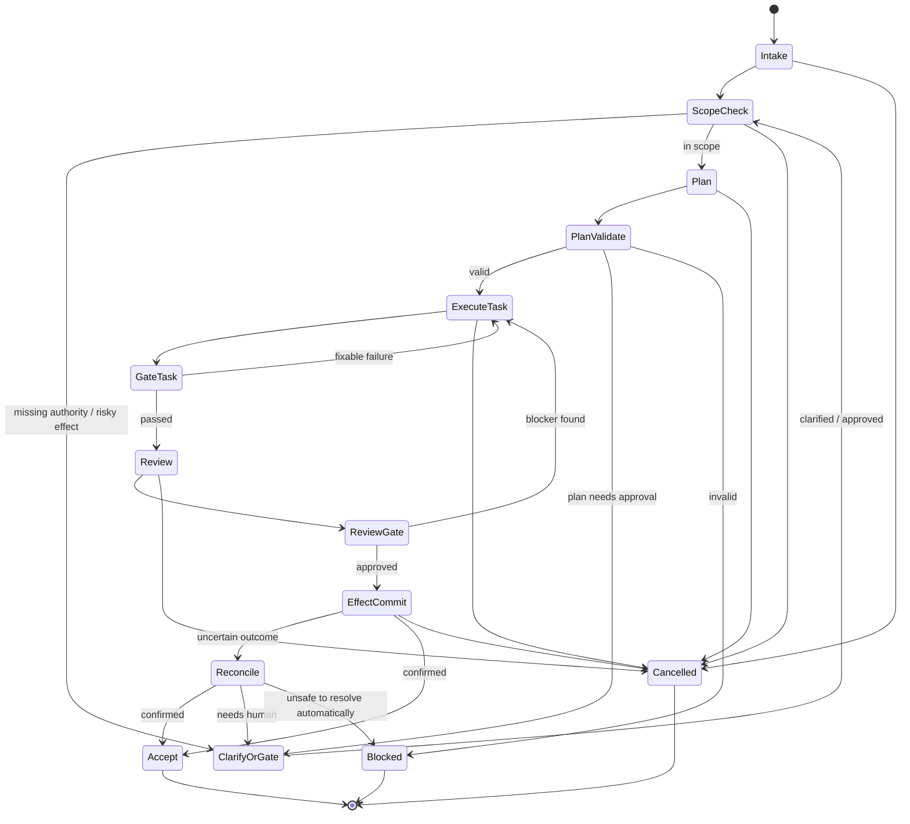

# Run record

- Case: `AR-E4`
- Condition: `candidate`
- Prompt: Design a resumable coding-agent workflow with durable state, typed handoffs, approval gates, retries by failure class, independent verification, and recovery after uncertain external effects. I am not asking whether a particular repository is ready for it yet.
- Expected routing: `agent-workflow-design`
- Loaded skills observed in Codex events: `agent-workflow-design`
- Agent-reported selection (not a native harness event): `none`
- Final response:

**Workflow Status**  
`Conditional`

Reason: the design is internally complete, but a few authority choices remain unresolved and must be confirmed before this can be made executable in a specific system:
- which external effect classes are allowed without human approval,
- what durable store is authoritative for checkpoints and receipts,
- what exact isolation guarantees exist for worker writes and external side effects.

**Outcome Contract**

`R1` The workflow must resume safely after interruption without relying on conversation memory.

`R2` Every material handoff between phases must be typed, versioned, and independently validateable.

`R3` Deterministic orchestration must own state, sequencing, retries, approvals, acceptance, and recovery.

`R4` Model use must be confined to bounded semantic decisions that cannot be expressed reliably in code.

`R5` Every consequential external effect must have a recovery path for outcome-unknown execution.

`R6` Final acceptance must be bound to the exact revision/state it validates.

`R7` The workflow must reject stale, duplicate, late, unauthorized, or superseded work.

`R8` Human approval must remain explicit for product, security, compliance, and other consequential decisions.

Trigger:
- a user request creates a run,
- or a paused/suspended run is resumed from durable state,
- or a reconciliation loop detects an uncertain external effect.

Terminal states:
- `Accepted`
- `Rejected`
- `Blocked`
- `Cancelled`
- `Superseded`
- `NeedsHuman`
- `NeedsReconciliation`

Invariants:
- no phase may claim success without evidence,
- no worker may modify the control plane that judges its own result,
- checkpoints are advisory evidence, not authority,
- resume always revalidates against current authoritative state,
- independent verification is performed by a separate context where the producer could bias judgment.

Scope:
- code changes, tests, artifact generation, optional deployment, external writes, and reconciliation.

Non-goals:
- maximizing autonomy,
- using a model for deterministic routing,
- assuming model output is trustworthy,
- relying on chat history as state.

Authoritative inputs:
- run specification,
- source revision IDs,
- policy/approval records,
- durable checkpoint store,
- effect receipts or external read-backs,
- current repository/external state.

Completion evidence:
- exact revision hash,
- validated handoff artifacts,
- gate receipts,
- test results,
- approval receipts where required,
- reconciliation receipts for uncertain effects.

**Evidence Ledger**

- `E1` The user explicitly requested a resumable coding-agent workflow with durable state, typed handoffs, approval gates, retries by failure class, independent verification, and recovery after uncertain external effects.
- `E2` The user explicitly said this is not about readiness of a particular repository.
- `I1` A useful design here should be repository-agnostic and state-machine based, because the request is about orchestration semantics rather than implementation details.
- `I2` Independent verification must be separate from the producer to avoid anchoring and self-certification bias.
- `A1` There is a durable store available for checkpoints, receipts, and run state. If not, the workflow must be downgraded to `Blocked`.
- `A2` The runtime can detect or bound external side effects via idempotency keys, expected-version checks, receipts, or read-back. If not, uncertain-effect recovery is not safe.
- `Q1` Which external effects are permitted to happen without human approval?
- `Q2` What is the authoritative store for run state and receipts?
- `Q3` What isolation boundaries exist for worker writes and network access?

**Phase Map**

1. `Intake` - `deterministic`
- Owner: coordinator
- Purpose: create `run_id`, capture inputs, freeze source revision, assign policy profile
- Inputs: user request, current repo revision, policy config
- Outputs: canonical run spec
- Effects: persist run record
- Why not model: pure parsing and normalization

2. `ScopeCheck` - `deterministic`
- Owner: coordinator
- Purpose: determine whether the requested outcome is in scope, safe, and sufficiently specified
- Inputs: run spec, policy rules
- Outputs: `scope_status`
- Effects: none
- Why not model: explicit policy evaluation

3. `ClarifyOrGate` - `human`
- Owner: user or accountable approver
- Purpose: resolve open questions or approve risky effects
- Inputs: scoped questions, approval request
- Outputs: approval receipt or clarified constraints
- Effects: recorded decision only
- Why human: consequential authority

4. `Plan` - `model`
- Owner: planner agent
- Purpose: produce a bounded implementation plan and typed task decomposition
- Inputs: run spec, repo snapshot, constraints, known evidence
- Outputs: `PlanArtifact`
- Effects: none
- Why model: semantic decomposition and synthesis

5. `PlanValidate` - `deterministic`
- Owner: coordinator
- Purpose: schema-check plan, verify dependencies, reject out-of-scope actions
- Inputs: `PlanArtifact`
- Outputs: accepted/rejected plan
- Effects: none
- Why not model: syntactic and policy validation

6. `ExecuteTask` - `model`
- Owner: worker agent
- Purpose: perform one bounded task slice
- Inputs: task packet, allowed files/resources, relevant evidence
- Outputs: typed result claims and artifact references
- Effects: may edit allowed workspace or create allowed external request
- Why model: semantic code changes, investigation, or synthesis

7. `GateTask` - `deterministic`
- Owner: coordinator or verifier service
- Purpose: compare claims to actual state, run tests, validate artifacts
- Inputs: claimed result, actual diff, test outputs, receipts
- Outputs: pass/fail plus violations
- Effects: records evidence
- Why not model: independent validation must be executable and objective

8. `Review` - `model`
- Owner: independent reviewer agent
- Purpose: assess correctness, regressions, and hidden risks against exact revision
- Inputs: exact revision, diff, test results, relevant context
- Outputs: review verdict and findings
- Effects: none
- Why model: semantic review beyond syntax

9. `ReviewGate` - `deterministic`
- Owner: coordinator
- Purpose: require review binding to exact revision and enforce blocker policy
- Inputs: review artifact, exact revision ID
- Outputs: accepted/rejected
- Effects: none

10. `EffectCommit` - `deterministic`
- Owner: coordinator or trusted effect executor
- Purpose: perform controlled external write, deployment, merge, or other approved effect
- Inputs: approved effect request, idempotency key, expected state/version
- Outputs: receipt or uncertain outcome
- Effects: external mutation
- Why not model: effect execution must be policy-controlled and idempotent

11. `Reconcile` - `deterministic`
- Owner: coordinator
- Purpose: resolve uncertain external outcomes by read-back or receipt comparison
- Inputs: effect request, receipts, current authoritative external state
- Outputs: `confirmed`, `replayed-safe`, or `needs-human`
- Effects: possible compensating action if safe

12. `Accept` - `deterministic`
- Owner: coordinator
- Purpose: mark run complete only when all required gates over exact state have passed
- Inputs: all evidence, approvals, reconciliation state
- Outputs: terminal acceptance record
- Effects: final durable status only

**State and Authority Model**

Authoritative state objects:
- `RunRecord`
- `PhaseRecord`
- `Checkpoint`
- `ApprovalReceipt`
- `ArtifactRef`
- `EffectReceipt`
- `ReconciliationRecord`

State identities:
- `run_id`
- `phase_id`
- `attempt_id`
- `revision_id`
- `effect_id`
- `checkpoint_id`

Version/freshness rules:
- every checkpoint stores the source revision, policy version, and external state identity it was derived from,
- every resume re-reads current authoritative state before continuing,
- any mismatch between checkpointed state and current authoritative state invalidates prior acceptance claims,
- review and approval are valid only for the exact revision and scope they reference.

Ownership:
- coordinator owns transitions,
- worker owns only its task-local output,
- reviewer owns only review findings,
- humans own approvals and risky policy decisions.

Pause/cancel/stale semantics:
- `Paused` freezes new execution but preserves state,
- `Cancelled` prevents new effects and requires reconciliation if a side effect may already have happened,
- `Stale` means the run’s source or policy is no longer current enough to continue,
- `Superseded` means a newer run or revision has replaced this one.

**Handoff Contracts**

1. `PlanArtifact v1`
```json
{
  "schema": "plan.v1",
  "run_id": "string",
  "source_revision": "string",
  "assumptions": ["string"],
  "tasks": [
    {
      "task_id": "string",
      "purpose": "string",
      "owned_paths": ["string"],
      "dependencies": ["string"],
      "acceptance_claims": ["string"]
    }
  ],
  "requires_human": ["string"]
}
```
Claims:
- this is a proposed decomposition, not proof of correctness.

2. `TaskPacket v1`
```json
{
  "schema": "task.v1",
  "run_id": "string",
  "task_id": "string",
  "source_revision": "string",
  "allowed_paths": ["string"],
  "forbidden_paths": ["string"],
  "required_evidence": ["string"],
  "exit_criteria": ["string"]
}
```
Claims:
- worker is authorized only within the packet boundaries.

3. `TaskResult v1`
```json
{
  "schema": "task-result.v1",
  "run_id": "string",
  "task_id": "string",
  "attempt_id": "string",
  "status": "passed|failed|blocked|needs_clarification",
  "claimed_changes": ["string"],
  "artifact_refs": ["string"],
  "test_refs": ["string"],
  "notes": "string"
}
```
Claims:
- the worker asserts what it changed and what evidence exists; not that the workflow should accept it.

4. `ReviewArtifact v1`
```json
{
  "schema": "review.v1",
  "run_id": "string",
  "revision_id": "string",
  "verdict": "pass|block|warn",
  "findings": [
    {
      "severity": "low|medium|high|critical",
      "path": "string",
      "claim": "string",
      "evidence": "string"
    }
  ]
}
```
Claims:
- the reviewer inspected the exact revision stated.

5. `EffectRequest v1`
```json
{
  "schema": "effect.v1",
  "run_id": "string",
  "effect_id": "string",
  "kind": "merge|deploy|publish|external_write",
  "target": "string",
  "expected_version": "string",
  "idempotency_key": "string",
  "approval_ref": "string"
}
```
Claims:
- this is the exact requested effect, not proof it occurred.

**Gate and Acceptance Map**

Material claims and independent gates:
- Claim: “I changed these files” -> gate by actual diff against allowed paths.
- Claim: “tests pass” -> gate by deterministic test command and recorded exit status.
- Claim: “artifact written” -> gate by existence, hash, format, and expected provenance.
- Claim: “review is clean” -> gate by independent reviewer bound to exact revision.
- Claim: “external write succeeded” -> gate by authoritative read-back or receipt validation.
- Claim: “run complete” -> gate by all required phase records, approvals, and reconciliation entries.

Acceptance requires:
- exact revision match,
- no open blockers,
- required approvals present and unexpired,
- all required task gates passed,
- any uncertain external effect reconciled,
- no stale or superseded state since the last authoritative check.

**Capability and Mutation Boundaries**

Enforced boundaries:
- worker writes only to allowed paths or isolated workspace,
- worker cannot edit coordinator policy, approval records, or acceptance logic,
- worker cannot alter its own gating configuration,
- external writes require explicit effect requests with idempotency and expected-version checks,
- network access should be scoped by effect class and environment,
- parallel workers must have disjoint mutable state or separately owned workspaces.

Protected control plane:
- workflow definitions,
- policy,
- approval state,
- gate configuration,
- reconciliation logic,
- acceptance decision logic,
- audit records.

Approval-required effects:
- deployment to production,
- publishing to external systems,
- destructive or irreversible writes,
- policy-sensitive actions,
- any effect the system cannot safely reconcile.

**Retry and Recovery Model**

Failure classes:
- `MalformedResult`
- `GateFailure`
- `TransientToolFailure`
- `ImplementationMiss`
- `VerificationMismatch`
- `MissingApproval`
- `StaleState`
- `UncertainExternalEffect`
- `UnauthorizedMutation`

Retry rules:
- `MalformedResult`: retry same worker with schema error and minimal preserved context.
- `GateFailure`: return concrete violations to the responsible worker if correction is still in scope.
- `TransientToolFailure`: retry in deterministic code with bounded timeout/backoff and idempotency.
- `ImplementationMiss`: stop repeating equivalent attempts; replan or escalate.
- `VerificationMismatch`: use independent verifier or fresh reviewer context.
- `MissingApproval`: block until human decision.
- `StaleState`: re-read authoritative state and rebase or supersede.
- `UncertainExternalEffect`: reconcile first; never blind-replay unless idempotent and safe.
- `UnauthorizedMutation`: fail closed and preserve evidence.

Budgets:
- max attempts per task,
- max retries per deterministic operation,
- no-progress detection over repeated equivalent diffs or repeated identical failures,
- wall-clock expiry for approvals and checkpoints.

Checkpoint policy:
- write checkpoint after each completed phase boundary and before any consequential external effect,
- checkpoint must record revision, state version, approvals, and receipts,
- on resume, revalidate everything against authority before reusing the checkpoint.

Uncertain-effect handling:
- send effect with idempotency key and expected version,
- if process dies after send but before recording success, reconcile via read-back or receipt lookup,
- if reconciliation cannot prove outcome, mark `NeedsReconciliation` and stop further side effects until resolved.

**Observability and Verification**

Required events:
- phase start/end,
- state transitions,
- plan and task artifact creation,
- gate checks and violations,
- approvals,
- effect requests and receipts,
- reconciliation attempts,
- retries, expiries, supersessions, cancellations,
- final acceptance or rejection.

Required trace properties:
- correlate by `run_id`, `phase_id`, `task_id`, `attempt_id`, `revision_id`,
- preserve exact command/effect identity where relevant,
- capture what was checked, not only pass/fail.

Trajectory tests:
- invalid transition rejection,
- malformed task result rejection,
- worker writes outside allowed paths,
- stale revision rejection,
- review bound to wrong revision,
- duplicate/late worker result rejection,
- approval expiry and supersession,
- transient tool retry,
- uncertain external effect recovery,
- cancellation mid-run,
- acceptance blocked despite local test success,
- reconciliation after process crash.

**Mermaid Diagram**



**Human Decisions and Open Questions**

`Q1` Which effects may proceed without human approval?

`Q2` What is the authoritative durable store, and does it support compare-and-swap or expected-version writes?

`Q3` What is the exact isolation boundary for worker writes: filesystem paths, containers, branches, or separate tenants?

`Q4` Which external systems require reconciliation support, and do they provide idempotency keys or read-back APIs?

`Q5` What is the approval expiry policy?

`Q6` What is the maximum allowed retry budget per failure class?

**Bottom line**

This workflow should be implemented as a deterministic coordinator with model workers as typed, bounded decision points. The coordinator owns state, authority, retries, and acceptance. Models can propose work, changes, and interpretations, but only independent gates can turn those claims into progress. The main unresolved design choice is the exact external-effect and approval policy; once that is fixed, this design can be made fully executable.

Outcome checks remain `not_verifiable` until reviewed against the suite rubric.
