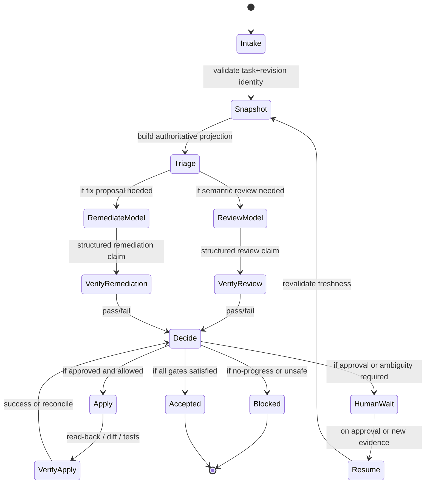

# Run record

- Case: `AWD-E1`
- Condition: `candidate`
- Prompt: Design a durable review-and-remediation agent workflow. I need the state machine, authority boundaries, typed handoffs, retry semantics, resumability, independent verification, and failure recovery. Do not choose or implement an orchestration runtime yet.
- Expected routing: `agent-workflow-design`
- Loaded skills observed in Codex events: `plan, agent-workflow-design`
- Agent-reported selection (not a native harness event): `none`
- Final response:

**Workflow Status:** `Conditional`  
Reason: the design is executable at the architecture level, but two authority choices are still open and could change the final control model: whether review/remediation is ticket-scoped or queue-scoped, and what human approval gates are mandatory before consequential external effects.

**Outcome Contract**

`R1` A review-and-remediation run must start from an explicit task identity, revision identity, and authoritative source snapshot.  
`R2` The workflow must separate deterministic control from model judgment. Model outputs are structured proposals, never direct effects.  
`R3` Every phase must have one owner, one responsibility, and one acceptance contract.  
`R4` Authority for state, approvals, attempts, and receipts must live outside model context and survive restart.  
`R5` Handoffs between phases must be typed and versioned.  
`R6` Retries must differ by failure class and stop after bounded no-progress.  
`R7` Resumption must revalidate source revision, approvals, and external state before continuing.  
`R8` Independent verification must be revision-bound and producer-independent.  
`R9` Protected control-plane state must not be writable by the worker being judged.  
`R10` The workflow must end in one of: `accepted`, `blocked`, `needs-human`, `stale`, `reconciled`, or `failed-with-recovery-path`.

Non-goals:
- Choosing an orchestration runtime.
- Implementing the workflow.
- Encoding project-specific review policy beyond the generic control model below.

Constraints:
- Deterministic orchestration owns sequencing, policy, state, retries, and recovery.
- Model decisions are only allowed where semantic interpretation or synthesis is needed.
- External writes must have idempotency, expected-version checks, or read-back reconciliation.

**Current-State Evidence**

- `E1` The repository README defines a portable-agent model with canonical workflow artifacts under `agents/` and skills under per-skill directories, and it explicitly describes workflow-supporting artifacts and agent workflow metadata. Source: [`README.md`](/home/mark/.local/state/codex-desktop/tmp/agent-skills-eval-elzo8fhu/repo/README.md)
- `E2` The README treats durable workflow artifacts as repository-local supporting evidence, not as the product deliverable itself, and recommends a canonical artifact root for workflow support data. Source: [`README.md`](/home/mark/.local/state/codex-desktop/tmp/agent-skills-eval-elzo8fhu/repo/README.md)
- `E3` The `plan` skill requires evidence-grounded, non-mutating design and explicitly calls for state machines, typed handoffs, retry semantics, resumability, independent verification, and failure recovery for agentic systems. Source: [`/home/mark/.local/state/codex-desktop/tmp/agent-skills-eval-elzo8fhu/repo/.codex/skills/plan/SKILL.md`](/home/mark/.local/state/codex-desktop/tmp/agent-skills-eval-elzo8fhu/repo/.codex/skills/plan/SKILL.md)
- `E4` The `agent-workflow-design` skill requires deterministic orchestration to own sequencing, policy, state, effects, retries, acceptance, and recovery, with model outputs as structured claims and independent gates for verification. Source: [`/home/mark/.local/state/codex-desktop/tmp/agent-skills-eval-elzo8fhu/repo/.codex/skills/agent-workflow-design/SKILL.md`](/home/mark/.local/state/codex-desktop/tmp/agent-skills-eval-elzo8fhu/repo/.codex/skills/agent-workflow-design/SKILL.md)
- `E5` No deeper repository-local docs, ADRs, or agent specs were present in the inspected tree beyond `README.md`. This constrains the plan to repo conventions plus the workflow-design skill. Source: `rg --files` result in the current repo root.
- `Q1` Whether the workflow is intended for a single review/remediation ticket or for a queue of tasks.
- `Q2` Whether a human approval gate is required before any external side effect, or only for risky/irreversible effects.
- `Q3` What authoritative store will hold run state in the eventual implementation.

**Approach and Decisions**

Selected design:
- Use a deterministic coordinator with a finite state machine.
- Use one focused model role for semantic review synthesis and one optional model role for remediation proposal generation.
- Keep verification and acceptance independent from the proposing agent.
- Persist every run checkpoint outside model context.

Alternatives considered:
- A single autonomous agent loop. Rejected because it collapses authority, proposal, and acceptance into one channel.
- A fully deterministic pipeline with no model phase. Rejected because review synthesis and remediation ranking are semantic tasks that benefit from bounded probabilistic judgment.
- A shared-context conversational workflow. Rejected because it is not resumable or independently auditable enough.

Continuity status: `new`

`D1` Human decision gate: confirm whether the workflow may trigger any external effect automatically or only after explicit approval.  
- Owner: product or operational accountable owner  
- Decision: set the approval boundary for external effects  
- Blocks: effect execution, reconciliation, and post-approval continuation  
- State: `open`

`D2` Human decision gate: confirm whether remediation is limited to patch proposal or may include applying changes.  
- Owner: workflow owner  
- Decision: choose proposal-only vs proposal-plus-apply  
- Blocks: mutation and effect-receipt design  
- State: `open`

**Phase Map**

Phase kinds:
- `Intake` - deterministic
- `Snapshot` - deterministic
- `Triage` - deterministic with model-routing decision only if needed
- `ReviewModel` - model
- `RemediateModel` - model
- `VerifyReview` - deterministic
- `VerifyRemediation` - deterministic
- `Decide` - deterministic
- `Apply` - deterministic or human-gated depending on `D1`/`D2`
- `VerifyApply` - deterministic
- `HumanWait` - human
- `Resume` - deterministic

Why the model phases exist:
- `ReviewModel` must interpret ambiguous evidence, infer likely defects, and rank risk.
- `RemediateModel` must synthesize candidate fixes from review findings and constraints.

**State and Authority Model**

Authoritative state:
- Run record
- Task identity
- Revision identity
- Approval receipts
- Attempt counters
- Effect receipts
- External read-back evidence
- Terminal status

State ownership:
- Coordinator owns all state transitions.
- Model sees only a projection of the current state.
- Worker/model output cannot directly mutate run state.
- The verifier can invalidate claims but cannot invent new acceptance.

Identity/version rules:
- Every phase checkpoint records `run_id`, `task_id`, `revision_id`, `phase_id`, and `attempt`.
- Every resume must compare stored `revision_id` with current source revision.
- Any mismatch forces `stale` until re-snapshotted.

Pause/cancel/stale semantics:
- `paused` means waiting on external input or approval.
- `cancelled` means no further mutation or effect is allowed.
- `stale` means the evidence set no longer matches source reality.
- `superseded` means a newer run has taken ownership of the same task.

**Handoff Contracts**

1. `SnapshotEnvelope`
- Fields: `run_id`, `task_id`, `revision_id`, `source_refs`, `policy_version`, `freshness_ts`
- Semantics: authoritative state projection for one decision point
- Not authorized to determine: approval state, completion status

2. `ReviewClaim`
- Fields: `run_id`, `revision_id`, `findings[]`, `risk_level`, `confidence`, `evidence_refs[]`, `blocked_by[]`
- Semantics: proposed review result
- Validation: every finding must map to evidence and a concrete location

3. `RemediationProposal`
- Fields: `run_id`, `revision_id`, `target_files[]`, `change_intent`, `expected_effect`, `rollback_notes`, `evidence_refs[]`
- Semantics: proposed change plan, not an applied change
- Validation: target scope must fit task scope and policy

4. `VerificationReceipt`
- Fields: `run_id`, `revision_id`, `checks[]`, `observed_signals[]`, `pass_fail`, `repro_steps_ref`
- Semantics: independent evidence from deterministic checks
- Validation: bound to exact revision and actual observed outputs

5. `ApprovalReceipt`
- Fields: `run_id`, `decision_id`, `approver`, `decision`, `expires_at`, `scope`
- Semantics: human authorization for gated actions
- Validation: expiry and scope must match the pending effect

**Gate and Acceptance Map**

Deterministic gates:
- `G1` Snapshot freshness: revision identity matches current source.
- `G2` Schema validation: structured handoff parses and satisfies required fields.
- `G3` Scope validation: proposed changes remain within task boundaries.
- `G4` Verification: tests, diff checks, or read-back evidence confirm claims.
- `G5` Approval validation: if required, approval exists, is current, and covers scope.
- `G6` Final acceptance: all required claims and gates are satisfied on the exact state.

Independent checks:
- Review claims are checked against actual source evidence, not the reviewer’s prose.
- Remediation claims are checked against the actual diff or applied effect.
- External actions are checked with read-back or receipts, not self-report.

**Capability and Mutation Boundaries**

- The proposer model may read evidence, but may not write control-plane state.
- The remediation worker may modify only explicitly allowed target files or artifacts.
- The coordinator/policy engine owns run state, attempts, approvals, and acceptance.
- Protected surfaces:
  - workflow definitions
  - policy configuration
  - verification config
  - approval records
  - evidence store
- Any broader filesystem or API capability must be treated as a potential bypass and fenced by deterministic pre/post checks.

**Retry and Recovery Model**

Failure classes:
- `malformed_result`: retry same phase with schema violation feedback.
- `gate_failed`: return concrete violations to same responsible phase if still fresh.
- `transient_deterministic_failure`: bounded retry with backoff and idempotency.
- `stale_source`: re-snapshot, then re-run dependent phases.
- `approval_expired`: re-request approval or halt.
- `no_progress`: stop after repeated equivalent attempts and escalate.
- `unsafe_scope`: block and replan.

Budgets:
- attempt budget per phase
- wall-clock budget per run
- no-progress threshold for equivalent failures
- approval expiry threshold

Recovery:
- Persist checkpoint before waiting, after each phase result, and before/after any effect.
- On resume, reload authoritative run state, current source revision, and approval status.
- If an external effect may have happened but receipt is missing, reconcile by read-back before replaying.
- If the system cannot prove whether an effect landed, stop in `needs-human` or `reconciled`, not silent retry.

**Observability and Verification**

Required records:
- phase start/end
- model input projection hash
- structured handoff payloads
- validation results
- approval receipts
- effect receipts
- retry reason and count
- resume reason
- stale/no-progress/cancel transitions

Deterministic tests to require:
- invalid transition rejection
- malformed handoff rejection
- stale revision rejection
- approval expiry rejection
- duplicate worker / late result handling
- restart after checkpoint and reconciliation
- no-progress escalation
- exact-state binding for verification receipts
- protected control-plane write rejection

**Human Decisions and Open Questions**

- `Q2` Whether remediation may be applied automatically or only proposed.
- `Q3` Where authoritative run state will live in the eventual implementation.
- `Q4` Whether the workflow needs one worker per task or a queue coordinator with multiplexed tasks.

If you want, I can turn this into a more concrete artifact next:
1. a ticket-ready workflow spec with explicit `R#`, `D#`, and `Q#` numbering
2. a sequence/state diagram with exact handoff schemas
3. a verification matrix with failure-path tests and acceptance criteria

Outcome checks remain `not_verifiable` until reviewed against the suite rubric.
