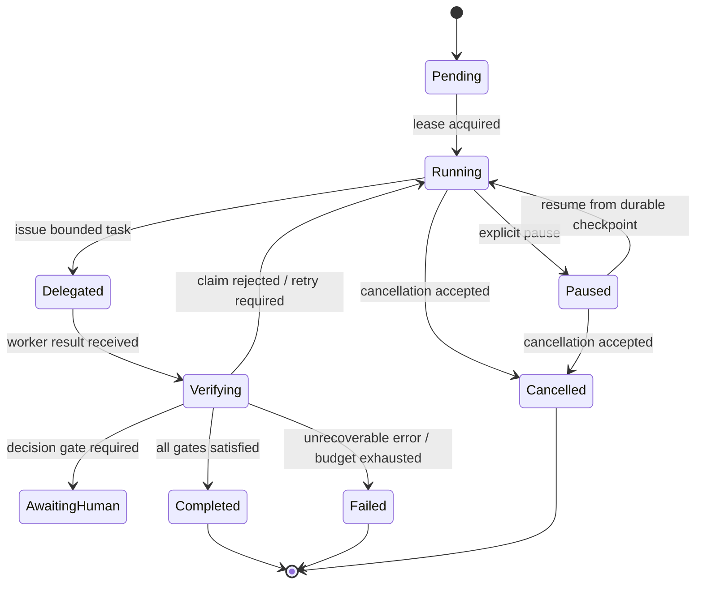

# Run record

- Case: `AWD-E2`
- Condition: `candidate`
- Prompt: We have a supervisor agent that keeps the whole coding workflow in its chat history: it delegates implementation, remembers which reviewer passed, retries failures itself, and decides when the run is complete. Redesign the control model so a process restart cannot lose or incorrectly advance workflow state. I only want the architecture and contracts, not implementation code.
- Expected routing: `agent-workflow-design`
- Loaded skills observed in Codex events: `plan, agent-workflow-design`
- Agent-reported selection (not a native harness event): `none`
- Final response:

**Workflow status**  
`Ready` for a design-only redesign. The repository context is sparse, but the requirement is clear enough to specify a restart-safe control model without choosing implementation details.

**Outcome contract**

`R1` The supervisor’s progression must be driven by durable workflow state, not chat history or transient model context.

`R2` A process restart must not lose state, duplicate work, or advance the workflow past an unverified step.

`R3` Every consequential transition must be bound to an explicit, versioned state record and a verifiable receipt.

`R4` Model outputs must be treated as claims that require independent validation before they can change workflow state.

`R5` Human accountability must remain explicit for terminal acceptance and any policy or architecture decision the automation is not authorized to make.

`R6` The control plane must be able to reconstruct the exact run status after crash, restart, or partial external effects.

Scope:
- supervisor orchestration
- durable run and step state
- delegated implementation/review handoffs
- retry, resume, cancel, and completion semantics
- independent verification and receipt tracking

Non-goals:
- implementation code
- UI/CLI details
- repository-specific task logic
- changing the underlying coding workflow beyond the control model

Constraints:
- deterministic orchestration owns state transitions
- the model may propose, never self-advance
- every accepted transition must be idempotent or guarded by expected-version checks
- exact-state binding is required for review and completion claims

Invariants:
- one authoritative run record exists per workflow instance
- each step has a stable identity and monotonically increasing version
- only the coordinator may advance persisted state
- accepted claims are always tied to the exact revision/state they validated
- restart replays from durable state, not from conversation memory

Completion evidence:
- persisted final terminal state
- stored receipts for all accepted step transitions
- independent review/verdict record for the exact revision
- reconciliation proof that durable state and external side effects agree

**Current-state evidence**

- `E1` The repository README describes agents as coordinating “skills, lifecycle, state, delegation, and human responsibility boundaries,” which confirms the problem space is workflow control, not just prompt design. Source: [README.md](/home/mark/.local/state/codex-desktop/tmp/agent-skills-eval-lxvp_22r/repo/README.md)
- `E2` The README explicitly distinguishes `implement`, `pr-review`, and `refine` as separate agent roles, which implies the workflow already has role separation and should preserve that boundary. Source: [README.md](/home/mark/.local/state/codex-desktop/tmp/agent-skills-eval-lxvp_22r/repo/README.md)
- `E3` The README states that workflow-internal modules like `contract-reconciliation`, `human-verdict-gate`, and `record-verdict` are owned stages, which is consistent with durable, stage-specific contracts. Source: [README.md](/home/mark/.local/state/codex-desktop/tmp/agent-skills-eval-lxvp_22r/repo/README.md)
- `I1` The current supervisor likely keeps workflow progress in conversational memory, because the user described that as the failure mode. If false, the redesign still applies as a stronger explicitness and recovery model.
- `I2` The repository is not currently providing enough local artifacts to anchor a file-level implementation plan, so this answer should stay at the architectural contract level.
- `Q1` What durable store or state backend will hold the authoritative run record is unspecified and must be chosen by the implementer.
- `Q2` Whether the supervisor is a single process, distributed service, or embedded agent runtime is unspecified and affects the exact checkpoint mechanism.

**Approach and decisions**

Chosen design: replace “chat-memory supervisor” with a durable, deterministic orchestrator plus bounded worker roles.

Core decision:
- the supervisor becomes a control-plane state machine
- model calls become step-local decision points
- step acceptance is written only after independent verification
- restart rebuilds state from durable checkpoints and receipts

Key design choices:
- Separate `workflow state` from `conversation state`
- Use immutable run identities and revision-bound step records
- Require optimistic concurrency on every state mutation
- Store outcomes as typed claims plus verification receipts
- Treat retry as a state transition, not an informal re-ask
- Treat completion as a terminal state entered only through explicit gates

Alternatives considered:
- chat-history continuation as source of truth: rejected because restart safety depends on volatile context
- free-form “resume from last message” logic: rejected because it cannot prevent false advancement after crash
- single generic status field: rejected because it cannot distinguish execution, validation, and acceptance

Mermaid view:

Responsibility and interface map:
- `Coordinator`: owns run state, transitions, leases, retries, and terminality
- `Worker agent`: consumes a typed task envelope and produces a bounded claim set
- `Verifier`: consumes a claim plus exact revision/state and returns pass/fail evidence
- `Human gate`: consumes a decision packet and returns explicit approval/rejection
- `Durable store`: persists authoritative run, step, claim, and receipt records

**Implementation slices**

1. **Outcome-state model**
   - **Outcome**: a formal workflow state model exists with run, step, claim, receipt, and terminal state concepts.
   - **Basis**: `E1`, `E2`, `E3`, `I1`
   - **Why**: restart safety starts with a state model that can be persisted and reconstructed.
   - **Affects**: control-plane contract only
   - **Work**: define the minimal authoritative entities, state transitions, versioning rules, and terminal states; separate execution, validation, and acceptance status.
   - **Dependencies**: none
   - **Consumes**: n/a
   - **Produces**: a stable state vocabulary for later orchestration and verification contracts
   - **Verify**: every intended workflow event maps to exactly one state transition category; invalid transitions are representable as rejection cases
   - **End state**: design can represent interruption, stale work, and exact-state binding
   - **Replan if**: a required state cannot be uniquely owned or versioned

2. **Durable checkpoint contract**
   - **Outcome**: restart reads a durable checkpoint as the source of truth.
   - **Basis**: `R1`, `R2`, `R6`, `I1`, `Q1`, `Q2`
   - **Why**: the user’s failure mode is loss of workflow state across process restart.
   - **Affects**: checkpoint schema, persistence semantics, resume semantics
   - **Work**: specify when checkpoints are written, what they contain, how they bind to run identity, and how resume revalidates against current authoritative state.
   - **Dependencies**: slice 1
   - **Consumes**: run/step/claim/receipt identities and terminal states
   - **Produces**: restart contract with exact revalidation rules
   - **Verify**: the checkpoint record is sufficient to reconstruct current state without conversation history
   - **End state**: resume is deterministic and cannot skip validation
   - **Replan if**: the store cannot support expected-version checks or atomic state updates

3. **Typed handoff and claim contract**
   - **Outcome**: worker output is a structured claim set rather than a free-form success report.
   - **Basis**: `R3`, `R4`, `E3`
   - **Why**: claims must be independently checked before they can advance the workflow.
   - **Affects**: task envelope, result envelope, verifier input
   - **Work**: define the minimum schema for task requests, worker claims, evidence references, and forbidden self-determined fields.
   - **Dependencies**: slice 1
   - **Consumes**: stable state model
   - **Produces**: reusable contract for delegation and review
   - **Verify**: every claim field has a downstream validator or is explicitly informational only
   - **End state**: worker responses can be validated without reinterpreting prose
   - **Replan if**: a claim type cannot be checked independently

4. **Independent verification and acceptance gates**
   - **Outcome**: no claim advances state unless the verifier or human gate approves the exact referenced revision/state.
   - **Basis**: `R3`, `R4`, `R5`, `E3`
   - **Why**: the control model must not trust the worker or model to certify itself.
   - **Affects**: review contract, completion contract, retry contract
   - **Work**: define gate types, pass/fail semantics, expected-state binding, and rejection reasons; separate technical verification from human approval.
   - **Dependencies**: slices 1 and 3
   - **Consumes**: typed claims and exact revision identities
   - **Produces**: acceptance rules and terminal-entry criteria
   - **Verify**: successful worker completion alone does not change terminal state; only verified receipts do
   - **End state**: workflow can distinguish “done by worker” from “accepted by coordinator”
   - **Replan if**: a gate cannot be tied to a specific revision or state snapshot

5. **Retry, pause, and reconciliation semantics**
   - **Outcome**: retries and resumes are bounded and cannot silently replay or double-apply side effects.
   - **Basis**: `R2`, `R6`, `I1`
   - **Why**: restart safety fails if retries are not semantically distinct from new work.
   - **Affects**: retry policy, pause/resume semantics, effect reconciliation
   - **Work**: define transient failure vs malformed claim vs stale state vs unrecoverable failure; require idempotency or reconciliation for external effects.
   - **Dependencies**: slices 1 and 2
   - **Consumes**: durable checkpoint and terminal-state model
   - **Produces**: bounded recovery contract
   - **Verify**: late or duplicate worker results cannot advance state after supersession or cancellation
   - **End state**: no-progress and duplicate-delivery conditions are explicit and safe
   - **Replan if**: any consequential effect lacks an idempotency or read-back path

**Verification map**

- `R1` verified by checkpoint reconstruction after simulated restart
- `R2` verified by invalid-transition rejection and resume-from-checkpoint rules
- `R3` verified by exact-state-bound acceptance gates
- `R4` verified by claim/result schema plus independent verification requirement
- `R5` verified by explicit human-verdict gate and terminal-state ownership
- `R6` verified by reconciliation rules for checkpoints, receipts, and external effects

Deterministic checks the implementation should eventually have:
- reject illegal transitions
- reject stale or duplicate claims
- reject unverified completion claims
- reject resume if checkpoint state disagrees with authoritative store
- reject late results from superseded work
- require exact revision binding for review verdicts
- require read-back or receipt reconciliation for external effects

**Operational transition**

- Existing conversational memory should become advisory only, not authoritative.
- Persisted workflow records become the recovery source of truth.
- Any current implicit “last message wins” logic should be replaced by explicit state transitions.
- Terminal states should be immutable once entered, except for a separately defined supersession correction path if the product requires it.

Rollback concept:
- because this is a design change, rollback is mainly reverting the control model to the previous behavior, but the prior behavior is less safe on restart
- if the new durable model is introduced incrementally, keep the old path read-only until the new state model proves it can reconstruct the run

**Handoff controls**

- Revalidate `Q1` and `Q2` before implementation: the storage backend and runtime topology determine the exact checkpoint and lease mechanism.
- Do not let any worker write the control-plane state that judges its own work.
- Do not treat a stored checkpoint as approval; always reconcile it against current authoritative state.
- Replan if the workflow must manage external effects without idempotency, receipts, or read-back.
- Replan if multiple workers share mutable state without an explicit coordinator and isolation boundary.

If you want, I can turn this into a more formal state-machine spec next, with:
1. the exact state enum and transition table, or
2. a set of interface contracts for coordinator, worker, verifier, and store.

Outcome checks remain `not_verifiable` until reviewed against the suite rubric.
