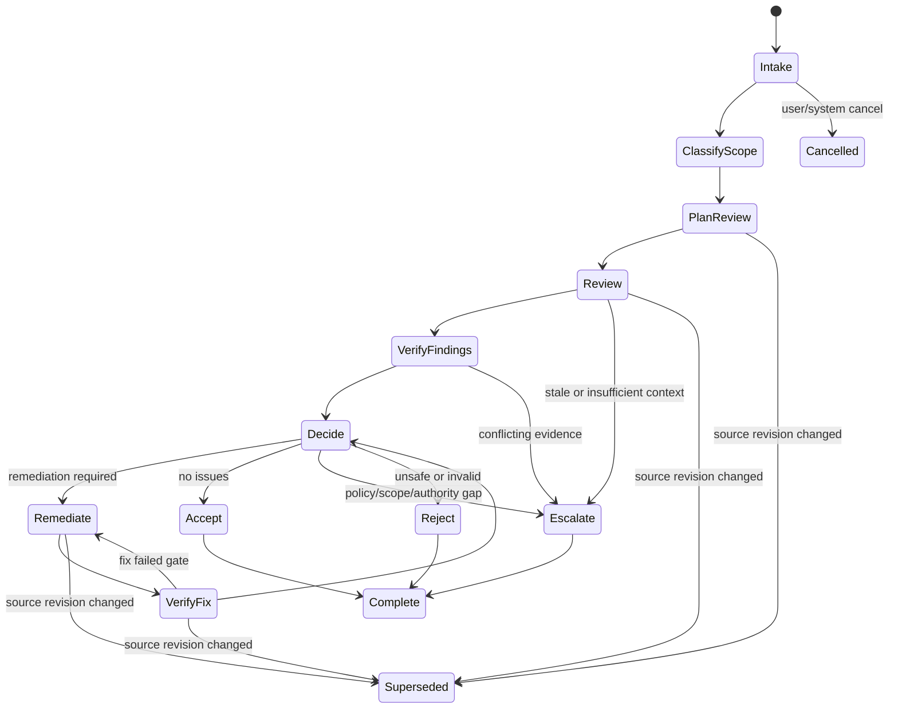

# Run record

- Case: `DW-E3`
- Condition: `baseline`
- Prompt: Design a durable agent workflow for a review-and-remediation process. I need the state machine, authority boundaries, retry semantics, resumability, and verification model, but do not choose or implement a runtime yet.
- Expected routing: `agent-workflow-design`
- Loaded skills observed in Codex events: `agent-workflow-design`
- Agent-reported selection (not a native harness event): `none`
- Final response:

**Workflow Status**  
`Conditional` — the workflow can be specified now, but two material authorities are unresolved: who owns the final accept/reject decision, and what classes of remediation effects are permitted to mutate external state.

**Outcome Contract**

`R1` Review and remediation must produce an exact, auditable decision for each target item: `accept`, `remediate`, `escalate`, or `reject`.

`R2` Every remediation must be bound to a specific source revision, issue snapshot, and run identity.

`R3` No phase may claim success unless independent evidence verifies the claim against the exact revision or external state it refers to.

`R4` The workflow must survive interruption and resume without duplicating mutable effects or losing ownership of in-flight work.

`R5` The workflow must distinguish these terminal states:
- `Accepted`
- `RemediatedAndVerified`
- `Rejected`
- `Escalated`
- `Cancelled`
- `Superseded`
- `FailedClosed`

`R6` The workflow must preserve a full decision trail: requested scope, findings, applied changes, verification results, retries, and final disposition.

`R7` Deterministic orchestration must own state transitions, retries, acceptance, and recovery. Models may propose claims, not authorise their own acceptance.

`R8` Human approval must be required for any consequential decision class not explicitly delegated, including scope expansion, policy exceptions, and external writes if they are not inherently safe.

`R9` Completion evidence must include:
- exact input revision identifiers
- exact output artifact or change set identifiers
- verification command/result receipts
- final disposition receipt
- any approval receipts

`R10` Out of scope:
- choosing a runtime
- implementing a queue, agent framework, or tool layer
- deciding product policy that the workflow does not already have authority to infer

**Evidence Ledger**

`E1` The workflow-design skill requires deterministic orchestration to own sequencing, policy, state, retries, and acceptance.  
`E2` Model outputs should be treated as structured claims, not proof.  
`E3` Independent gates must validate world state, not the agent’s wording.  
`E4` Durable progress must be persisted outside conversation memory and revalidated on resume.  
`E5` Capability is not authority: a worker may have a tool but still not be allowed to use it for some effects.  
`E6` Retry semantics should differ by failure class; a single generic retry loop is inadequate.  
`E7` Review-and-remediation is a workflow where exact revision binding matters for both findings and fixes.  
`A1` The process may touch files or other mutable artifacts. Consequence: write boundaries and reconciliation are required.  
`A2` There is an accountable human or system owner for escalation decisions. Consequence: unresolved cases can terminate safely.  
`Q1` Are external writes allowed at all, or is this purely a review-plus-local-remediation loop?  
`Q2` Which decisions require human approval versus delegated automation?  
`Q3` What is the authoritative source of record for the target item: ticket, PR, branch, document, or external system?

**Phase Map**



### Phase-by-phase design

1. `Intake` — `deterministic`
- Owner: coordinator
- Purpose: bind the run to a target item, source revision, and policy context
- Inputs: target identifier, snapshot/revision, requested objective, constraints
- Outputs: immutable run record and lease
- Effects: create checkpoint
- Why deterministic: simple validation and identity capture

2. `ClassifyScope` — `deterministic`
- Owner: coordinator
- Purpose: determine whether the request is in scope, requires human approval, or is blocked
- Inputs: policy, target type, requested action class
- Outputs: scope class, approval needs, blocked reasons
- Effects: none
- Why deterministic: policy routing should not depend on model judgment

3. `PlanReview` — `model`
- Owner: review agent
- Purpose: identify likely review dimensions, risks, and evidence to inspect
- Inputs: exact revision, historical diffs, issue context, policy summary
- Outputs: structured review plan
- Effects: none
- Why model: semantic prioritization and focus selection are probabilistic

4. `Review` — `model`
- Owner: review agent
- Purpose: inspect the target and produce findings or a clean bill of health
- Inputs: exact revision and scoped evidence
- Outputs: structured findings, severity, confidence, evidence references
- Effects: none
- Why model: requires interpretation, ranking, and synthesis

5. `VerifyFindings` — `deterministic` plus optional independent `model` check for semantic cases
- Owner: coordinator first, then independent verifier only when needed
- Purpose: validate that findings are grounded in exact evidence and current state
- Inputs: finding claims and referenced artifacts
- Outputs: verified / unverified / stale / conflicting
- Effects: none
- Why mostly deterministic: identity, path, and diff checks can be machine-checked

6. `Decide` — `deterministic` with human gate when required
- Owner: coordinator, or human approver for gated cases
- Purpose: choose accept, remediate, reject, or escalate
- Inputs: verified findings, policy, approval state
- Outputs: next state and reason
- Effects: route next phase
- Why deterministic: policy application and state transition should not depend on free-form model output

7. `Remediate` — `model` or `worker` depending on task complexity
- Owner: remediation worker
- Purpose: produce a change set that addresses approved findings
- Inputs: verified findings, permitted scope, exact revision
- Outputs: patch/change set and rationale
- Effects: limited mutation within approved boundaries
- Why model may be needed: when the fix requires synthesis; otherwise this can be a deterministic tool-driven phase

8. `VerifyFix` — `deterministic`
- Owner: coordinator / verifier
- Purpose: check the actual change set against the findings and run required tests or checks
- Inputs: change set, expected fix claims, verification plan
- Outputs: pass/fail plus evidence
- Effects: none
- Why deterministic: acceptance must rest on independently reproducible checks

9. `Escalate` — `human`
- Owner: accountable human/system owner
- Purpose: resolve policy gaps, scope expansion, conflicting evidence, or unsafe mutation requests
- Inputs: compact evidence packet
- Outputs: decision receipt
- Effects: may authorise continuation or terminate
- Why human: consequential judgment outside current automation authority

10. `Accept` — `deterministic`
- Owner: coordinator
- Purpose: close the run as verified and complete
- Inputs: exact revision, verification receipts, approval receipts if any
- Outputs: terminal accepted state
- Effects: persist final record
- Why deterministic: terminalization must be governed by explicit evidence

**State and Authority Model**

### Authoritative store
- A durable run ledger is authoritative for:
- run identity
- source revision identity
- state transitions
- claims and receipts
- retries
- approvals
- final disposition

### Identity model
- `run_id` uniquely identifies the workflow instance
- `phase_id` uniquely identifies each phase execution attempt
- `source_id` identifies the exact input revision or snapshot
- `artifact_id` identifies any generated patch, report, or verification receipt
- `lease_id` identifies current ownership of mutable work

### Transition rules
- Transitions are append-only records.
- Every transition must cite:
- current state
- requested next state
- evidence basis
- actor identity
- source revision identity
- timestamp
- attempt number

### Freshness rules
- Any change to the target revision invalidates all downstream evidence until revalidated.
- Any approval has an expiry and a bound source identity.
- Any late result arriving after supersession is recorded but ignored for acceptance.

### Authority boundaries
- Coordinator controls state and acceptance.
- Worker controls only its assigned task scope.
- Human approver controls only the decisions explicitly delegated to that role.
- No worker may update the rules that judge its own output.
- No remediation phase may widen its own permission scope.

### Pause/cancel/stale semantics
- `Cancelled`: immediate stop, no further effects permitted except safe cleanup.
- `Superseded`: current source revision changed; old evidence retained but not trusted.
- `Stale`: an artifact or approval expired relative to current run state.
- `Paused`: execution halted but resumable from checkpoint if source state still matches.
- `FailedClosed`: an authority, validation, or reconciliation check failed and the workflow must not continue automatically.

**Handoff Contracts**

### Review result schema
```json
{
  "schema_version": "1",
  "run_id": "string",
  "source_id": "string",
  "phase_id": "string",
  "status": "clean | findings | blocked | stale",
  "summary": "string",
  "findings": [
    {
      "finding_id": "string",
      "severity": "low | medium | high | critical",
      "claim": "string",
      "evidence_refs": ["artifact_id_or_location"],
      "confidence": "low | medium | high"
    }
  ],
  "blocked_reason": "string | null"
}
```

### Remediation proposal schema
```json
{
  "schema_version": "1",
  "run_id": "string",
  "source_id": "string",
  "phase_id": "string",
  "status": "proposed | applied | failed | stale",
  "target_findings": ["finding_id"],
  "change_refs": ["artifact_id_or_location"],
  "fix_claims": [
    {
      "claim": "string",
      "evidence_plan": ["deterministic_check"]
    }
  ],
  "blocked_reason": "string | null"
}
```

### Verification result schema
```json
{
  "schema_version": "1",
  "run_id": "string",
  "source_id": "string",
  "phase_id": "string",
  "status": "pass | fail | stale | inconclusive",
  "checks": [
    {
      "check_name": "string",
      "method": "deterministic | human | model",
      "result": "pass | fail | skipped",
      "evidence_refs": ["artifact_id_or_location"]
    }
  ],
  "violations": ["string"]
}
```

### Status semantics
- `clean`: no actionable findings
- `findings`: actionable issues identified
- `blocked`: cannot proceed safely or authoritatively
- `stale`: evidence no longer bound to the active source state
- `proposed`: a fix has been suggested but not yet applied
- `applied`: the change set is in place
- `pass`: all required gates passed
- `fail`: at least one required gate failed
- `inconclusive`: checks could not establish the claim

**Gate and Acceptance Map**

### Independent gates for material claims
- Claim: “I inspected the correct revision”
- Gate: exact revision hash or snapshot match
- Claim: “These are valid findings”
- Gate: evidence reference existence and binding to the exact source
- Claim: “The fix addresses the findings”
- Gate: compare change set against targeted findings
- Claim: “Tests pass”
- Gate: run the declared deterministic checks and record outputs
- Claim: “No new issues were introduced”
- Gate: rerun the applicable verification suite on the post-change state
- Claim: “Workflow is done”
- Gate: final state satisfies exact revision binding, verification pass, and approval conditions

### Acceptance criteria
Workflow acceptance requires all of:
- current state is not stale, cancelled, or superseded
- required approvals are present and unexpired
- every actionable finding is either remediated and verified or explicitly accepted by authorised human decision
- all required checks passed on the exact post-change state
- final disposition record exists

### Distinct acceptance layers
- Phase execution status: phase ran
- Phase result validity: output parsed and passed semantic checks
- Workflow acceptance: every required gate for the exact state is satisfied

**Capability and Mutation Boundaries**

### Required boundaries
- Write scope limited to approved target paths or resources
- Protected control plane excluded from worker writes
- Network egress only if explicitly required
- Credentials scoped to the smallest acceptable blast radius
- External writes require idempotency or reconciliation support
- Parallel workers must not share mutable state unless an integration owner arbitrates merges

### Protected control plane
The following must be off-limits to ordinary workers:
- workflow definitions
- state-transition rules
- retry policy
- approval records
- evaluator configuration
- evidence ledger

### Consequential effects
If the workflow can write outside the local workspace, each effect must have one of:
- idempotency key
- expected-version check
- read-back verification
- external receipt
- reconciliation step

### Parallel ownership
- One owner per mutable area
- One integration owner for merging outputs
- No two workers should edit the same control surface concurrently

**Retry and Recovery Model**

### Failure classes
1. `Malformed structured result`
- Retry owner: same worker or same model call
- Action: reissue with schema error details
- Budget: small, bounded

2. `Failed gate`
- Retry owner: same responsible worker if correction is feasible
- Action: return concrete violations and request correction
- Budget: bounded by no-progress detection

3. `Deterministic transient failure`
- Retry owner: coordinator
- Action: safe replay with backoff
- Budget: limited retries, only for idempotent operations

4. `Failed implementation hypothesis`
- Retry owner: coordinator
- Action: switch strategy or escalate
- Budget: no infinite retries on equivalent attempts

5. `Missing authority / stale source / policy denial`
- Retry owner: none
- Action: block, revalidate, or escalate
- Budget: zero automatic retries

### No-progress detection
Treat as no-progress when:
- the same failure repeats with equivalent inputs
- the change set does not move the failing gate
- the source revision changes but the worker keeps acting on the old state
- repeated outputs differ only cosmetically
- late results keep arriving after supersession

### Checkpointing
Persist after every meaningful boundary:
- intake complete
- scope classification complete
- review result recorded
- remediation proposal recorded
- fix applied
- verification complete
- final decision recorded

### Resume rules
On resume:
- reread authoritative source state
- revalidate the source revision
- compare checkpoint identity to current state
- discard stale claims
- restore ownership or lease
- replay only from the earliest safe checkpoint

### Uncertain-effect handling
If a mutation may have succeeded but recording the success failed:
- do not blindly replay
- read back the external state
- check idempotency key or expected version
- reconcile before proceeding

**Observability and Verification**

### Required run events
- run started
- source revision bound
- scope classified
- phase start/end
- claim emitted
- gate invoked
- gate pass/fail
- retry scheduled
- checkpoint written
- ownership acquired/released
- approval requested/granted/denied/expired
- final disposition recorded

### Required evidence for reconstruction
- exact source revision
- exact change set or artifact identifiers
- exact verification commands or checks
- gate outcomes with reasons
- retry counts and causes
- any supersession or cancellation events
- approval receipts when used

### Verification coverage
Tests or evidence should cover:
- invalid transition rejection
- malformed output rejection
- stale source rejection
- unauthorized write rejection
- independent review bound to exact revision
- fix verification on post-change state
- superseded late-result handling
- resume from checkpoint
- cancellation mid-run
- no-progress escalation

**Human Decisions and Open Questions**

`Q1` Who is the accountable owner for final escalation decisions?  
`Q2` Are remediation effects limited to local workspace changes, or can they modify external systems?  
`Q3` What is the authoritative source of truth for the item under review?  
`Q4` Are there classes of findings that may be auto-accepted without human review?  
`Q5` What is the maximum tolerated remediation scope expansion before re-approval is required?

**Design Judgment**

This workflow should be treated as a review-and-remediation ledger with deterministic governance, not as a conversational loop. The model is useful for interpreting evidence and synthesizing fixes; the coordinator remains the authority for state, retries, safety, and acceptance.

If you want, I can turn this into one of these next:
1. a more formal ADR/spec,
2. a concrete state-transition table with guards and receipts,
3. a failure taxonomy with retry budgets and escalation thresholds.

Outcome checks remain `not_verifiable` until reviewed against the suite rubric.
