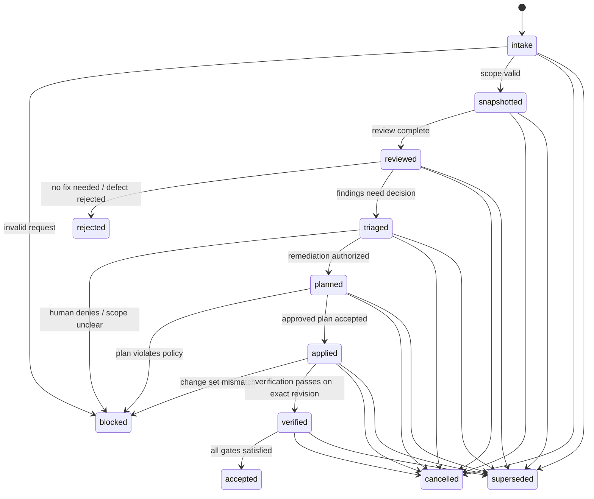

# Run record

- Case: `DW-E3`
- Condition: `candidate`
- Prompt: Design a durable agent workflow for a review-and-remediation process. I need the state machine, authority boundaries, retry semantics, resumability, and verification model, but do not choose or implement a runtime yet.
- Expected routing: `agent-workflow-design`
- Loaded skills observed in Codex events: `agent-workflow-design`
- Agent-reported selection (not a native harness event): `agent-workflow-design`
- Final response:

**Workflow Status**  
`Conditional` because the durable control model can be specified now, but the exact remediation authority still depends on what kinds of effects you allow:
- repo-only changes vs external writes
- whether human approval is required before mutation
- whether the workflow may auto-apply fixes or only propose them

**Outcome Contract**
- `R1`: Review a target revision against a declared baseline and produce bounded, evidence-backed findings.
- `R2`: Classify each finding as `informational`, `needs_fix`, `blocker`, or `unknown`.
- `R3`: For fixable findings, produce a remediation plan or patch proposal tied to the exact reviewed revision.
- `R4`: Apply only approved, scoped remediations, never outside the authorized write set.
- `R5`: Re-run verification against the exact revised state and reconcile results before acceptance.
- `R6`: Survive pause, restart, duplicate delivery, late results, and partial external effects without advancing incorrectly.
- `R7`: Preserve human ownership for decisions that change risk, scope, or external state.
- `R8`: Emit durable evidence for every acceptance or rejection decision.

Trigger:
- A review request arrives with a target artifact, baseline identity, and policy scope.

Terminal states:
- `Accepted`
- `Rejected`
- `Blocked`
- `Cancelled`
- `Superseded`

In scope:
- code review
- issue triage
- remediation planning
- scoped mutation
- verification
- checkpointing
- reconciliation

Out of scope:
- unbounded autonomous deployment
- control-plane edits by the same worker being judged
- implicit approval from model conversation state
- unverifiable external side effects

Invariants:
- state transitions are explicit and monotonic
- every acceptance is bound to an exact revision
- producer output is never treated as proof
- a worker cannot authorize its own unreviewed control-plane change
- stale results cannot advance a newer run

Completion evidence:
- review record
- finding set
- remediation artifact or patch receipt
- verification receipts
- exact revision hash
- final decision receipt

**Evidence Ledger**
- `E1`: The workflow-design skill explicitly requires deterministic orchestration to own sequencing, policy, state, retries, acceptance, and recovery.
- `E2`: It requires separating phase execution, result validity, and workflow acceptance.
- `E3`: It requires typed handoffs and independent validation of claims.
- `E4`: It requires durable checkpoints and resume reconciliation against authoritative state.
- `E5`: It requires explicit authority boundaries and protected control-plane state.
- `E6`: It requires different retry semantics by failure class.
- `I1`: A review-and-remediation process is safest when review, fix proposal, fix application, and post-fix verification are distinct phases.
- `I2`: The coordinator should be deterministic even if the reviewer or fixer is model-driven.
- `I3`: Human approval is likely required before any consequential remediation effect beyond local, reversible changes.
- `A1`: The workflow is intended to operate on code or artifacts with versioned identities.
- `A2`: The workflow may need to mutate state, but only within a bounded write set.
- `Q1`: Are external effects allowed at all, or is this strictly repo-local?
- `Q2`: Must all remediations be human-approved, or can low-risk fixes auto-apply?
- `Q3`: What is the authoritative source of truth for target revision identity and policy scope?

**Phase Map**
1. `intake` - `deterministic`
   - owner: coordinator
   - purpose: validate request shape, target identity, policy scope, and run identity
   - inputs: request, baseline hash, policy, source snapshot refs
   - outputs: accepted run record or rejection
   - effects: persist run envelope
2. `snapshot` - `deterministic`
   - owner: coordinator
   - purpose: bind exact reviewed state and dependency versions
   - inputs: repository/artifact snapshot, policy, exact revision IDs
   - outputs: immutable review context record
   - effects: none beyond read-only capture
3. `review` - `model`
   - owner: review agent
   - purpose: identify defects, risks, or ambiguities
   - why model: semantic interpretation, prioritization, and synthesis
   - inputs: review context, diff, policy rubric, allowed evidence
   - outputs: structured findings
   - effects: none
4. `gate_review` - `deterministic`
   - owner: coordinator
   - purpose: validate finding schema, scope, evidence links, and revision binding
   - inputs: findings
   - outputs: accepted or rejected findings set
   - effects: persist review receipt
5. `triage` - `human` or `deterministic` depending on policy
   - owner: human if risk/scope choice is needed
   - purpose: decide which findings require remediation, approval, or escalation
   - inputs: validated findings
   - outputs: triage decision receipt
6. `remediate_plan` - `model`
   - owner: remediation agent
   - purpose: propose a minimal fix plan or patch
   - why model: synthesis of change strategy and tradeoffs
   - inputs: exact findings, target files, constraints
   - outputs: structured remediation plan
   - effects: none
7. `gate_plan` - `deterministic`
   - owner: coordinator
   - purpose: validate scope, path allowlist, and policy compliance
   - inputs: remediation plan
   - outputs: approved plan or rejection
   - effects: persist plan receipt
8. `apply_fix` - `deterministic` or `model`-assisted tool use under deterministic policy
   - owner: implementation worker
   - purpose: make only approved changes
   - inputs: approved plan, write scope, expected version
   - outputs: patch/change set receipt
   - effects: mutate only authorized paths
9. `verify` - `deterministic`
   - owner: verifier
   - purpose: run tests/checks and confirm exact-state binding
   - inputs: changed revision, test recipe
   - outputs: verification receipts
   - effects: none
10. `accept_or_reject` - `deterministic`
   - owner: coordinator
   - purpose: determine final workflow state from all receipts and current authoritative state
   - inputs: review receipt, plan receipt, change set, verification receipts, current revision
   - outputs: terminal decision
   - effects: persist final decision

Model phases and why they require model judgement:
- `review`: needs semantic understanding of correctness, risk, and context
- `remediate_plan`: needs synthesis of a minimal, workable fix under constraints
- `apply_fix` should not be an unconstrained model phase; if model help is used, it must stay inside a deterministic mutation boundary

**State and Authority Model**
Authoritative store:
- a durable run record
- a durable phase ledger
- immutable evidence artifacts
- exact revision identities
- approval receipts
- verification receipts

State transitions:
- `created -> intake_passed -> snapshotted -> reviewed -> triaged -> planned -> approved_to_apply -> applied -> verified -> accepted`
- side exits: `rejected`, `blocked`, `cancelled`, `superseded`

Version and freshness rules:
- every phase records the exact source revision it inspected
- every resume re-reads current authoritative revision and compares it to the stored checkpoint
- if current revision differs, prior evidence is stale unless the workflow explicitly permits it
- approval receipts expire when the bound revision or policy changes

Pause/cancel/stale semantics:
- `paused`: progress frozen, no transition advancement
- `cancelled`: no further mutation allowed, only reconciliation and finalization
- `superseded`: a newer run or revision invalidates stale pending work
- `stale`: a phase result is preserved as evidence but cannot advance acceptance

Authority boundaries:
- coordinator owns transitions and acceptance
- review worker cannot approve its own remediation
- remediation worker cannot rewrite policy, gates, or acceptance logic
- verifier must be independent from the producer of the fix when possible

**Handoff Contracts**
1. Review result schema
```json
{
  "schema_version": "1.0",
  "run_id": "string",
  "target_revision": "string",
  "reviewed_revision": "string",
  "status": "pass|fail|needs_fix|needs_human|unknown",
  "findings": [
    {
      "id": "string",
      "severity": "info|low|medium|high|critical",
      "summary": "string",
      "evidence_refs": ["string"],
      "recommended_action": "string",
      "scope": ["string"]
    }
  ],
  "claims": ["string"]
}
```
Claims:
- these findings were derived from the referenced revision and policy only
- the result is not a proof of defect severity, only a structured judgment

2. Remediation plan schema
```json
{
  "schema_version": "1.0",
  "run_id": "string",
  "finding_ids": ["string"],
  "target_revision": "string",
  "proposed_changes": [
    {
      "path": "string",
      "operation": "edit|add|delete",
      "intent": "string"
    }
  ],
  "requires_human_approval": true,
  "risk_notes": ["string"]
}
```
Claims:
- proposed changes are minimal and scoped
- no unauthorized path or effect is included

3. Change-set receipt
```json
{
  "schema_version": "1.0",
  "run_id": "string",
  "base_revision": "string",
  "new_revision": "string",
  "changed_paths": ["string"],
  "write_receipt": "string"
}
```
Claims:
- the actual mutation set matches the approved plan
- only allowed paths changed

4. Verification receipt
```json
{
  "schema_version": "1.0",
  "run_id": "string",
  "revision": "string",
  "checks": [
    {
      "name": "string",
      "status": "pass|fail|skip",
      "evidence_ref": "string"
    }
  ]
}
```
Claims:
- checks were run against the exact revision named
- the result is evidence-backed, not self-reported

**Gate and Acceptance Map**
Independent checks:
- request shape and policy scope validation
- revision binding validation
- finding schema validation
- finding evidence completeness
- remediation scope validation
- write-set comparison against approved paths
- test command execution
- post-change read-back or file hash comparison
- exact revision identity binding at verify time
- approval expiry and supersession check

Acceptance criteria:
- all required findings are triaged
- all required remediations are approved
- actual change set matches approved scope
- verification passes on the exact mutated revision
- no stale, duplicate, or late result is being used
- no open human approvals remain
- authoritative state still matches the checkpointed assumptions

**Capability and Mutation Boundaries**
Enforced boundaries:
- allowed paths: only the declared target repository or artifact subtree
- protected control plane: workflow definitions, policies, gates, approval state, and evidence store
- credentials: scoped per phase and never shared broadly
- network: deny by default for review and verification unless explicitly needed
- parallel ownership: one mutable area per worker, plus a single integration owner
- effect size: bounded diff size, bounded external writes, bounded retries

Important rule:
- capability is not authority. A worker may be technically able to call broad tools, but the workflow must still reject out-of-scope effects.

**Retry and Recovery Model**
Failure classes:
- malformed structured result
  - retry same model phase with schema error
- failed claim gate
  - return violations to the same phase owner if context is still fresh
- deterministic transient failure
  - retry in code with bounded backoff and idempotency
- stale source or superseded revision
  - do not retry; rebase or restart from the new authoritative state
- missing approval
  - block and escalate
- uncertain external effect
  - reconcile via read-back or receipt before any replay

Budgets:
- per phase attempt cap
- total run attempt cap
- time budget per phase
- no-progress detection after repeated identical failures or unchanged outputs

Checkpointing:
- write a checkpoint after each accepted phase boundary
- store run id, phase, exact revision, receipts, and current lease owner
- on resume, re-read authoritative state first
- if checkpoint and authoritative state diverge, authoritative state wins and the discrepancy is recorded

Uncertain-effect handling:
- use idempotency keys, expected-version checks, or read-back receipts
- never assume a side effect succeeded because the worker said so

**Observability and Verification**
Record:
- run id, phase id, owner, timestamps
- input revision hashes
- structured outputs and validation results
- tool/effect requests and receipts
- approval state transitions
- retries, backoff, and no-progress signals
- stale or cancelled transition attempts
- final acceptance or rejection reason

Verification tests for the workflow itself:
- reject invalid transitions
- reject malformed handoffs
- reject unauthorized path mutations
- reject stale revision acceptance
- reject self-approved remediation
- reject late worker results after supersession
- resume after checkpoint and reconcile correctly
- fail closed when verification is missing
- preserve pre-existing unrelated dirty state instead of silently discarding it

**Mermaid State Diagram**


**Human Decisions and Open Questions**
- `Q1`: Should remediation ever auto-apply, or must a human approve all writes?
- `Q2`: Are external effects in scope, or is the workflow strictly repo-local?
- `Q3`: What is the authoritative revision source: git SHA, artifact digest, or another version key?
- `Q4`: What findings require human triage versus deterministic policy routing?
- `Q5`: What is the rollback or recovery policy if verification passes but an external side effect later fails?

**Summary**
The durable design is a deterministic coordinator controlling a review -> triage -> plan -> apply -> verify -> accept state machine, with model use limited to semantic review and remediation synthesis. The key safety properties are exact revision binding, independent verification, explicit authority boundaries, and checkpoint/reconciliation on resume.

If you want, I can turn this into one of these next:
1. a narrower policy for repo-only code review and fix loops
2. a generalized multi-tenant workflow spec with explicit leases and run records
3. a machine-readable state machine plus JSON schemas for each handoff

Outcome checks remain `not_verifiable` until reviewed against the suite rubric.
