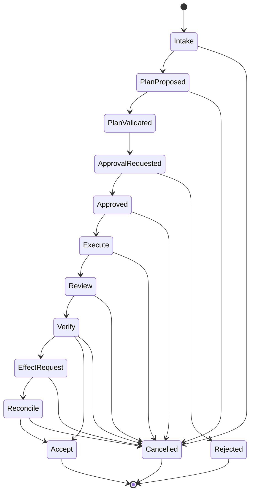

# Run record

- Case: `PTC-E5`
- Condition: `baseline`
- Prompt: Design a resumable multi-agent delivery workflow with typed handoffs, human approval gates, independent review, durable state, retries by failure class, cancellation, and recovery after uncertain external effects. I haven't chosen a runtime.
- Expected routing: `agent-workflow-design`
- Loaded skills observed in Codex events: `agent-workflow-design`
- Agent-reported selection (not a native harness event): `none`
- Final response:

**Workflow Status**  
`Conditional`

Reason: the workflow can be designed runtime-neutrally now, but two policy choices remain unresolved and materially affect the control plane: the exact approval authorities and the external-effect reconciliation model for each destination system.

**Outcome Contract**

`R1` Deliver a multi-agent task to completion with resumability across process loss and model restarts.  
`R2` All material handoffs must be typed, versioned, and bound to exact source state.  
`R3` Human approval is required before any consequential effect class the policy marks as gated.  
`R4` Each material claim must be independently verified before acceptance.  
`R5` Durable state must survive interruption, cancellation, supersession, and recovery after uncertain external effects.  
`R6` Retries must differ by failure class, with bounded attempt budgets and no-progress detection.  
`R7` The control plane must be protected from worker mutation.  
`R8` Final acceptance must be tied to the exact revision/state that was reviewed and executed.

Trigger:
- A user or system submits a deliverable request that can be decomposed into one or more bounded work items.

Terminal states:
- `Succeeded`
- `Failed`
- `Cancelled`
- `Superseded`
- `BlockedAwaitingHuman`
- `BlockedAwaitingExternalReconciliation`

Invariants:
- No worker may self-approve a gated decision.
- No acceptance is recorded without exact-state binding.
- No external write is treated as complete without a receipt or read-back.
- No retry may bypass a policy denial or stale-state conflict.
- Checkpoints are evidence, not permission.

Scope:
- In scope: decomposition, agent execution, review, approvals, effect execution, verification, checkpointing, reconciliation, and cancellation.
- Out of scope: inventing policy for consequential effects, replacing human accountability, or silently mutating control-plane state.

Authoritative inputs:
- User request.
- Current run state.
- Approved policy/configuration.
- Exact source revision or artifact set.
- External system state for reconciliation.

Completion evidence:
- Typed handoff receipts.
- Independent review result bound to exact revision.
- Human approval receipts where required.
- Deterministic validation artifacts.
- External effect receipts or authoritative read-back evidence.

**Evidence Ledger**

`E1` The desired workflow must be resumable, typed, gated, independently reviewed, durable, retry-aware, cancelable, and recoverable after uncertain external effects.  
`E2` The runtime has not been chosen, so the design must be expressed as a state machine and contracts, not implementation details.  
`E3` Consequential effects require explicit human accountability; this should not be delegated to model output.  
`E4` Durable state and authoritative reconciliation are required because conversation memory is not a reliable source of truth.  
`I1` A deterministic coordinator should own sequencing, state, retries, approvals, and acceptance because those rules are expressible and need not depend on model judgment.  
`I2` Model workers should only handle bounded semantic tasks such as decomposition, synthesis, review, or diagnosis. Falsifier: a phase with no semantic uncertainty can be implemented deterministically.  
`A1` There is some external store available for durable state and event history. Consequence: the workflow can be crash-resumable. Revalidate at runtime-selection time.  
`A2` There exists a way to distinguish at least read-only checks from mutating effects. Consequence: gating and reconciliation can be enforced cleanly. Revalidate per target integration.  
`Q1` Which effect classes require human approval by policy?  
`Q2` Which external systems must support idempotency keys, expected-version checks, or authoritative read-back?  
`Q3` What runtime will own leases, durable events, timers, and retries?

**Phase Map**

1. `Intake and classify`  
- Kind: `deterministic`  
- Owner: coordinator  
- Purpose: normalize request, assign run ID, capture authoritative inputs, classify effect risk, and decide whether human approval is needed.  
- Inputs: user request, policy, current state.  
- Outputs: run record, initial plan stub, approval requirements, scope constraints.  
- Effects: durable run creation.

2. `Decompose and propose plan`  
- Kind: `model`  
- Owner: planning agent  
- Purpose: break the request into bounded work items and propose a dependency graph.  
- Why model: semantic decomposition and prioritization are not reliably deterministic.  
- Inputs: run record, scope, constraints, recent evidence.  
- Outputs: typed plan claims, dependencies, uncertainties, proposed verification targets.  
- Effects: none.

3. `Plan validation`  
- Kind: `deterministic`  
- Owner: coordinator  
- Purpose: validate schema, dependency graph, budget limits, and policy constraints.  
- Outputs: accepted plan or rejection with violations.  
- Effects: plan state transition.

4. `Human approval gate`  
- Kind: `human`  
- Owner: named approver or role  
- Purpose: approve, reject, amend, or narrow gated effects.  
- Inputs: exact plan version, risk summary, effect class, evidence of scope.  
- Outputs: approval receipt bound to plan version and expiry.  
- Effects: approval state transition.

5. `Execute work item`  
- Kind: `model`  
- Owner: worker agent  
- Purpose: perform bounded task, produce claimed artifacts, or prepare an effect request.  
- Why model: requires semantic judgment, tool-use judgment, or synthesis.  
- Inputs: task spec, allowed context, exact source revision, constraints.  
- Outputs: structured result with claims and evidence references.  
- Effects: limited to assigned work scope, never control-plane mutation.

6. `Independent review`  
- Kind: `model`  
- Owner: separate reviewer agent  
- Purpose: verify the produced work against the exact revision and stated acceptance criteria.  
- Why model: semantic review of code, reasoning, or evidence.  
- Inputs: exact artifact set, exact revision, acceptance criteria, prior claims.  
- Outputs: pass/fail with findings and evidence links.  
- Effects: none.

7. `Deterministic verification`  
- Kind: `deterministic`  
- Owner: coordinator/tooling  
- Purpose: run tests, schema checks, diffs, hashes, policy checks, and artifact validation.  
- Outputs: pass/fail receipts, failure class.  
- Effects: record evidence only.

8. `Effect execution`  
- Kind: `deterministic` with `human` precondition when gated  
- Owner: coordinator/service  
- Purpose: perform external writes under idempotency, expected-version, or transactional guarantees where possible.  
- Outputs: effect receipt or reconciliation-needed state.  
- Effects: external system mutation.

9. `Reconciliation after uncertain effect`  
- Kind: `deterministic`  
- Owner: coordinator/service  
- Purpose: determine whether an uncertain external write actually occurred and reconcile durable state.  
- Outputs: reconciled status, retry-safe continuation, or manual intervention request.  
- Effects: record authoritative read-back or receipt.

10. `Acceptance`  
- Kind: `deterministic`  
- Owner: coordinator  
- Purpose: declare completion only if all required claims, gates, and exact-state bindings are satisfied.  
- Outputs: terminal workflow state.  
- Effects: close run.

**State and Authority Model**

Authoritative store:
- One durable run ledger plus append-only event log.
- Event types should include: `RunCreated`, `PlanProposed`, `PlanValidated`, `ApprovalRequested`, `Approved`, `Rejected`, `WorkStarted`, `WorkClaimed`, `ReviewStarted`, `ReviewCompleted`, `VerificationCompleted`, `EffectRequested`, `EffectReceipted`, `EffectReconciled`, `CheckpointWritten`, `Cancelled`, `Superseded`, `Accepted`, `Failed`.

Identity model:
- Every run has a stable `run_id`.
- Every phase has a stable `phase_id`.
- Every artifact, revision, approval, and receipt is versioned and references its parent `run_id` and `phase_id`.
- Every checkpoint stores the exact source revision or external state version it describes.

Authority rules:
- Coordinator owns state transitions and acceptance.
- Workers own only their assigned task scope.
- Reviewers own only review judgments, not acceptance.
- Humans own any gated consequential decision.
- Workers cannot write control-plane state directly.

Transition rules:
- Only valid transitions are accepted.
- Unknown or out-of-order transitions are rejected.
- Supersession immediately invalidates stale claims after the superseding revision is recorded.
- Cancellation prevents new work from starting and stops acceptance, but does not discard evidence already produced.
- Resume requires revalidation against current authoritative state, not checkpoint trust alone.

Pause/cancel/stale semantics:
- `Paused`: work is intentionally suspended, state preserved.
- `Cancelled`: no further progress is accepted unless explicitly resumed by a new run.
- `Superseded`: earlier revision invalidated by a newer accepted input.
- `Stale`: a previously valid claim no longer applies because source or approval expired.

Mermaid view:

**Handoff Contracts**

1. `PlanProposalV1`
- Fields: `run_id`, `plan_id`, `source_revision`, `assumptions`, `tasks[]`, `dependencies[]`, `risks[]`, `required_approvals[]`, `verification_targets[]`, `open_questions[]`.
- Status semantics: `proposed`, `needs_clarification`, `ready_for_validation`.
- Claims: “This is the proposed decomposition and risk profile for this exact input revision.”
- Not authorized to determine: policy approval, acceptance, or effect completion.

2. `WorkResultV1`
- Fields: `run_id`, `task_id`, `source_revision`, `artifact_refs[]`, `claim_set[]`, `uncertainties[]`, `tool_receipts[]`, `suggested_followups[]`.
- Claims: “I produced these artifacts for this exact task and revision.”
- Not authorized to determine: review pass, test pass, or final acceptance.

3. `ReviewResultV1`
- Fields: `run_id`, `task_id`, `reviewed_revision`, `findings[]`, `status`, `blocked_reason`, `evidence_refs[]`.
- Status semantics: `pass`, `fail`, `needs_more_evidence`.
- Claims: “I independently checked this exact revision against the stated criteria.”
- Not authorized to determine: run acceptance.

4. `EffectRequestV1`
- Fields: `run_id`, `effect_id`, `target_system`, `idempotency_key`, `expected_version`, `payload_ref`, `approval_ref`, `risk_class`.
- Claims: “This effect is authorized and safe to attempt under the stated preconditions.”
- Not authorized to determine: completion.

5. `EffectReceiptV1`
- Fields: `run_id`, `effect_id`, `receipt_type`, `external_version`, `read_back_ref`, `status`, `reconciliation_notes`.
- Status semantics: `committed`, `applied_unknown`, `rejected`, `conflict`, `requires_manual_recovery`.
- Claims: “This is what the external system or read-back confirms.”
- Not authorized to determine: broader workflow acceptance.

**Gate and Acceptance Map**

Independent checks for material claims:
- “Plan is valid” -> schema validation, dependency acyclicity, budget and policy checks.
- “Work is done” -> artifact existence, diff bounds, hash checks, expected path scope.
- “Tests pass” -> deterministic execution of the configured test command with exact logs and exit code.
- “Review passed” -> separate reviewer context bound to exact revision and criteria.
- “External write succeeded” -> receipt or authoritative read-back from the external system.
- “Approval exists” -> approval receipt matches exact plan version and is unexpired.
- “Resume is safe” -> checkpoint state matches current authoritative state or is explicitly superseded.

Final acceptance requires all of the following:
- Exact run revision matches the reviewed revision.
- All required approvals are present and unexpired.
- All mandatory verifications passed.
- All gated effects are either confirmed or reconciled.
- No pending stale, cancelled, or superseded claims remain.
- Acceptance is recorded by the coordinator, not by a worker or reviewer.

**Capability and Mutation Boundaries**

Enforced scope:
- Workers may write only to their work artifacts area, never to policy, approval state, or scheduler state.
- Reviewers may write only review records.
- Coordinator may write state, event log, checkpoints, and acceptance records.
- External writes require explicit effect handlers with idempotency or reconciliation support.

Protected control plane:
- state machine definitions
- approval records
- retry policy
- evaluator configuration
- acceptance logic
- cancellation/supersession controls

Credentials:
- Per-system, least-privilege credentials.
- No shared long-lived credentials in model-visible context if avoidable.
- External write credentials only in the effect executor.

Parallel-state ownership:
- Parallel workers need isolated task state and separate artifact paths.
- An integration owner must merge outputs and resolve conflicts.
- No two workers should own the same mutable artifact set.

**Retry and Recovery Model**

Failure classes:
- `Malformed structured result`
  - Retry owner: same worker, bounded re-prompt if context is still fresh.
  - Action: schema error feedback and one or two bounded retries.
- `Gate failure`
  - Retry owner: same worker if the issue is fixable and evidence is fresh.
  - Action: return exact violations, re-run only after correction.
- `Deterministic transient failure`
  - Retry owner: coordinator.
  - Action: bounded retry with backoff for safe idempotent operations only.
- `Policy denial` or `missing authority`
  - Retry owner: none.
  - Action: block and escalate.
- `Stale source` or `superseded revision`
  - Retry owner: coordinator with new input binding.
  - Action: invalidate old claims, restart from earliest safe phase.
- `Failed implementation hypothesis`
  - Retry owner: planner/coordinator.
  - Action: replan, do not loop equivalent speculative fixes.
- `Uncertain external effect`
  - Retry owner: coordinator/reconciler.
  - Action: read back authoritative state, compare to expectation, then continue, compensate, or escalate.
- `No-progress`
  - Detection: repeated identical claims, unchanged failure signatures, or oscillation across the same state.
  - Action: stop and escalate.

Budgets:
- Max attempts per phase.
- Max wall-clock per run.
- Max unresolved effect retries.
- Max replan loops before human intervention.

Checkpoints:
- Write after each accepted phase boundary and before each risky external effect.
- Include current revision, approval state, artifact hashes, effect receipts, and unresolved questions.
- On resume, re-read authoritative state first, then compare checkpoint state.
- If they differ, authoritative state wins and the discrepancy is recorded.

Uncertain-effect handling:
- Prefer idempotency keys, expected-version checks, transactional APIs, or read-back.
- If the process dies after sending an effect but before recording success, do not replay blindly.
- Reconcile first; only replay if the authoritative state proves the effect did not land.

**Observability and Verification**

Required durable events:
- phase start/end
- handoff created/consumed
- approval requested/granted/rejected/expired
- verification start/end
- external effect requested/receipted/reconciled
- checkpoint written/restored
- cancellation/supersession
- retry classification and reason
- acceptance or failure with terminal reason

Verification suite should cover:
- invalid transition rejection
- malformed handoff rejection
- stale revision rejection
- approval expiry
- independent review binding to exact revision
- cancellation before and after an effect request
- duplicate worker result handling
- late result against superseded state
- uncertain effect reconciliation
- retry exhaustion and escalation
- resume from checkpoint after crash

**Human Decisions and Open Questions**

1. Which effect classes are gated by human approval?
2. Which external systems need deterministic idempotency versus manual reconciliation?
3. Who is the accountable approver for product, security, and deployment decisions?
4. What are the exact acceptance criteria per deliverable type?
5. What retention policy applies to raw prompts, transcripts, and evidence artifacts?

If you want, I can turn this into one of two next artifacts:

1. a runtime-agnostic executable spec with event types, state transitions, and JSON schemas
2. a runtime comparison matrix for Temporal, LangGraph, Mastra, and a custom queue-based orchestrator

Outcome checks remain `not_verifiable` until reviewed against the suite rubric.
