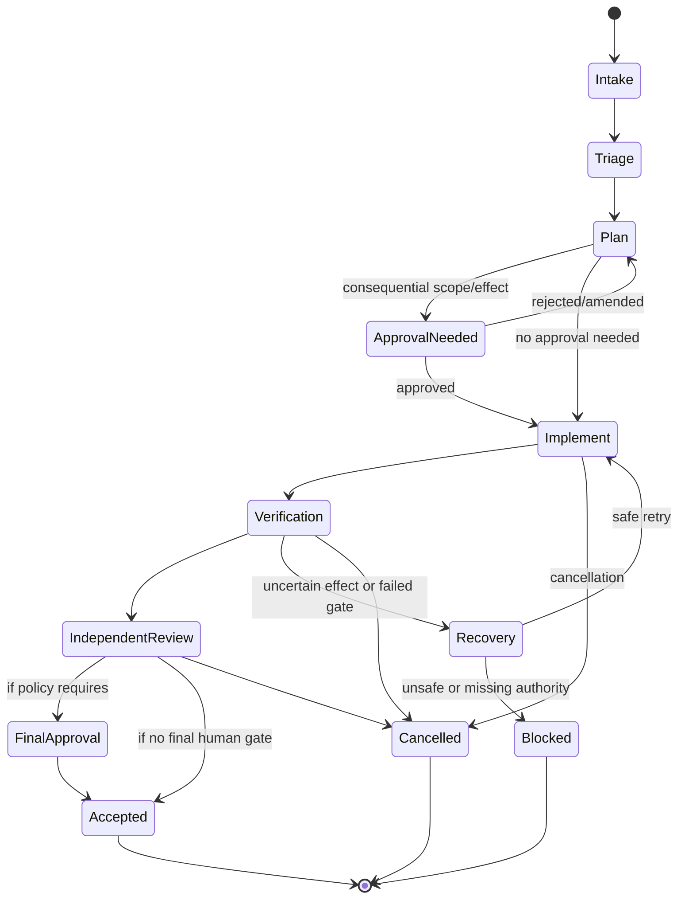

# Run record

- Case: `PTC-E5`
- Condition: `candidate`
- Prompt: Design a resumable multi-agent delivery workflow with typed handoffs, human approval gates, independent review, durable state, retries by failure class, cancellation, and recovery after uncertain external effects. I haven't chosen a runtime.
- Expected routing: `agent-workflow-design`
- Loaded skills observed in Codex events: `agent-workflow-design`
- Agent-reported selection (not a native harness event): `none`
- Final response:

**Workflow Status**  
`Conditional`: the design is complete as a runtime-neutral specification, but some authority and recovery assumptions remain open because you have not chosen a runtime or external effect model.

**Outcome Contract**

`R1` The workflow must deliver a bounded task or change request from intake to final acceptance with durable progress tracking.  
`R2` Every nontrivial model action must return typed claims, not free-form prose.  
`R3` The coordinator must own all sequencing, state transitions, retries, cancellation, and acceptance decisions.  
`R4` Human approval must gate consequential actions: scope changes, external writes, deployments, and unsafe recovery choices.  
`R5` Independent review must validate the exact revision/state produced by the producer, not the producer’s self-report.  
`R6` The workflow must resume after interruption from durable checkpoints without trusting conversation memory.  
`R7` Uncertain external effects must be reconciled with idempotency keys, read-back checks, expected-version guards, or effect receipts.  
`R8` Retries must vary by failure class and stop when evidence no longer improves.  
`R9` Cancellation, supersession, stale inputs, duplicate workers, and late results must be explicit states, not edge-case exceptions.  
`R10` Observability must let an operator reconstruct what happened from durable events and receipts.

Triggers:
- New task intake
- Resume after crash/restart
- Human approval arrival
- External effect receipt or read-back
- Independent review completion
- Cancellation or supersession request

Terminal states:
- `Accepted`
- `Rejected`
- `Cancelled`
- `Superseded`
- `Blocked`
- `Failed` after bounded retries or unresolved authority

Invariants:
- Coordinator is authoritative for transitions.
- Producers cannot mark their own output accepted.
- Review must be bound to exact revision/state identity.
- No consequential effect executes without either explicit approval or a pre-authorized policy rule.
- Checkpoints are evidence, not authorization.

Completion evidence:
- Final artifact/revision identity
- Independent review receipt
- Gate receipts for required checks
- Human approval receipts where required
- External effect receipts or read-back confirmations where relevant
- Final state record with exact source/version bindings

**Evidence Ledger**

- `E1`: Workflow design should start from an outcome contract, not from an agent roster.
- `E2`: Deterministic orchestration should own sequencing, policy, state, and recovery.
- `E3`: Model outputs are untrusted claims until independently validated.
- `E4`: Durable checkpoints must survive interruption and be reconciled on resume.
- `E5`: Uncertain external effects require reconciliation, not blind replay.
- `E6`: Independent review is required for acceptance when producer bias matters.
- `I1`: A runtime-neutral design can be expressed as a state machine plus typed handoffs. Falsified if the target runtime cannot persist state or route typed events.
- `I2`: Human approval gates should be centralized around consequential effects. Falsified if all operations are strictly non-consequential.
- `A1`: The runtime can persist run/task/phase state durably. Consequence: resume and reconciliation are possible.
- `A2`: The runtime can attach exact revision IDs and receipts to events. Consequence: independent review can bind to exact state.
- `Q1`: Which external systems can be written to, and what read-back or idempotency guarantees they offer?
- `Q2`: Which decisions must be human-owned in your organization?
- `Q3`: Whether multiple workers may run concurrently on disjoint state, or must be serialized.

**Phase Map**

State machine overview:



Phase kinds:

1. `human` - Intake clarification / scope approval  
   - Owner: named human or role
   - Purpose: resolve ambiguous or consequential scope before work proceeds
   - Inputs: request, policy, current state, blocked questions
   - Outputs: approval, rejection, amendment, or escalation
   - Why human: accountable decisions cannot be inferred safely by a model

2. `deterministic` - Coordinator triage and state transition control  
   - Owner: workflow engine
   - Purpose: classify task type, assign phase, enforce transitions
   - Inputs: current state, event, policy, checkpoint
   - Outputs: next state, leases, phase assignment
   - Why deterministic: rules are expressible and should not depend on model judgment

3. `model` - Planning / decomposition  
   - Owner: planning agent
   - Purpose: produce a task plan, risk list, and typed constraints
   - Inputs: task spec, allowed scope, relevant artifacts
   - Outputs: plan manifest with claims, risks, required gates
   - Why model: semantic decomposition and tradeoff assessment are probabilistic

4. `model` - Implementation worker  
   - Owner: bounded worker agent
   - Purpose: produce the requested artifact or change
   - Inputs: exact plan slice, repo state, allowed write scope
   - Outputs: change manifest, artifact refs, claims about what changed
   - Why model: may require synthesis, coding, or writing under partial context

5. `deterministic` - Verification runner  
   - Owner: coordinator/tooling
   - Purpose: run tests, lint, schema checks, diff checks, receipt checks
   - Inputs: artifact refs, exact revision, expected state
   - Outputs: pass/fail evidence and violations
   - Why deterministic: executable checks should not be delegated to model judgment

6. `model` - Independent review  
   - Owner: separate reviewer agent/context
   - Purpose: evaluate correctness, completeness, risk, and consistency
   - Inputs: exact revision, plan, verification evidence, relevant diffs
   - Outputs: review manifest with blockers, non-blockers, and confidence
   - Why model: semantic review benefits from independent judgment

7. `human` - Final consequential approval  
   - Owner: accountable person/role
   - Purpose: authorize deployment, publication, external writes, or closure when policy requires
   - Inputs: exact artifacts, verification, review, risk summary
   - Outputs: approve/reject/request changes
   - Why human: policy and accountability

8. `deterministic` - External effect executor  
   - Owner: coordinator/service
   - Purpose: perform deployment, publish, send, or write with idempotency and receipts
   - Inputs: approved request, idempotency key, expected version
   - Outputs: receipt, read-back confirmation, reconciliation state
   - Why deterministic: effect execution should be mechanically controlled and auditable

**State and Authority Model**

Authoritative store:
- A durable workflow store owns `run_id`, `task_id`, `phase_id`, `state_version`, `lease_owner`, `attempt_count`, approval receipts, and effect receipts.
- Conversation history is non-authoritative.

Identity and freshness:
- Every material artifact, revision, and external effect target gets a stable identity.
- Every transition records the exact source revision and policy version it depended on.
- Approval expires if source revision or scope changes.

Transitions:
- Only the coordinator can move state forward or backward according to policy.
- Workers can propose claims, not state transitions.
- Reviewers can recommend acceptance or blockers, not accept directly.

Pause/cancel/stale:
- `Paused` means the workflow is intentionally stopped and resumable.
- `Cancelled` means no further work may proceed except cleanup and reconciliation.
- `Superseded` means a newer run invalidated prior claims.
- `Stale` means a claim or approval no longer matches current authoritative state.

**Handoff Contracts**

Use typed, versioned payloads. Keep them small and reference durable artifacts.

1. `PlanManifestV1`
```json
{
  "schema": "PlanManifestV1",
  "run_id": "string",
  "task_id": "string",
  "source_revision": "string",
  "scope": ["string"],
  "assumptions": ["string"],
  "risks": ["string"],
  "required_gates": ["string"],
  "out_of_scope": ["string"],
  "next_action": "implement|approve|clarify|stop"
}
```

2. `WorkClaimV1`
```json
{
  "schema": "WorkClaimV1",
  "run_id": "string",
  "phase_id": "string",
  "source_revision": "string",
  "changed_artifacts": ["string"],
  "effect_intent": ["string"],
  "claim_status": "done|blocked|needs_input|uncertain_effect",
  "evidence_refs": ["string"],
  "notes": "string"
}
```

3. `ReviewManifestV1`
```json
{
  "schema": "ReviewManifestV1",
  "run_id": "string",
  "reviewed_revision": "string",
  "verdict": "approve|block|needs_changes",
  "blockers": ["string"],
  "non_blocking_issues": ["string"],
  "confidence": "low|medium|high",
  "evidence_refs": ["string"]
}
```

4. `ApprovalReceiptV1`
```json
{
  "schema": "ApprovalReceiptV1",
  "run_id": "string",
  "approved_revision": "string",
  "approver": "string",
  "decision": "approve|reject|amend",
  "timestamp": "string",
  "scope_hash": "string"
}
```

5. `EffectReceiptV1`
```json
{
  "schema": "EffectReceiptV1",
  "run_id": "string",
  "effect_type": "deploy|publish|send|write",
  "idempotency_key": "string",
  "target": "string",
  "expected_version": "string",
  "receipt_id": "string",
  "read_back_status": "matched|mismatched|pending",
  "evidence_refs": ["string"]
}
```

Semantic rules:
- `claim_status=done` means the worker believes the assigned slice is complete, not that the workflow is accepted.
- `uncertain_effect` means an external side effect may have happened but was not yet reconciled.
- `needs_changes` means the reviewer found issues but the revision may still be salvageable.
- `reviewed_revision` and `approved_revision` must bind exactly to a revision hash or content digest.
- `scope_hash` must change if approved scope changes.

**Gate and Acceptance Map**

Independent checks:
- Transition gate: reject invalid state moves.
- Scope gate: compare claimed work against permitted paths and actions.
- Revision gate: bind all claims to exact source/revision IDs.
- Verification gate: run deterministic checks against the produced revision.
- Review gate: require independent reviewer context and exact revision binding.
- Approval gate: require current, unexpired, human-owned approval for consequential effects.
- External-state gate: verify receipts or read-back against authoritative system state.
- Acceptance gate: require all required gates for the exact end state, not just successful phases.

Acceptance requires:
- exact final artifact/revision
- required verification pass
- required independent review pass
- required human approval, if policy says so
- no unresolved uncertain effects
- no stale or superseded claims
- no open blockers

**Capability and Mutation Boundaries**

Principle:
- Capability is not authority.

Boundaries to enforce:
- Allowed write paths or resources per worker
- Forbidden control-plane paths for all workers
- Distinct credentials for coordinator, producer, reviewer, and effect executor
- Separate leases for parallel workers
- Maximum change size per phase
- Network and tenant restrictions for external effects
- Human approval required for production or irreversible actions

Critical control-plane protections:
- Workflow definitions
- policy rules
- approval records
- review routing
- verification configuration
- retry limits
- reconciliation logic

Parallelism rules:
- Only disjoint mutable state may be processed in parallel.
- Each worker must own a distinct artifact set or task slice.
- An integration owner must merge results.

**Retry and Recovery Model**

Failure classes and handling:

1. `malformed_structured_result`
- Owner: same worker
- Retry: bounded, same context if schema repair likely
- Action: return exact validation error and ask for corrected typed output

2. `failed_gate`
- Owner: same worker or coordinator depending on gate
- Retry: if evidence can improve without changing the underlying plan
- Action: surface concrete violations

3. `deterministic_transient`
- Owner: coordinator
- Retry: safe, idempotent, bounded by backoff and max attempts
- Examples: timeouts, temporary transport failures

4. `failed_hypothesis`
- Owner: coordinator + human if needed
- Retry: do not loop blindly; replan or stop
- Examples: wrong approach, repeated equivalent failures

5. `missing_authority` / `policy_denial` / `stale_source`
- Owner: human or coordinator
- Retry: none
- Action: block or request approval/replan

6. `uncertain_external_effect`
- Owner: coordinator
- Retry: no blind replay
- Action: reconcile via read-back, idempotency key, expected-version check, or compensating action

Budgets:
- Max attempts per phase
- Max wall-clock time per run
- Max no-progress repeats
- Retry only while evidence improves

No-progress detection:
- Same failure repeating with unchanged inputs
- Equivalent diffs with unchanged outcome
- Late worker result for superseded revision
- Alternation between two states without new evidence

Checkpoint model:
- Write checkpoint after each accepted phase boundary and after any external effect request/receipt.
- Each checkpoint stores current state, exact revision, approvals, receipts, and next safe resume point.
- On resume, reconcile checkpoint against authoritative store and external system state.
- If they conflict, authoritative state wins and the discrepancy is recorded.

Uncertain effect recovery:
- Before any external write, allocate an idempotency key and expected version.
- After any uncertain outcome, read back authoritative state.
- If read-back confirms the effect, record receipt and continue.
- If state is ambiguous, stop and escalate rather than replaying blindly.
- If the operation is idempotent and safe, replay only when the effect executor can prove it is a duplicate-safe retry.

**Observability and Verification**

Record durable events:
- phase start/end
- state transitions
- claim manifests
- validation errors
- review verdicts
- human approvals
- effect requests and receipts
- read-back checks
- cancellation and supersession events
- retry counters and no-progress detection
- source revision IDs
- policy version IDs
- lease ownership
- timestamps and durations

Trajectory tests:
- invalid transition rejection
- malformed typed handoff rejection
- stale revision rejection
- review bound to exact revision
- approval expiry after scope change
- cancellation mid-implementation
- uncertain external effect recovery
- duplicate/late worker result rejection
- retry exhaustion
- acceptance only after all required gates
- cleanup/reconciliation after crash before checkpoint write

**Human Decisions and Open Questions**

Open questions you need to settle before implementation:
1. Which external effects are allowed at all?
2. Which approvals are mandatory versus policy-exempt?
3. What write isolation is available in the chosen runtime?
4. Do you need serial execution, or can workers operate in parallel on disjoint slices?
5. What is the source of truth for approvals and receipts?
6. How should supersession be triggered and who can invoke it?
7. What is the rollback or compensation policy for irreversible actions?

**Recommended runtime shape**

If you have not chosen a runtime, the safest implementation shape is:
- a durable orchestrator/state machine as the source of truth
- separate worker execution for model calls
- deterministic validators and reviewers
- a separate effect-execution service for external writes
- immutable event log plus compact checkpoint records

That gives you clean separation between:
- orchestration
- generation
- verification
- approval
- reconciliation

If you want, I can next turn this into one of these:
1. a runtime-neutral JSON schema package for the states and handoffs,
2. a concrete workflow graph in Mermaid plus event definitions,
3. or an implementation plan for a specific runtime like Temporal, LangGraph, Mastra, or a custom queue-based orchestrator.

Outcome checks remain `not_verifiable` until reviewed against the suite rubric.
